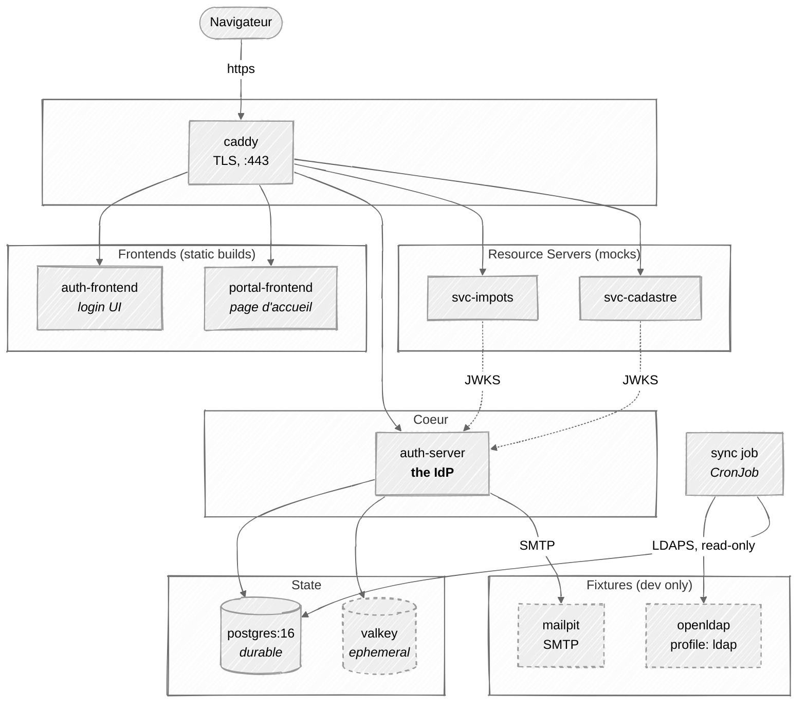
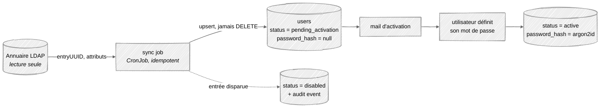
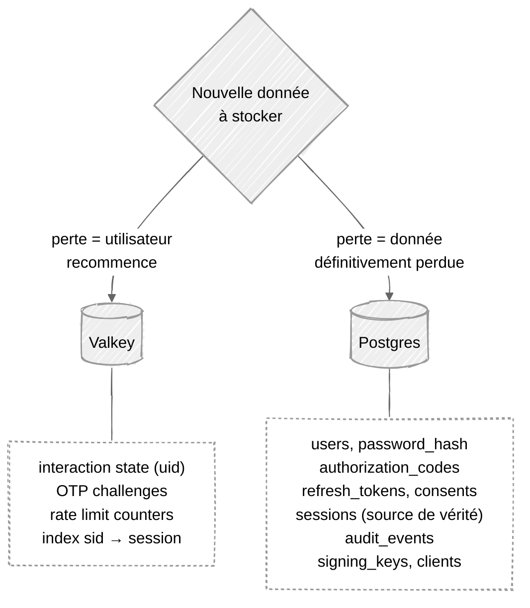
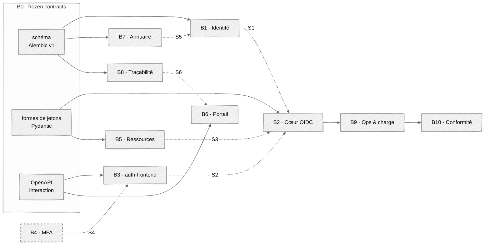
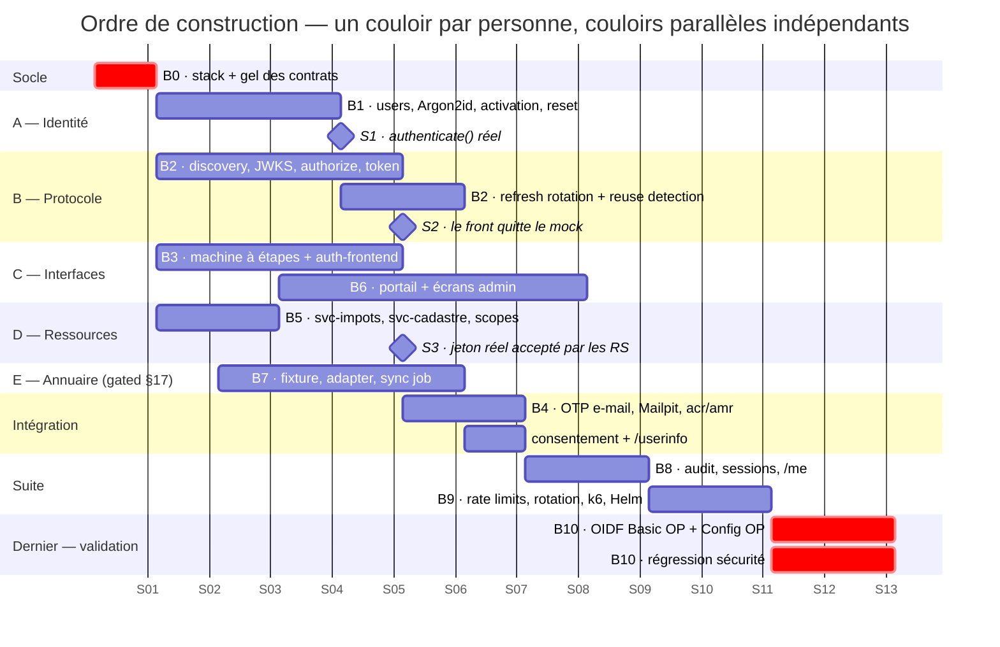

# Authent'INT — Plan d'implémentation

> Companion document to the project brief (`README.md`).
> Audience: the dev team + AI coding assistants (Claude Code).
> Scope: how to build a self-hosted OpenID Connect Provider for the DGFiP brief.

---

## 0. How to use this document

This is the **implementation contract**. The brief says *what* the client wants;
this says *what we build, with which tools, in which order*.

When working with Claude Code, point it at a specific section rather than the
whole file:

```
Read docs/adr/0001-choix-stack.md §6 (Data model) and §7 (Endpoints),
then scaffold the SQLAlchemy models for the OAuth state tables only.
```

Anything marked **[À VALIDER]** is a question for the client, not a decision we
have already made.

---

## 1. Core decision: we build the Authorization Server

We are **not** deploying Keycloak/Authentik and configuring it. We implement the
OpenID Provider ourselves.

**What "implement OAuth2/OIDC" does and does not mean:**

| We write | We do NOT write |
| --- | --- |
| The `/authorize` state machine | RSA / SHA-256 / HMAC primitives |
| The `/token` grant handlers | JWT serialisation & signature verification |
| Code + refresh token lifecycle | Argon2id password hashing |
| Discovery + JWKS documents | TLS |
| MFA stages, consent, sessions | Base64url, CSPRNG |

Cryptography comes from audited libraries. Hand-rolling it would be a defect,
not a demonstration of skill. What we own is **protocol logic and state
management** — which is exactly where real-world IdP vulnerabilities live.

### Specifications we implement against

| Spec | Use |
| --- | --- |
| RFC 6749 | OAuth 2.0 core |
| RFC 6750 | Bearer token usage |
| RFC 7636 | PKCE (mandatory for all clients) |
| RFC 7009 | Token revocation |
| RFC 7662 | Token introspection — **deferred**, see §7 |
| RFC 8414 | Authorization Server Metadata |
| RFC 9700 (BCP) | OAuth 2.0 Security Best Current Practice |
| OIDC Core 1.0 | ID tokens, UserInfo, `sub` semantics |
| OIDC Discovery 1.0 | `/.well-known/openid-configuration` |
| OIDC RP-Initiated Logout | `/end-session` |

Target conformance profile: **Basic OP** + **Config OP** (see §13). Conformance
is validated **last** (§16) — it cannot pass until every brick is wired.

---

## 2. Container topology

Everything runs in Docker. One external entry point; every backing service binds
internally only.



Dotted edges are JWKS fetches: the mock services validate tokens locally against
cached public keys, never calling back per request (§11).

| Container | Role | Image / base |
| --- | --- | --- |
| `caddy` | TLS termination, single ingress, routes by host | `caddy:2-alpine` |
| `auth-server` | The OpenID Provider. All protocol + admin endpoints | Python 3.13 (built), `uvicorn` |
| `auth-frontend` | Login, MFA, consent, activation, reset UI | `caddy:2-alpine` serving Vite build |
| `portal-frontend` | *Page d'accueil* listing services per role | `caddy:2-alpine` serving Vite build |
| `svc-impots`, `svc-cadastre`, … | **Mocked** services (brief: *services externes à mocker*) | small FastAPI apps |
| `postgres` | Single source of truth for identity state | `postgres:16-alpine` |
| `valkey` | OTP storage, rate limit counters, session index | `valkey/valkey:8-alpine` |
| `mailpit` | Dev SMTP catcher for A2F + activation mails | `axllent/mailpit` |
| `openldap` | **Test fixture only** — stands in for the client's directory. Compose profile `ldap`, never deployed | see §5b |
| `conformance-suite` | OIDF tests — **not ours**, cloned separately with its own compose file | see §13 |

**Networking rules**
- Only `caddy` publishes ports to the host.
- `postgres` and `valkey` are on an internal network, never published.
- Mock services validate tokens against `auth-server`'s JWKS — they are Resource
  Servers, so they exercise the real integration path.

### Why an edge proxy at all

Not for load balancing — for **issuer identity**. Three things must agree
byte-for-byte: the `iss` claim, the Discovery document, and the URL the
conformance suite hits. Without a proxy, the browser sees `localhost:8000` while
containers see `auth-server:8000`, and you patch around that mismatch for the
rest of the project. Secondary reasons: TLS terminated once instead of in five
services, and correct cookie scoping (on bare `localhost`, cookies ignore the
port, so the SSO cookie leaks across every service — it appears to work locally
and breaks in the cluster).

### Why Caddy rather than Traefik or nginx

`tls internal` runs a local CA and issues certificates automatically. That
removes the mkcert step entirely (§13). Traefik's Docker-label discovery is its
main advantage and we don't need it — six services, all known upfront. The whole
edge config is:

```caddyfile
auth.authentint.local {
    tls internal
    reverse_proxy auth-server:8000
}

login.authentint.local {
    tls internal
    reverse_proxy auth-frontend:80
}

portal.authentint.local {
    tls internal
    reverse_proxy portal-frontend:80
}

impots.authentint.local {
    tls internal
    reverse_proxy svc-impots:8001
}
```

Add the hostnames to `/etc/hosts` pointing at `127.0.0.1`.

Inside the frontend containers, Caddy also serves the static Vite build with SPA
fallback:

```caddyfile
:80
root * /usr/share/caddy
try_files {path} /index.html
file_server
```

**This is dev scaffolding, not architecture.** In Kubernetes the cluster's
ingress controller replaces it (§12). Do not spend a session debating it.

**Why a separate `auth-frontend`:** keeping login UI out of the auth server means
the server stays a pure API and is far easier to conformance-test and to reason
about. It also mirrors how Ory Hydra separates the login/consent app.

---

## 3. Tech stack

### Decision — locked

**Backend is Python.** The team is stronger in Python.

| Layer | Choice | Rationale |
| --- | --- | --- |
| Language | **Python 3.13** | Team fluency. 3.13 rather than 3.14 because `argon2-cffi`, `asyncpg` and the LDAP clients ship wheels for it today — no source builds in the image |
| HTTP | **FastAPI** (`uvicorn`) | Schema-first validation per route, same shape as Fastify's JSON Schema; emits OpenAPI for free — the frontends generate their types from it (§4) |
| ORM / migrations | **SQLAlchemy 2.0** + **Alembic** | Typed models; versioned migrations are a real deliverable (*schéma de BDD*) |
| JOSE | **`joserfc`** | Maintained by the `authlib` author, tracks the RFCs closely; JWT sign/verify, JWKS |
| Password hashing | **`argon2-cffi`** | Argon2id, binding to the reference C implementation |
| Validation | **Pydantic v2** | Runtime validation of every protocol parameter; the Rust core keeps it cheap enough to sit on the hot path |
| Frontend | **React + Vite + TypeScript** | Unchanged — the frontends talk HTTP, the backend language does not reach them |
| Styling | Tailwind or plain CSS modules | Team preference |
| Tests | **pytest** + **httpx** `ASGITransport`, **Playwright** (e2e) | |
| Load testing | **k6** | Scripts the *pics fiscaux* scenario |
| Observability | **structured JSON logs** + `/metrics` (Prometheus format) | The *montée en charge* evidence is the k6 report, which k6 produces itself |

**Not a full observability stack.** OpenTelemetry → Prometheus + Grafana + Loki
was the previous entry: three extra containers, no brick of its own in §16, and
nothing in §18 that needs them. `/metrics` in the Prometheus text format costs one
dependency and means the client's cluster can scrape us if it already runs
Prometheus. Add collectors the day someone asks for a dashboard.

**Two consequences worth stating up front:**

1. **Argon2id runs in the GIL-bound process.** §11.3 already flags hashing as the
   login-rate bottleneck; in Python it also blocks the event loop. Every
   `verify()` and `hash()` call goes through `run_in_executor` / a thread pool —
   decide this on day one, not after the k6 run.
2. **`sub`, claim and token shapes are Pydantic models, not hand-built dicts.**
   That is what buys back the typing rationale we lose with the language change;
   §5's ID token and §8's authorization-code state are model definitions.

### Viable alternatives (rejected)

- **TypeScript** (Node 22): Fastify + Prisma + `jose` + `@node-rs/argon2` + `zod`.
  The prior recommendation. Marginally better JOSE ecosystem and no GIL caveat,
  rejected on team fluency.
- **Java**: Spring Boot + Spring Authorization Server. Closest to what a real
  French public-sector project would ship, but the framework does so much that
  you learn less about the protocol.
- **Go**: excellent for the scaling story, weaker library ergonomics for
  building an AS from scratch.

### Deliberately not used

**`authlib`, `python-oauth2-provider`**, and on the other side of the fence
`node-oidc-provider`, Keycloak, Hydra, Authentik — these *are* the thing we're
building. `authlib` deserves the explicit mention: it is the obvious Python
reflex, its grant plumbing is exactly §8, and adopting it would hollow out the
project. They remain useful as **reference implementations to read** when a spec
detail is ambiguous.

`joserfc` is the one library from that author we *do* take — JOSE primitives are
in the "we do NOT write" column of §1. The line is: cryptography and
serialisation, yes; grant and `/authorize` state machines, no.

---

## 4. Repository layout

```
authentint/
├── README.md                    # brief + fonctionnalités (livrable)
├── docker-compose.yml           # dev stack
├── docker-compose.conformance.yml
├── .env.example
├── docs/
│   ├── adr/0001-choix-stack.md  # this file
│   ├── architecture.md
│   ├── threat-model.md
│   ├── generated/               # db-schema.md + api-endpoints.md (livrables),
│   │                            # emitted by `make docs` — never hand-edited
│   └── conformance-results/     # OIDF exports
├── apps/
│   ├── auth-server/
│   │   ├── src/
│   │   │   ├── oidc/            # authorize, token, discovery, jwks, userinfo
│   │   │   ├── flows/           # login, mfa, activation, reset (staged)
│   │   │   ├── admin/           # user CRUD, client CRUD
│   │   │   ├── domain/          # entities, scope resolution
│   │   │   ├── infra/           # db, cache, mailer, keystore
│   │   │   └── audit/
│   │   ├── alembic/             # versioned migrations (livrable)
│   │   ├── pyproject.toml
│   │   └── tests/
│   ├── auth-frontend/           # `npm run gen:api` → src/api/types.ts
│   ├── portal-frontend/         # same, from the same OpenAPI schema
│   └── mock-services/
├── k8s/                         # manifests / Helm chart
├── fixtures/
│   └── ldap/                    # LDIF seed data for the OpenLDAP test fixture
└── load/                        # k6 scripts
```

**No `packages/` workspace.** The backend is Python, so the only cross-app
artefact is the TypeScript type file generated from the auth-server OpenAPI
schema by `openapi-typescript`. Each frontend generates its own copy in its own
build; a monorepo workspace to share one generated file earns nothing.

**`db-schema.md` and `api-endpoints.md` are generated, not written.** They are
client deliverables, but §6 makes the SQLAlchemy models the source of truth and
FastAPI already emits the OpenAPI schema. A hand-written copy of either is a
second source of truth that drifts before the third brick lands.

---

## 5. Identity & authorization model

### The three levels

| Niveau | `role` claim | Droits |
| --- | --- | --- |
| Admin | `admin` | CRUD utilisateurs, CRUD clients, lecture audit |
| Agent | `agent` | Accès étendu aux services |
| Contribuable | `contribuable` | Accès restreint |

All three authenticate identically: **numéro fiscal + mot de passe**.

### Critical identifier rule

The **numéro fiscal is a login identifier, never the `sub` claim.**

- `sub` = an opaque UUIDv4, stable per user, meaningless outside our system.
- The numéro fiscal is PII (it is a French tax identifier). It must not leak into
  JWTs handed to relying parties, logs, URLs, or error messages.
- Store it hashed-and-indexed if the threat model demands it, or encrypted at
  rest at minimum. **[À VALIDER — client]**

Given the brief opens with *"système d'information précédemment compromis"*, this
is the single most defensible design decision in the project. Say so in the
README.

### Scopes

Two families:

```
# OIDC standard
openid, profile, email, offline_access

# Service access (granularité fine)
svc:impots.read      svc:impots.write
svc:cadastre.read    svc:cadastre.write
svc:admin.users      svc:admin.audit
```

Role → allowed scopes is a **server-side table**, never client-supplied. The
`/authorize` handler computes `granted = requested ∩ allowed(role) ∩ client.allowed_scopes`
and issues only that intersection. Downgrading silently is correct per RFC 6749;
log every downgrade.

### Claims in the ID token

```json
{
  "iss": "https://auth.authentint.local",
  "sub": "9f1c...uuid",
  "aud": "portal-web",
  "exp": 1750000000, "iat": 1749999700,
  "auth_time": 1749999700,
  "nonce": "<echoed>",
  "acr": "urn:authentint:acr:mfa",
  "amr": ["pwd", "otp"],
  "name": "Marie Dupont",
  "given_name": "Marie", "family_name": "Dupont",
  "role": "agent",
  "sid": "<session id, for logout>"
}
```

`amr` and `acr` are how a Resource Server proves MFA actually happened — needed
for *traçabilité totale*.

---

## 5b. Annuaire LDAP — intégration en lecture seule

### The constraint

**We do not operate the directory.** In the target architecture it is an external
system, owned by the client, and our access to it is **read-only**. We never
create, modify, or delete an entry. Our adapter exposes no write method — this is
enforced by the interface shape, not by convention.

For development and pre-launch testing we run **our own OpenLDAP instance** as a
fixture: seeded with representative entries so we can build and test the adapter
without access to the real directory. It is infrastructure in the same category
as Mailpit — never a deliverable, never deployed.

### What read-only implies about passwords

This resolves a tension in the brief. Read-only access means we cannot write a
password to the directory. Since *réinitialisation de mot de passe* and
*activation de compte* are both **in scope** and both are writes, the credential
store must be **ours**.

Therefore:

| Concern | Owner |
| --- | --- |
| Password hash (Argon2id) | **Our Postgres** |
| Activation & reset tokens | **Our Postgres** |
| MFA factors | **Our Postgres** |
| Sessions, audit, consents | **Our Postgres** |
| nom, prénom, mail, affiliation | **LDAP** (read) |
| Group membership → role | **LDAP** (read), mapped server-side |

Everything in §6 stands unchanged. LDAP is an *identity attribute source and
provisioning feed*, not the authentication backend.

**[À VALIDER — client, priorité haute]** Confirm the directory is not expected to
verify credentials via `bind`. If the client does expect delegated bind, then
password reset leaves our scope and §6/§9 need rework. This is the single
highest-impact open question in the project.

### The port

One interface, no write methods:

```python
class UserDirectory(Protocol):
    """Read-only view of the client's directory."""

    async def find_by_numero_fiscal(self, nf: str) -> DirectoryUser | None:
        """Attribute lookup. Never verifies credentials."""

    def list(self, modified_since: datetime | None = None) -> AsyncIterator[DirectoryUser]:
        """Incremental provisioning feed."""


class DirectoryUser(BaseModel):
    external_id: str      # LDAP entryUUID — the join key
    numero_fiscal: str
    nom: str
    prenom: str
    email: EmailStr
    groups: list[str]     # raw group DNs, mapped to role by us
```

A `Protocol`, not an ABC: the read-only guarantee comes from the shape having no
write method, and structural typing keeps `FixtureDirectory` free of an
inheritance link to the LDAP implementation. Client library: **`bonsai`** (async,
LDAPS) or `ldap3` if a synchronous sync job turns out simpler — decide inside
brick **B7** (§16), against the fixture.

Two implementations: `LdapDirectory` (production) and `FixtureDirectory`
(unit tests, no container needed). The `openldap` container exercises
`LdapDirectory` in integration tests.

**Use `entryUUID` as the join key, never the DN.** DNs change when an entry is
moved between OUs; treating one as a stable identifier is a classic bug. Add
`users.external_id` (unique, nullable) to the schema in §6.

### Provisioning flow



This matches the brief exactly: *base existante avec des utilisateurs déjà créés
→ activer les comptes*. The sync job is idempotent, runs on a schedule
(`CronJob` in k8s), and:

- creates local rows for new `entryUUID`s
- updates changed attributes on existing rows
- **never deletes** — a disappeared entry sets `status = disabled` and is audited.
  Hard-deleting on a failed sync would be catastrophic; a transient LDAP error
  must not be able to wipe the user base.
- writes an audit event per change

### Operational rules — external dependency

The directory is outside our failure domain. Treat it accordingly.

1. **Only the sync job talks to LDAP.** No request handler ever does. This is the
   rule the rest of this list follows from: the provisioning flow above copies
   attributes into `users`, so the login path reads Postgres. A slow directory
   slows a CronJob, nothing a user is waiting on.
2. **Timeout ~2 s, retry with backoff. No circuit breaker, no Valkey attribute
   cache.** Both were in an earlier draft and both protect a hot path that does
   not exist: a breaker guards a cron job from a dependency only it uses, and the
   `users` row *is* the attribute cache. Two cache layers over one dataset is how
   they disagree.
3. **Degradation policy — decide it, don't let it emerge:**
   - Directory unreachable → **existing sessions keep working** (sessions are
     local state, deliberately independent of LDAP).
   - Login still works (passwords are local); only attribute *freshness* degrades.
   - Sync job fails → retries with backoff, alerts, changes nothing.
   - This is a strong argument for the local-credential design above: an external
     outage cannot lock every user out.
4. **`/health/ready` reflects directory reachability** for the sync worker, but
   **not** for the auth server — the auth server can serve logins without it.
5. **LDAPS or StartTLS only.** Never plain `ldap://`, even against the fixture,
   so the TLS path is exercised in dev.
6. Bind credentials for the service account come from a Secret. Read-only service
   account — **ask the client to enforce this server-side too**, so a bug on our
   side cannot write.

### The OpenLDAP fixture

Under a compose profile so it stays out of the default path:

```bash
docker compose --profile ldap up
```

Seed with LDIF fixtures in `fixtures/ldap/` covering: an admin, several agents,
several contribuables, an entry with accented characters, one with a missing
optional attribute, and one that disappears between syncs (to test the
`disabled` path).

**Two cautions:**

- **Verify image maintenance before committing.** `osixia/openldap` was the
  long-standing default but has stalled, and Bitnami's catalog terms have shifted
  recently. Check what is currently maintained rather than copying an old blog
  post. If OpenLDAP configuration (`slapd`, `olc` overlays, opaque errors) eats
  more than a session, **lldap** is a lighter LDAP-compatible server with a web
  UI that is sufficient to prove the adapter works.
- **Our schema is a guess until confirmed.** Fixtures encode assumptions that
  will be wrong in ways we can't predict. See the questions below.

### Schema mapping (provisional)

| Our field | LDAP attribute | Note |
| --- | --- | --- |
| `external_id` | `entryUUID` | join key, stable |
| `numero_fiscal` | `uid` | **assumption** — likely a custom attribute |
| `nom` | `sn` | |
| `prenom` | `givenName` | |
| `email` | `mail` | |
| `role` | `memberOf` | group DN → role, mapped in our config |

**[À VALIDER — client] before writing the adapter.** One email gets all of this:

1. An **anonymised LDIF export of a single user entry**
2. The **base DN** and the **search filter** they expect us to use
3. Which attribute carries the **numéro fiscal**
4. Which **groups** exist and how they map to admin / agent / contribuable
5. Whether `entryUUID` is available (some directories expose a different
   operational attribute)
6. Expected **directory size** and **change rate** — decides full vs incremental
   sync
7. **LDAPS endpoint** and CA certificate

Until these arrive, build against the fixture and keep the mapping in
configuration, not in code.

---

## 6. Data model

Grouped by concern. The SQLAlchemy models + Alembic migrations are the source of
truth; this is the intent.

### Identity

```
users
  id                uuid pk
  external_id       text unique null   -- LDAP entryUUID, see §5b. Never the DN.
  numero_fiscal     text unique        -- login id, encrypted/indexed
  email             citext unique
  nom               text
  prenom            text
  password_hash     text null          -- null until activation. OURS, not LDAP's.
  role              enum(admin, agent, contribuable)
  status            enum(pending_activation, active, locked, disabled)
  password_changed_at  timestamptz
  failed_login_count   int default 0
  locked_until      timestamptz null
  synced_at         timestamptz null   -- last successful directory sync
  created_at, updated_at
```

The brief says *base existante avec des utilisateurs déjà créés → activer les
comptes*. So a seed script inserts users with
`status = pending_activation, password_hash = null`. Activation is the flow that
sets the first password.

### Credentials & recovery

```
activation_tokens / password_reset_tokens
  id, user_id, token_hash, expires_at, consumed_at, requested_ip
```

**No `mfa_factors` table.** The brief specifies email OTP — *le plus simple* —
and the factor target is already `users.email`. A table with
`enum(email_otp, totp, webauthn)` and a `secret_encrypted` column stores one
implied row per user and serves a second factor type nobody has asked for; §17
Q10 has not come back yet. When it does and the answer is TOTP for admins, this
is an Alembic migration, not a refactor — the *stage* seam in §9 is what makes
that cheap, and that seam costs nothing to keep.

**OTP challenges are a Valkey key, not a table** (§11b):

```
otp:{uid}  →  { code_hash, purpose, attempts }   TTL 10 min
```

Modelling them as a table with `expires_at`/`consumed_at` columns and then
annotating "store in Valkey" was the previous draft describing one thing twice.
`INCR` gives atomic attempt counting and the TTL removes the cleanup job.

**Rule: never store an OTP, activation token, or reset token in plaintext.**
Hash them exactly as you hash passwords. If the DB leaks, tokens must be inert.

### OAuth clients & state

```
clients
  id                text pk           -- client_id
  name              text
  type              enum(public, confidential)
  secret_hash       text null         -- confidential only, argon2id
  redirect_uris     text[]            -- EXACT match, no wildcards
  post_logout_redirect_uris text[]
  allowed_grants    text[]            -- authorization_code, refresh_token
  allowed_scopes    text[]
  require_consent   boolean
  created_at

authorization_codes
  code_hash         text pk
  client_id, user_id, session_id
  redirect_uri      text              -- must match at /token
  scope             text
  nonce, state
  code_challenge, code_challenge_method
  auth_time         timestamptz
  acr, amr
  expires_at        timestamptz       -- now() + 60s
  consumed_at       timestamptz null

refresh_tokens
  token_hash        text pk
  family_id         uuid              -- reuse detection
  parent_hash       text null
  client_id, user_id, session_id, scope
  issued_at, expires_at
  rotated_at, revoked_at
  revocation_reason text null

consents
  id, user_id, client_id, scopes text[], granted_at, revoked_at
```

### Sessions & audit

```
sessions                              -- the SSO session
  id                uuid pk           -- becomes `sid` claim
  user_id
  device_label      text              -- "Firefox / Windows"
  user_agent, ip_address inet
  created_at, last_seen_at
  expires_at, revoked_at, revocation_reason
  acr, amr                            -- how strongly authenticated

audit_events                          -- APPEND ONLY
  id                bigserial
  occurred_at       timestamptz
  actor_user_id     uuid null
  actor_ip          inet
  event_type        text              -- login.success, mfa.failed, token.issued…
  client_id         text null
  session_id        uuid null
  outcome           enum(success, failure)
  detail            jsonb             -- NEVER contains secrets or numéro fiscal
  request_id        text              -- correlation id injected at the edge
```

Enforce append-only at the DB level: revoke `UPDATE`/`DELETE` on `audit_events`
from the application role. Trivial to do, and it turns *traçabilité* from a claim
into a guarantee.

### Key management

```
signing_keys
  kid               text pk
  alg               text              -- RS256
  public_jwk        jsonb
  private_pem_encrypted text
  status            enum(next, active, retired)
  not_before, not_after, created_at
```

Rotation: a scheduled job promotes `next`→`active`, `active`→`retired`. Retired
keys stay published in JWKS until every token signed with them has expired. This
is the classic zero-downtime rotation pattern.

---

## 7. Endpoints

### OIDC / OAuth2 (spec-defined — conformance-tested)

| Method | Path | Notes |
| --- | --- | --- |
| GET | `/.well-known/openid-configuration` | Discovery |
| GET | `/.well-known/jwks.json` | Public keys, `kid`-addressed |
| GET | `/authorize` | Validates, then 302 to `auth-frontend` |
| POST | `/token` | `authorization_code`, `refresh_token` |
| GET/POST | `/userinfo` | Bearer-protected |
| POST | `/revoke` | RFC 7009 |
| GET | `/end-session` | RP-initiated logout |

**`/introspect` is deferred.** §11.1 makes access tokens stateless RS256 JWTs
that Resource Servers validate locally against a cached JWKS — which is what our
mock services do (§2). Nothing in this system introspects anything. It is ~30
lines against the `refresh_tokens` table the day a client appears that needs it;
until then it is an endpoint maintained for no caller. Neither Basic OP nor
Config OP requires it.

### Interaction API (ours — consumed by `auth-frontend`)

| Method | Path | Notes |
| --- | --- | --- |
| GET | `/interaction/{uid}` | What does this pending auth need next? |
| POST | `/interaction/{uid}/login` | numéro fiscal + password |
| POST | `/interaction/{uid}/mfa/send` | Email an OTP |
| POST | `/interaction/{uid}/mfa/verify` | Verify OTP → advance stage |
| POST | `/interaction/{uid}/consent` | Grant/deny scopes |

The `uid` is an opaque handle to server-side state. **The client never carries
`client_id`, `scope`, or `redirect_uri` back to us** — those stay server-side,
which removes an entire class of parameter-tampering attacks.

### Account lifecycle

| Method | Path |
| --- | --- |
| POST | `/account/activation/request` |
| POST | `/account/activation/confirm` |
| POST | `/account/password-reset/request` |
| POST | `/account/password-reset/confirm` |

Both `request` endpoints must return an **identical response whether or not the
account exists** — otherwise they become account-enumeration oracles against a
tax-identifier namespace.

### Self-service (Bearer-protected)

| Method | Path |
| --- | --- |
| GET | `/me` |
| GET | `/me/sessions` — *plusieurs appareils* |
| DELETE | `/me/sessions/{id}` |
| GET | `/me/audit` — user's own connection history |
| POST | `/me/password` |

No `/me/mfa/factors`: with email OTP as the only factor there is nothing to
list, add, or delete (§6). It returns with the `mfa_factors` table if §17 Q10
brings TOTP.

### Admin (`svc:admin.*`)

| Method | Path |
| --- | --- |
| GET/POST/PATCH/DELETE | `/admin/users` |
| POST | `/admin/users/{id}/lock` / `/unlock` / `/resend-activation` |
| GET/POST/PATCH/DELETE | `/admin/clients` |
| GET | `/admin/audit` (filter, paginate, export) |
| GET | `/admin/sessions` |

### Ops

`/health/live`, `/health/ready`, `/metrics` — needed for Kubernetes probes.

---

## 8. `/authorize` — the state machine

This is the heart of the system. Order matters; do not reorder.

1. **Parse & validate.** `client_id` exists? → else render an error page. **Never
   redirect to an unvalidated `redirect_uri`.**
2. **Exact-match `redirect_uri`** against `clients.redirect_uris` (string
   equality). Mismatch → error page, no redirect. *This is the #1 IdP
   vulnerability class.*
3. From here on, errors may redirect with `error=` + `state`.
4. Validate `response_type=code` (we support **code only**; no implicit, no
   hybrid), `scope` contains `openid`, `state` present, `nonce` present.
5. **Require PKCE**: `code_challenge` present, `code_challenge_method=S256`.
   Reject `plain`. Require it from confidential clients too.
6. Is there a live SSO session cookie satisfying required `acr`?
   - Yes → skip to step 9 (**this is SSO**). No interaction state is written.
   - No → continue.
7. Create pending-interaction state (Valkey, 10 min TTL), get `uid`, then 302 to
   `auth-frontend/login?uid=…`.

   *These two steps are in this order deliberately.* §11 puts 90 % of peak
   traffic on the SSO path; writing interaction state before checking the cookie
   means the busiest branch does a Valkey write it never reads.
8. Frontend drives stages: password → MFA → (consent). Each step posts to the
   interaction API; the server decides what's next. Never trust the client's
   claim about which stage it's on.
9. Consent: skip if `require_consent=false` or a matching `consents` row exists.
10. Mint an authorization code: 60 s TTL, single use, bound to
    `client_id + redirect_uri + code_challenge + user + session`.
11. 302 to `redirect_uri?code=…&state=…`.
12. Audit: `authorize.granted`.

### `/token`, authorization_code grant

1. Authenticate client (`client_secret_basic` for confidential; PKCE alone for
   public).
2. Look up code **by hash**. Not found → `invalid_grant`.
3. Already consumed? → `invalid_grant` **and revoke every token descended from
   that code.** Code replay means the code leaked.
4. Expired → `invalid_grant`.
5. `client_id` and `redirect_uri` must match what was stored.
6. Verify PKCE: `BASE64URL(SHA256(code_verifier)) == code_challenge`.
7. Mark consumed **atomically** (single `UPDATE … WHERE consumed_at IS NULL
   RETURNING`, or `SELECT … FOR UPDATE`). Two concurrent redemptions must not
   both succeed.
8. Issue access token (JWT, 10 min), ID token (5 min), refresh token if
   `offline_access` (30 days, rotating).

### Refresh rotation with reuse detection

Every refresh issues a **new** refresh token and revokes its parent, keeping
`family_id`. If a **revoked** token from a family is presented, the token leaked:
revoke the entire family, kill the session, emit a high-severity audit event.
This is the mechanism that limits blast radius after a compromise — directly
relevant to the client's stated history.

---

## 9. MFA — email OTP

The brief says *le plus simple == A2F par mail*.

**Flow:** after password success, generate 6 digits from a CSPRNG → store
**hash** in Valkey with 10 min TTL, bound to the interaction `uid` → send mail →
user submits → constant-time compare → max 5 attempts → on success set
`amr=["pwd","otp"]`, `acr=urn:authentint:acr:mfa`.

**Rules**
- The OTP is bound to the `uid`. An OTP issued for one interaction cannot be
  replayed in another.
- Rate limit: per account **and** per IP, separately.
- Consume on success *and* on attempt exhaustion.
- Never reveal in the response whether the code was wrong or expired.

**[À VALIDER — client]** Internal SMTP relay or third-party provider? Affects the
k8s manifest and the deliverability story. Dev uses Mailpit regardless.

**Keep the seam, skip the scaffolding.** MFA is a *stage* in the §8 flow, which
is what makes a second factor a new stage implementation rather than a refactor.
That seam is free — it is how the flow already works. The `mfa_factors` table,
the factor-type enum and `/me/mfa/factors` are **not** free and are cut (§6, §7):
they model a choice no user has. Mention this in the client review — email OTP is
the weakest common factor, and for `admin` accounts it is arguably insufficient
(§17 Q10). If the answer is TOTP for admins, the work is a migration plus one
stage class, scheduled then.

---

## 10. Frontend pages

### `auth-frontend`
- `/login` — numéro fiscal + password
- `/mfa` — OTP entry, resend with cooldown
- `/consent` — scope list in plain French
- `/activate` — first-password set from emailed token
- `/reset` — request + confirm
- `/error` — safe error rendering (never echo raw params)

### `portal-frontend` (*page d'accueil listant les services*)
- `/` — service tiles, **filtered by role**
- `/account` — profile
- `/account/sessions` — active devices, revoke buttons
- `/account/security` — password, MFA factors
- `/account/activity` — own connection history
- `/admin/users`, `/admin/audit` — admin only

**Filtering tiles client-side is presentation, not security.** Every mock service
must independently validate the token and its scopes. Build one mock service that
*correctly* rejects an under-scoped token and demo that — it proves the
granularity claim.

---

## 11. Scalability & resilience

The brief states **20 million simultaneous users** between 8–10h and May–June.

**[À VALIDER — client] — flag this explicitly.** 20M genuinely concurrent
sessions would exceed the traffic of nearly any European public service. Almost
certainly this means 20M users *over the period*. Ask for: peak
authentications/second, and peak concurrent sessions. Getting this clarified is
itself good consultancy, and the answer changes the architecture by an order of
magnitude. Do not silently design for either reading.

**Design choices that hold either way:**

1. **Stateless access tokens.** Short-lived RS256 JWTs; Resource Servers validate
   locally against a cached JWKS. No DB hit per API call. *Retrofitting this is
   painful — decide it on day one.*
2. **Stateless auth-server pods.** All state in Postgres/Valkey → horizontal
   scaling and rolling restarts for free.
3. **Argon2id is deliberately expensive.** At high login rates it is the
   bottleneck. Tune parameters against measured hardware; consider a dedicated
   node pool for login. Budget this in the k6 tests. **In Python it must run in a
   thread pool** (§3) — hashing on the event loop stalls every concurrent
   request, not just the login being hashed. Size `uvicorn` workers to cores and
   the executor to the hash cost, and verify both under k6.
4. **Postgres**: partition `audit_events` by month **now** — it is the one item
   here that is painful to retrofit once the table is large. PgBouncer and read
   replicas are deploy-time configuration, not code: write them into the Helm
   values in **B9** (§16), turn them on when k6 or the answer to §17 Q1 says to.
   Building them against a load figure the same section says it does not believe
   is designing for a number nobody has confirmed.
5. **Valkey** for rate limiting and OTP so hot paths avoid Postgres.
6. **Graceful degradation**: if mail is down, fail the MFA send with a clear
   error — never fall back to skipping MFA.
7. **Resilience**: PodDisruptionBudgets, anti-affinity across nodes,
   liveness/readiness probes, HPA on CPU + request rate.

**Load test scenario (k6)**: ramp to target logins/sec, 90 % returning users
hitting SSO (no password), 10 % full password+OTP. Record p95 latency and error
rate. Put the graph in the README — it is the evidence for the *montée en charge*
requirement.

---

## 11b. Valkey — rôle, règle de durabilité, éviction

### What it is

Valkey is a BSD-licensed fork of Redis, created under the Linux Foundation after
Redis changed its licence in 2024. It is API-compatible, so every Redis client
library and every Redis tutorial applies unchanged. Choosing it over Redis is a
licensing decision — relevant for a public-sector deliverable.

### The split rule

This is the rule that decides where anything goes. Write it on the wall:

> **If losing this row means a user has to redo something → Valkey.
> If losing it means data is gone forever → Postgres.
> If losing it silently disables a security control → Postgres, whatever its TTL.**

The third line is not padding — it is the clause that puts `authorization_codes`
in Postgres (§6) despite a 60-second lifetime that reads like textbook Valkey
data. §8 detects code replay by finding an *already-consumed* code. If that row
evaporates on a restart, a replayed code looks brand new and the revocation
chain never fires. The control has to outlive the cache.



### What lives in Valkey

| Data | Key pattern | TTL | Why not Postgres |
| --- | --- | --- | --- |
| Pending interaction state | `int:{uid}` | 10 min | Written on every `/authorize`, read every step, then dead. Pure churn. |
| OTP challenges | `otp:{uid}` | 10 min | Native TTL = no cleanup job. `INCR` gives atomic attempt counting. |
| Rate limit counters | `rl:{scope}:{key}` | window | **Hot path.** Every login, token call and OTP send. This is what a credential-stuffing attack saturates — keep it off the identity DB. |
| Session lookup index | `sid:{sid}` | session TTL | Fast resolution without a DB round trip per request. **Index only** — see below. |

There is no `dir:*` LDAP attribute cache. An earlier draft had one; §5b's sync
job already copies those attributes into `users`, so the login path reads
Postgres and the cache had no reader.

### Could we drop it?

Yes. All four could live in Postgres with `expires_at` columns and a cleanup job.
Authentik removed its mandatory Redis dependency in 2025.10 and runs on Postgres
alone.

**We keep it**, because peak load is the headline constraint of this brief and
rate limiting is a write on *every* request including failed ones. That is
exactly the traffic shape of an attack, and exactly when the identity database
must not be saturated.

### Durability rules

1. **Never store the only copy of anything durable.** Sessions are the
   temptation: the authoritative row stays in `sessions` (Postgres), Valkey holds
   an index. Revocation must survive a Valkey restart.
2. **Cache misses fall through**, they don't fail. Miss on `sid:*` → query
   Postgres.
3. **Rate limiting fails *closed*.** If Valkey is unreachable, reject rather than
   allow. Failing open removes brute-force protection at precisely the moment
   something is going wrong. This is the one place where degradation is *not*
   graceful, and that is deliberate.
4. **Interaction state and OTPs failing = login failures, not security holes.**
   Acceptable. The user retries.

### Eviction policy — footgun

Valkey holds two different *kinds* of data here, and they need opposite policies:

| Kind | Keys | Eviction |
| --- | --- | --- |
| True cache — evictable | `sid:*` | `allkeys-lru` fine |
| **Not a cache** — evicting breaks logins | `int:*`, `otp:*`, `rl:*` | must **never** be evicted |

Setting a blanket `allkeys-lru` means that under memory pressure Valkey silently
drops in-flight OTPs and rate limit counters. Logins fail intermittently and
brute-force protection quietly disappears — with no error anywhere.

**Chosen approach:** `maxmemory-policy noeviction` with generously provisioned
memory, plus alerting on memory usage. Everything we store has a TTL, so memory
is bounded by traffic rather than growing without limit. If separation is needed
later, split into two Valkey instances (not two logical DBs — `maxmemory-policy`
is per-instance, not per-DB).

```
# valkey.conf
maxmemory 512mb
maxmemory-policy noeviction
appendonly no          # we never need to recover this data
```

`appendonly no` is intentional: persisting ephemeral state buys nothing and costs
I/O on the hot path.

### Kubernetes note

One Valkey instance shared by all `auth-server` replicas. Do **not** run one
sidecar per pod — rate limit counters and interaction state must be global, or
three replicas means three times the allowed login attempts. See the
`--scale auth-server=3` check in §14.

---

## 12. Kubernetes

The client provides the cluster. Ship a **Helm chart** in `k8s/`.

- `Deployment` for `auth-server` (≥3 replicas), both frontends, mock services
- `Secret` for DB creds, key-encryption key, SMTP creds — **[À VALIDER]** whether
  the client mandates an external secret manager (Vault / Sealed Secrets)
- `ConfigMap` for issuer URL, token TTLs
- `Ingress` with cert-manager TLS. **Keep annotations and `ingressClassName`
  configurable in `values.yaml`** — the cluster is the client's, so use whichever
  controller it already runs (`ingress-nginx` is the most common). Caddy is our
  dev-only edge and does not ship to the cluster. **[À VALIDER — client]**
- `HorizontalPodAutoscaler`, `PodDisruptionBudget`
- `CronJob` for key rotation and expired-token cleanup
- `NetworkPolicy`: only `auth-server` may reach Postgres

*Multi-site / plusieurs centres*: **[À VALIDER]** — active/active across sites
requires either a globally replicated Postgres or a primary/standby with
documented failover. Signing keys must be shared across sites, or every site
publishes its own `kid` in a common JWKS. Decide before writing manifests.

---

## 13. OpenID Foundation conformance testing

> **This is the last phase (B10, §16), and deliberately so.** The suite drives a
> full authorization code flow end to end: it needs Discovery, JWKS,
> `/authorize`, `/token`, `/userinfo` *and* a working login UI before a single
> test can go green. Standing it up earlier means paying its setup cost — MongoDB,
> a Java server, an httpd front, a truststore import, issuer alignment inside and
> outside Docker — to watch every test fail for reasons you already know about.
> We do **not** build a test suite up front. We build the bricks, wire them, and
> then run the suite that already exists.
>
> The one thing that does not wait: a ~30-line `pytest` spec smoke test that
> drives one code flow and asserts `nonce` echo, `at_hash`, `sub` stability and
> `state` round-trip. It ships with B2 and catches the regressions this suite
> would catch, at zero infrastructure cost. That is the cheap 80 %; the suite is
> the certified 100 %.

The OIDF conformance suite is an open source project run by the OpenID
Foundation, hosted at <https://gitlab.com/openid/conformance-suite/>. Using it to
test a deployment costs nothing — a fee applies only to formal certification. It
installs locally inside Docker, and ships `scripts/run-test-plan.py` for driving
it from CI, which the Foundation explicitly recommends authorization-server
developers integrate into their pipeline.

> Note: the older `openid-certification/oidctest` repo is **deprecated** — its
> README states the suite has migrated. Use the GitLab project.

### Setup

1. Clone `https://gitlab.com/openid/conformance-suite/` next to our repo.
2. Build and run it via its own `docker-compose-localtest.yml` (it needs MongoDB
   + a Java server + an httpd front). Follow the *Build & Run* wiki page.
3. Join it to our Docker network, or expose `auth-server` on a hostname the suite
   can resolve. Add `/etc/hosts` entries so the issuer URL is identical inside
   and outside containers — **issuer mismatch is the most common setup failure.**
4. Register a test client in our `clients` table with the suite's redirect URIs.
5. Run the **`oidcc-basic-certification-test-plan`** first, then the config plan.

### Practical notes

- The suite requires **HTTPS** and an exact `issuer` match with what Discovery
  returns. Caddy's `tls internal` already issues the certificate; export its root
  CA and add it to the suite's Java truststore:

  ```bash
  docker compose cp caddy:/data/caddy/pki/authorities/local/root.crt ./caddy-root.crt
  # then import caddy-root.crt into the conformance suite's cacerts
  ```

  No mkcert needed — the CA Caddy generates on first boot is the one to trust.
- It tests things easy to get wrong: `nonce` echo, `at_hash`, `sub` stability,
  error codes, `state` round-trip, unsupported-parameter handling.
- Expect many failures on the first run. That is the point — **each failure is a
  concrete spec bug**, and the fix log is excellent evidence for the client
  review.
- Wire `scripts/run-test-plan.py` into CI once the basic plan passes, so
  regressions surface immediately.
- Export results to `docs/conformance-results/` after each milestone.

Passing Basic OP is a far stronger claim than "we tested the login button", and
costs nothing.

---

## 14. Testing strategy

Two tiers, and the split matters for scheduling: the first runs **inside each
brick** from the day that brick starts, the second is a **phase of its own at the
end** (§16 B10).

### Tier 1 — per-brick, continuous

Each brick's tests are part of its definition of done. Nobody builds a suite for
someone else's brick; you test what you wrote.

| Level | Tool | Owned by | Covers |
| --- | --- | --- | --- |
| Unit | pytest | every brick | PKCE verify, scope intersection, token TTLs, OTP compare, Argon2 params |
| Integration | httpx `ASGITransport` | every brick | Routes against a real Postgres from the compose stack |
| Spec smoke | pytest, ~30 lines | B2 | One code flow: `nonce` echo, `at_hash`, `sub` stability, `state` round-trip |
| Component E2E | Playwright | B3, B6 | One happy path per frontend, against the mocked API |

Integration tests use **the compose Postgres**, not testcontainers. The stack is
already up (B0); a second mechanism for getting a database earns nothing here.

### Tier 2 — cross-cutting, last phase only

These need the whole system wired, so they cannot run before B10 and there is no
value in writing them earlier.

| Level | Tool | Covers |
| --- | --- | --- |
| Conformance | OIDF suite | Spec correctness (§13) |
| Security | pytest, the assertions below | The attack list |
| Full E2E | Playwright | Login → MFA → portal → service access → logout |
| Load | k6 | *Pics fiscaux* |
| Multi-replica | `docker compose up --scale auth-server=3` | Anything that only works at `--scale 1` is a Kubernetes bug found early: per-process key generation, in-memory rate limits, sticky interaction state |

**Run the multi-replica check at the first seam (S2), not in B10.** It is one
command, and the bugs it finds — per-process key generation, in-memory rate
limits — are structural. Finding them in the last phase means rewriting a brick
when there is no time left.

**Security regression tests — write these as assertions, not as a checklist:**

- redirect_uri mismatch → rejected, no redirect issued
- authorization code replay → both tokens revoked
- refresh token reuse → whole family revoked
- `alg: none` token → rejected
- HS256 token signed with the RSA public key → rejected
- expired / wrong-`aud` / wrong-`iss` token → rejected at Resource Server
- under-scoped token → 403 at mock service
- account enumeration: identical responses & timing for known vs unknown user
- OTP brute force → locked after N attempts
- password spray → per-IP limit trips

---

## 15. Security checklist

- [ ] Argon2id for passwords and client secrets (never SHA-*, never bcrypt-only)
- [ ] Every code / refresh token / OTP / reset token stored **hashed**
- [ ] RS256 with asymmetric keys; algorithm **pinned** on verify
- [ ] Exact redirect_uri matching, no wildcards
- [ ] PKCE S256 mandatory, all client types
- [ ] Codes: 60 s, single use, atomically consumed
- [ ] Refresh rotation + reuse detection
- [ ] `sub` is an opaque UUID; numéro fiscal never in a JWT, URL, or log
- [ ] Session cookies: `HttpOnly`, `Secure`, `SameSite=Lax`, `__Host-` prefix
- [ ] Rate limits on `/token`, login, OTP, reset — per IP **and** per account
- [ ] Account lockout with backoff (and admin unlock path)
- [ ] Strict CSP on both frontends; no inline scripts
- [ ] CORS allow-list, not `*`
- [ ] Audit log append-only at DB privilege level
- [ ] Secrets from env/secret manager, never committed
- [ ] Dependency scanning in CI (`pip-audit` backend, `npm audit` frontends,
      Dependabot/Renovate), and a lockfile (`uv.lock` / `poetry.lock`) committed
- [ ] Threat model written up in `docs/threat-model.md`

---

## 16. Build plan — bricks, lanes, schedule

The previous version of this section was a single 12-step queue: one person's
plan, run twelve times. This one is built so several people work at once.

### The rule that makes parallelism possible

**Bricks depend on frozen contracts, never on each other's code.** That is the
whole trick, and it is why B0 exists. If a lane needs to read another lane's
source to know what to build, the contract was not specific enough and the two
lanes have quietly become one.

The corollary: **every lane starts against a fake.** Waiting for the real
dependency is what turns a parallel plan back into a queue.

### B0 — the four contracts to freeze

One short session, everyone in the room. Nothing else starts until these exist,
and they are the only things that need everyone.

| Contract | Artefact | Unblocks |
| --- | --- | --- |
| Database shape | `alembic/versions/0001_*.py` (§6) | B1, B7, B8 |
| Token & claim shapes | Pydantic models for ID token, access token, `authorization_codes` (§5, §6) | B2, B5 |
| Interaction API | OpenAPI schema for `/interaction/{uid}/*` (§7) | B3, B6 |
| Scopes & errors | Role→scope table, OAuth `error=` codes (§5) | B2, B5, B6 |

Also in B0: compose stack up, Caddy, Postgres, Valkey, `/health/live`,
`/health/ready`, request-id at the edge, CI running `pytest`.

### The bricks

| # | Brick | Owns | Starts against | Done when |
| --- | --- | --- | --- | --- |
| **B0** | Socle & contrats | Compose, Caddy, PG, Valkey, migration v1, CI | — | Stack up, four contracts merged |
| **B1** | Identité | `users`, Argon2id, activation, reset, lockout | Seed script | A user can be seeded → activated → password verified, in pytest |
| **B2** | Cœur OIDC | Discovery, JWKS, keystore, `/authorize`, `/token`, PKCE, codes, refresh rotation, `/userinfo`, `/revoke`, `/end-session` | `fake_authenticate()` returning a seeded uuid | Spec smoke test green (§13) |
| **B3** | Interaction & auth-frontend | Stage machine, `/login`, `/mfa`, `/consent`, `/activate`, `/reset`, `/error` | OpenAPI mock (Prism or MSW) | Playwright happy path against the mock |
| **B4** | MFA e-mail | OTP generate/verify, Mailpit, `acr`/`amr` | B3's stage seam | OTP stage advances the flow; brute force locks |
| **B5** | Ressources & scopes | `svc-impots`, `svc-cadastre`, JWKS validation, scope enforcement | Throwaway-signed JWT + a checked-in `jwks.json` | Under-scoped token → 403; `alg:none` → reject |
| **B6** | Portail & admin | `portal-frontend`, role-filtered tiles, admin CRUD screens | Same OpenAPI mock as B3 | Screens render every role from fixtures |
| **B7** | Annuaire LDAP | Fixture, `UserDirectory`, sync job | `FixtureDirectory` (no container) | Sync is idempotent; a vanished entry disables, never deletes |
| **B8** | Traçabilité | `audit_events`, `sessions`, `/me/*` | Emitted events from whatever exists | Append-only enforced at DB privilege level |
| **B9** | Ops & charge | Rate limiting, key rotation CronJob, k6, Helm chart | Running system | k6 report produced; `--scale 3` clean |
| **B10** | Conformité & durcissement | OIDF suite, security regression suite | Whole system | Basic OP + Config OP pass; §14 assertions green |

### What each lane fakes, and when the fake dies

The fakes are the schedule. Deleting one is an integration seam, and every seam
below is a scheduled piece of work owned by two people — not something discovered
late.

| Seam | Fake removed | Owners |
| --- | --- | --- |
| **S1** | `fake_authenticate()` → B1's real password check | B1 + B2 |
| **S2** | OpenAPI mock → B2's real interaction API | B3 + B2 |
| **S3** | Throwaway JWKS → B2's real signing keys | B5 + B2 |
| **S4** | B3's stubbed MFA stage → B4's real OTP | B4 + B3 |
| **S5** | `FixtureDirectory` → sync job writing real `users` | B7 + B1 |
| **S6** | B6's mock → real audit and session data | B6 + B8 |

### Dependency graph — what actually blocks what



Solid edges are contract dependencies — they exist from B0 and never block
anyone. Dotted edges are the **seams**: they are integration events, not
prerequisites. A lane keeps working right through them.

### Schedule

Unit is one working session. No dates — the shape is what matters, and the
client answers in §17 will move the right-hand half anyway.



> The dates above are **scaffolding, not a commitment**: one week = one working
> session, and the axis is labelled `S01…S13` so nothing reads as a calendar
> promise. Mermaid needs real dates to place bars reliably; the session labels
> are what you read.

Three things the shape encodes:

1. **Four lanes start at once**, immediately after B0. Nobody waits on B2 despite
   B2 being the heart of the system, because B1, B3 and B5 each start against a
   fake instead of against B2.
2. **B7 (annuaire) is deliberately isolated.** It is the one brick gated on client
   answers (§17 Q5, Q6) and Q5 could invalidate its design outright. It sits on
   its own lane touching only `users`, so it can slip a full phase — or be
   rebuilt — without stalling anything else.
3. **B10 is last and it is a phase, not an afterthought.** Two sessions, because
   §13 says to expect a wall of failures on the first run and each one is a real
   spec bug to fix.

### Rules

- **Brick rule** (replaces the old milestone rule): a brick is done when *its own*
  tests pass (§14 tier 1). Lanes do not wait on each other, but a lane does not
  advance past a red brick.
- **Seam rule:** a seam is booked as work for two people. "We'll wire it up when
  we get there" is how a parallel plan silently becomes a queue at the end.
- **Fake rule:** every fake is deleted at its seam. A fake still in the tree at
  B10 is a lie the conformance suite will find.
- **Run `--scale auth-server=3` at S2**, not in B10 (§14).
- **Small team?** Collapse in this order: B5 into B2, B6 into B3, B8 into B1.
  Never collapse B7 into anything — it is the one with an external dependency.

---

## 17. Questions for the client

Collect answers at the next *point client* — these are blocking:

1. **20M simultaneous** — concurrent sessions, or users over the period? Peak
   authentications/second? (§11)
2. **Mail** — internal SMTP relay or third-party provider?
3. **Numéro fiscal** — required storage protection? Encrypted at rest? Is
   pseudonymisation acceptable/expected?
4. **Multi-site** — active/active or active/passive? Acceptable RTO/RPO?
5. **LDAP — credential ownership.** *Highest priority.* We assume the directory
   is read-only and supplies attributes only, with passwords held by us (§5b).
   Confirm the client does not expect delegated `bind`. If they do, password
   reset leaves our scope and §6/§9 need rework.
6. **LDAP — schema.** Anonymised LDIF for one entry, base DN, search filter,
   which attribute carries the numéro fiscal, group→role mapping, `entryUUID`
   availability, directory size and change rate, LDAPS endpoint + CA. Full list
   at the end of §5b. Blocking for brick **B7** (§16).
7. **Password policy** — ANSSI recommendations? Rotation? History?
8. **Session lifetime** — idle timeout and absolute max, per role?
9. **Audit retention** — how long, and does it need to be exportable/immutable
   for compliance?
10. **MFA for admins** — is email OTP acceptable, or is a stronger factor required
   for accounts with user-CRUD rights?
11. **Secrets** — does the provided cluster mandate Vault or similar?
12. **Ingress controller** — which one is installed in the provided cluster
    (`ingress-nginx`, Traefik, HAProxy, a cloud LB)? Five-second question that
    decides our Helm `Ingress` annotations. Also: is cert-manager available, or
    are certificates provisioned externally?

---

## 18. Definition of done

The project is complete when:

- OIDF Basic OP + Config OP conformance plans pass, results exported to `docs/`
- All security regression tests in §14 pass
- A user can: activate → login with MFA → SSO into 2+ services → view and revoke
  a device session → reset their password
- An admin can CRUD users and read a filtered audit trail
- Every access decision is enforced **server-side at the Resource Server**, not
  only in the UI
- The whole stack comes up with `docker compose up` and deploys with `helm install`
- k6 results and their interpretation are in the README
- `README.md` documents every feature, with the §17 answers folded in
