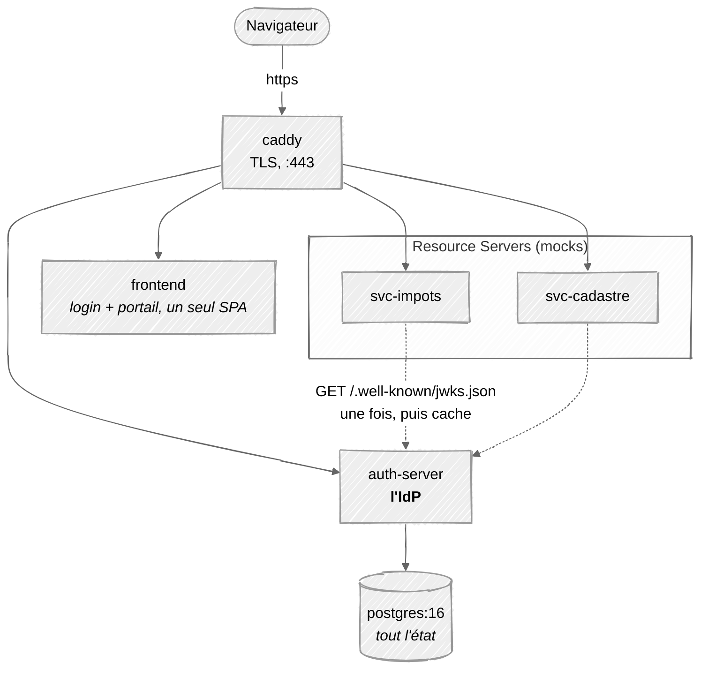
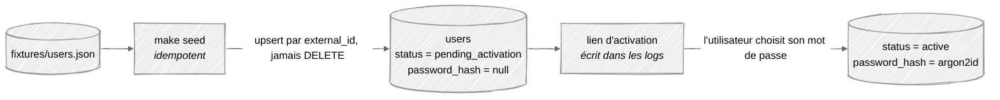
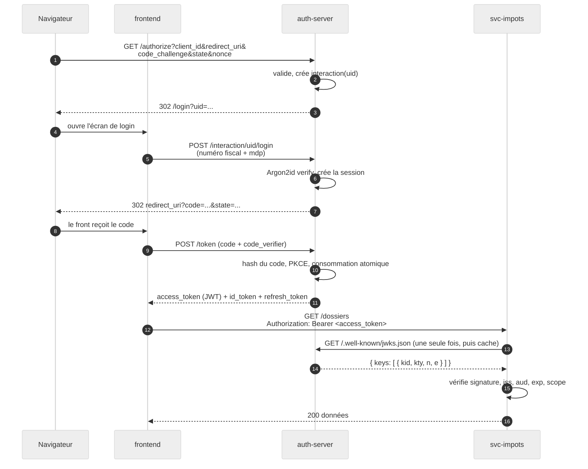
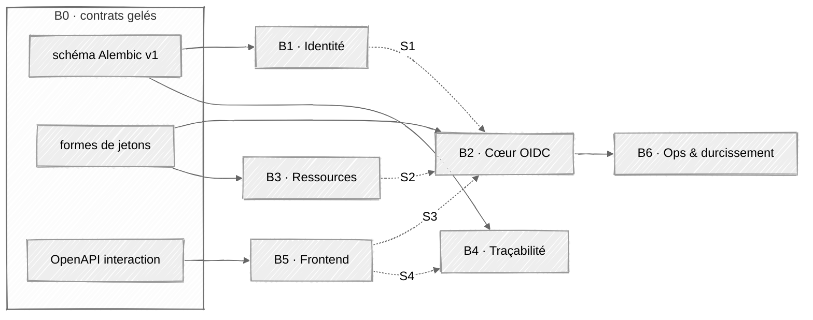

# ADR 0002 — Stack simplifiée

> **Statut : accepté. Remplace l'ADR [0001](0001-choix-stack.md).**
> 0001 reste lisible comme journal de réflexion. Il ne doit plus être suivi.
> Audience : l'équipe + les assistants de code.

---

## 0. Pourquoi cette révision

L'ADR 0001 décrivait un système correct mais surdimensionné : 10 conteneurs,
2 frontends, une dépendance LDAP externe, un cache Valkey, un catcher SMTP,
3 CronJobs, 11 bricks. Chaque élément se justifiait isolément. Ensemble ils
noyaient l'objectif.

**L'objectif du projet n'est pas de livrer un IdP de production. C'est de
comprendre, en les écrivant, deux mécanismes :**

1. **L'échange de jeton** — le flow `authorization_code` + PKCE : comment un
   code à usage unique se transforme en jeton signé, et pourquoi chaque étape
   de la vérification existe.
2. **JWKS** — comment un service tiers valide un jeton **sans jamais rappeler
   le serveur d'authentification**, grâce à une clé publique publiée.

Tout ce qui ne sert pas directement ces deux mécanismes, ou la démo au client,
est du coût sans bénéfice pédagogique. Cet ADR coupe.

Et la contrainte qui rend la coupe non négociable : **le déploiement final est
un cluster Kubernetes fourni par le client.** Chaque conteneur en plus, c'est
un Deployment, un Service, un Secret, une sonde, une PVC. Le travail
d'infrastructure croît plus vite que le nombre de conteneurs.

---

## 1. Ce qu'on coupe, et ce qu'on garde à la place

| Coupé | Pourquoi | Remplacé par |
| --- | --- | --- |
| **Valkey** | Aucun gain de sécurité, gain de perf non mesurable à notre échelle, et un footgun d'éviction documenté (§3) | Tables Postgres avec `expires_at` |
| **OpenLDAP (conteneur)** | Un serveur d'annuaire à configurer pour tester un adaptateur en lecture seule. `slapd` mange des séances entières | `fixtures/users.json` + le **même** port `UserDirectory` (§6) |
| **CronJob de sync LDAP** | Plus d'annuaire à synchroniser | Script de seed lancé à la main / au `make seed` |
| **CronJob de rotation de clés** | La rotation est justement ce qu'on veut *démontrer* — un job nocturne la rend invisible | Endpoint admin `POST /admin/keys/rotate` (§8) |
| **CronJob de nettoyage** | Un conteneur pour un `DELETE` | Nettoyage paresseux dans la requête (§9) |
| **Mailpit** | Plus d'A2F par mail → plus rien à intercepter en volume | `ConsoleMailer` : le lien d'activation/reset est écrit dans les logs du serveur |
| **A2F / MFA** | Décision équipe. **Attention : c'est une réduction de périmètre vis-à-vis du brief client** (§2) | Le *seam* d'étape reste dans `/authorize`, vide (§7) |
| **`portal-frontend` séparé** | Deux builds Vite, deux conteneurs, deux Dockerfiles, deux pipelines, pour un même utilisateur connecté | Un seul SPA `frontend` (§11) |
| **`/introspect`** | Nos jetons sont des JWT validés localement. Personne n'introspecte | — (déjà différé en 0001) |
| **Table `mfa_factors`** | Plus de MFA | — |
| **Suite de conformité OIDF** | MongoDB + serveur Java + httpd + truststore, pour une phase entière | Test smoke pytest (§13). La suite reste une **option de fin de projet si le temps le permet** |

**Compte de conteneurs : 10 → 5.**

---

## 2. Le MFA — à dire au client, pas à cacher

Le brief (`README.md`) liste explicitement *« Authentification multifacteur
(plusieurs facteurs) »* dans le périmètre. **Le retirer est une décision qui
appartient au client, pas à nous.**

Position à tenir au prochain point client, en une phrase :

> Nous livrons d'abord le socle OIDC complet (SSO, jetons, granularité d'accès,
> traçabilité) sans second facteur, puis nous ajoutons l'A2F par mail comme
> étape supplémentaire du parcours. Le flow est conçu pour l'accueillir sans
> refonte.

Et c'est vrai techniquement, à condition de tenir une chose : **le parcours
d'authentification est une machine à étapes, pas une page de login.** Le serveur
répond à la question « qu'est-ce qu'il manque pour authentifier cet
utilisateur ? ». Aujourd'hui la réponse est `["password"]`. Demain
`["password", "otp"]`. Ajouter un facteur = ajouter une implémentation
d'étape, pas réécrire `/authorize`.

Ce *seam* est gratuit — c'est déjà la forme naturelle du flow. Ce qui coûtait,
c'était la table `mfa_factors`, l'enum de types de facteurs, `/me/mfa/factors`
et Mailpit. Ça, c'est coupé.

Les claims `acr` / `amr` restent émis, avec `amr: ["pwd"]` et
`acr: "urn:authentint:acr:pwd"`. Un Resource Server peut donc déjà exiger un
niveau d'authentification — le jour où `mfa` existe, il n'y a rien à changer
côté RS.

---

## 3. Valkey — la question tranchée

Gardé dans 0001 parce que « la montée en charge est la contrainte phare du
brief ». Voici pourquoi ça ne tient pas.

### Ce que Valkey stockait

| Donnée | Devient |
| --- | --- |
| `otp:{uid}` | **disparaît** (plus de MFA) |
| `int:{uid}` — état d'interaction | table `interactions` |
| `rl:{scope}:{key}` — compteurs de rate limit | table `rate_limits` |
| `sid:{sid}` — index de session | **disparaît** — on lit `sessions` directement |

### Gain de sécurité : nul

Valkey ne stockait aucun secret en clair — tout était déjà haché. Le rate
limiting *est* le contrôle de sécurité ; Valkey n'était que l'endroit où vit le
compteur. Un compteur en Postgres limite exactement aussi bien.

Pire : l'ADR 0001 documente lui-même le piège. Avec `maxmemory-policy
allkeys-lru`, sous pression mémoire Valkey supprime silencieusement des
compteurs de rate limit — la protection anti-brute-force disparaît **sans
aucune erreur nulle part**. La parade (`noeviction` + alerting sur la mémoire)
est un contrôle opérationnel de plus à tenir. Un contrôle de sécurité rendu
plus fragile par le cache, pas moins.

### Gain de performance : réel, mais pas à notre échelle

Redis/Valkey gagne quand les écritures de compteurs saturent la base
d'identité — des centaines d'écritures/seconde de pure churn. En démo on en
fait quelques dizaines. Ceci est atomique, partagé entre toutes les réplicas,
et Postgres ne le sent pas passer :

```sql
INSERT INTO rate_limits (bucket, count, expires_at)
VALUES ($1, 1, $2)
ON CONFLICT (bucket) DO UPDATE
  SET count = rate_limits.count + 1
RETURNING count;
```

Précédent qui compte : **Authentik a supprimé sa dépendance obligatoire à Redis
en 2025.10** et tourne sur Postgres seul. Ce n'est pas un jouet, c'est un IdP
en production. Postgres-seul est un motif légitime, pas un compromis.

### Coût payé aujourd'hui

Un StatefulSet de plus dans le cluster, un second pool de connexions, un second
mode de panne, une politique d'éviction à régler, et surtout **une règle
« quelle donnée va où » que chaque personne de l'équipe doit intégrer avant
d'écrire une ligne**. Contre un objectif d'apprentissage qui est JWKS et
l'échange de jeton, ce budget n'achète rien.

### On garde le seam, pas le conteneur

```python
class RateLimiter(Protocol):
    async def hit(self, bucket: str, limit: int, window: timedelta) -> bool:
        """True si autorisé. False si le quota est dépassé."""
```

Une seule implémentation aujourd'hui : `PostgresRateLimiter`. Le jour où le
rapport k6 montre Postgres en goulot sur `rate_limits`, on écrit
`ValkeyRateLimiter` et on change une ligne de câblage.

**Condition de réintroduction, écrite pour ne pas être un débat :** si k6
mesure p95 de `/token` ou du login dégradé de plus de 20 % avec la contention
sur `rate_limits` comme cause identifiée, on ajoute Valkey. Sinon, non.

> **Règle de durabilité, toujours valable et maintenant triviale :** tout est
> en Postgres, donc rien ne peut être perdu par un redémarrage de cache. La
> raison pour laquelle `authorization_codes` devait déjà y être — détecter le
> rejeu d'un code suppose de retrouver la ligne **déjà consommée** — s'applique
> maintenant partout par construction.

---

## 4. Topologie — 5 conteneurs



Les **arêtes en pointillés sont le cœur du projet.** Les services mocks ne
demandent jamais au serveur d'auth « ce jeton est-il valide ? ». Ils
récupèrent ses clés publiques une fois, les gardent en cache, et vérifient la
signature localement. C'est ça, JWKS (§10).

| Conteneur | Rôle | Image |
| --- | --- | --- |
| `caddy` | Terminaison TLS, point d'entrée unique | `caddy:2-alpine` |
| `auth-server` | L'OpenID Provider. Tous les endpoints | Python 3.13, `uvicorn` |
| `frontend` | Login, consentement, activation, reset, portail, compte, admin | `caddy:2-alpine` servant un build Vite |
| `svc-impots`, `svc-cadastre` | Services mockés — **même image**, config différente | petite app FastAPI |
| `postgres` | Toute la persistance | `postgres:16-alpine` |

### Règles réseau — cloisonnement par réseaux Docker

Pas de « tout sur localhost ». Deux réseaux, et un seul port publié dans toute
la stack.

| Réseau | Membres | Propriété |
| --- | --- | --- |
| `edge` (bridge) | `caddy`, `frontend`, `auth-server`, les deux mocks | `caddy` y porte les 4 noms d'hôte comme **alias DNS** |
| `data` (bridge, `internal: true`) | `auth-server`, `postgres` | Aucune passerelle : pas d'accès sortant |

Trois conséquences :

1. **`postgres` est injoignable** depuis les mocks, le frontend et la machine
   hôte. Un mock compromis n'a aucune route vers la base d'identité.
2. **`auth-server` est le seul pont** entre les deux réseaux — et le seul
   composant qui devrait l'être.
3. **Les alias DNS de `caddy` résolvent l'écueil de l'issuer.** `svc-impots`
   appelle `https://auth.authentint.local/.well-known/jwks.json`, exactement
   l'URL que voit le navigateur et exactement le claim `iss`. Sans alias, il
   appellerait `http://auth-server:8000/…` : URL différente, en clair, chemin
   TLS jamais exercé en dev.

Le prix des alias : les mocks doivent faire confiance à l'autorité interne de
Caddy. Le volume `caddy_data` est monté en lecture seule et le client JWKS
pointe explicitement dessus.

> **Aucune clé `ports:` ailleurs que sur `caddy`.** Publier `5432` « juste pour
> DBeaver » annule la conséquence n°1. Pour inspecter la base :
> `docker compose exec postgres psql`.

Ce découpage n'est pas que du développement : il se traduit directement en
`NetworkPolicy` dans le cluster, donc ce qui est vérifié en local est ce qui
est déployé. Topologie détaillée et bloc Compose :
[`docs/architecture.md` §1](../architecture.md#1-vue-densemble).

### Pourquoi garder Caddy alors qu'on simplifie

Parce que Caddy résout précisément le problème que ce projet doit enseigner :
**l'identité de l'émetteur**. Trois choses doivent être identiques au
caractère près — le claim `iss` dans le jeton, le champ `issuer` du document
de découverte, et l'URL que le navigateur appelle. Sans proxy, le navigateur
voit `localhost:8000` et les conteneurs voient `auth-server:8000`. Ce
décalage se contourne pendant tout le projet et casse à la première
validation de jeton.

Accessoirement, `tls internal` génère une autorité de certification locale et
émet les certificats tout seul — pas de `mkcert`. Et sur `localhost` nu, les
cookies ignorent le port : le cookie SSO fuite entre tous les services, ça a
l'air de marcher en local et ça casse dans le cluster.

```caddyfile
auth.authentint.local   { tls internal; reverse_proxy auth-server:8000 }
app.authentint.local    { tls internal; reverse_proxy frontend:80 }
impots.authentint.local { tls internal; reverse_proxy svc-impots:8001 }
cadastre.authentint.local { tls internal; reverse_proxy svc-cadastre:8001 }
```

Ajouter ces noms dans `/etc/hosts` vers `127.0.0.1`.

**C'est un échafaudage de développement, pas de l'architecture.** Dans
Kubernetes, l'Ingress Controller du client le remplace (§12). Ne pas y passer
une séance de débat.

---

## 5. Stack technique

Inchangée par rapport à 0001, moins ce qui devient inutile.

| Couche | Choix | Raison |
| --- | --- | --- |
| Langage | **Python 3.13** | Fluidité de l'équipe |
| HTTP | **FastAPI** (`uvicorn`) | Validation par route, OpenAPI généré — le front en tire ses types |
| ORM / migrations | **SQLAlchemy 2.0** + **Alembic** | Les migrations versionnées sont un livrable (*schéma de BDD*) |
| JOSE | **`joserfc`** | Signature/vérification JWT, JWKS. Suit les RFC de près |
| Hachage mdp | **`argon2-cffi`** | Argon2id, liaison à l'implémentation C de référence |
| Validation | **Pydantic v2** | Chaque paramètre de protocole validé à l'exécution |
| Frontend | **React + Vite + TypeScript** | Un seul build (§11) |
| Tests | **pytest** + **httpx** `ASGITransport`, **Playwright** (e2e) | |
| Charge | **k6** | Scénario des pics fiscaux |
| Observabilité | logs JSON structurés + `/metrics` (format Prometheus) | Pas de stack de collecte. Le cluster du client scrape s'il veut |

### Ce qu'on écrit / ce qu'on n'écrit pas

| On écrit | On n'écrit **pas** |
| --- | --- |
| La machine à états `/authorize` | RSA / SHA-256 / HMAC |
| Les handlers de grant `/token` | Sérialisation et signature JWT |
| Le cycle de vie code + refresh | Le hachage Argon2id |
| Les documents Discovery et JWKS | TLS, Base64url, CSPRNG |

La cryptographie vient de bibliothèques auditées. L'écrire à la main serait un
défaut, pas une démonstration de compétence. **Ce qu'on possède, c'est la
logique de protocole et la gestion d'état** — exactement là où vivent les
vraies vulnérabilités des IdP.

### Délibérément non utilisés

`authlib`, Keycloak, Hydra, Authentik — **ce sont la chose qu'on construit.**
`authlib` mérite la mention explicite : c'est le réflexe Python évident, sa
plomberie de grants est exactement le §7, et l'adopter viderait le projet de
son contenu. Ils restent utiles comme **implémentations de référence à lire**
quand un détail de spec est ambigu.

### Un piège Python à décider au jour 1

**Argon2id tourne dans le processus tenu par le GIL.** Le hachage est
volontairement coûteux — c'est sa fonction. En Python il bloque aussi la boucle
d'événements : pendant un `verify()`, *toutes* les requêtes concurrentes
attendent, pas seulement le login en cours. Chaque appel `hash()` et `verify()`
passe par un thread pool (`run_in_executor`). À décider maintenant, pas après
le run k6.

---

## 6. Source des utilisateurs — JSON au lieu de LDAP

Le brief est explicite : *« Pas de LDAP à setup »*, *« l'enregistrement des
utilisateurs n'est pas à implémenter »*, *« base existante avec des
utilisateurs déjà créés → activer les comptes »*.

Donc : un fichier de fixtures, chargé par un script de seed.

```
fixtures/users.json
```

```json
[
  {
    "external_id": "8f3c2a10-0000-4000-8000-000000000001",
    "numero_fiscal": "1234567890123",
    "nom": "Dupont",
    "prenom": "Marie",
    "email": "marie.dupont@example.gouv.fr",
    "groups": ["cn=agents,ou=groupes,dc=dgfip,dc=fr"]
  }
]
```

### Le port reste le même

C'est le point important : **on garde l'interface, on change
l'implémentation.** Le jour où le client fournit son annuaire, on écrit
`LdapDirectory` et rien d'autre ne bouge.

```python
class UserDirectory(Protocol):
    """Vue en lecture seule de l'annuaire du client."""

    async def find_by_numero_fiscal(self, nf: str) -> DirectoryUser | None:
        """Consultation d'attributs. Ne vérifie jamais d'identifiants."""

    def list_all(self) -> Iterator[DirectoryUser]:
        """Alimentation du provisioning."""


class DirectoryUser(BaseModel):
    external_id: str      # clé de jointure stable (entryUUID côté LDAP)
    numero_fiscal: str
    nom: str
    prenom: str
    email: EmailStr
    groups: list[str]     # DN bruts, mappés vers un rôle chez nous
```

**Un `Protocol`, pas une classe abstraite, et aucune méthode d'écriture.** La
garantie de lecture seule vient de la *forme* de l'interface : il n'existe pas
de méthode pour écrire, donc on ne peut pas écrire par accident.

Implémentation unique aujourd'hui : `JsonDirectory`.

### Ce que la lecture seule implique sur les mots de passe

C'est la tension du brief, et elle se résout ici. Si on ne peut pas écrire dans
l'annuaire, on ne peut pas y écrire de mot de passe. Or *réinitialisation de
mot de passe* et *activation de compte* sont toutes deux **dans le périmètre**,
et toutes deux sont des écritures. Donc **le magasin de credentials est le
nôtre.**

| Donnée | Propriétaire |
| --- | --- |
| Hash du mot de passe (Argon2id) | **notre Postgres** |
| Jetons d'activation et de reset | **notre Postgres** |
| Sessions, audit, consentements | **notre Postgres** |
| nom, prénom, mail, rattachement | annuaire (lecture) |
| Appartenance à un groupe → rôle | annuaire (lecture), mappé chez nous |

Conséquence de robustesse, à souligner au client : **une panne de l'annuaire ne
peut pas verrouiller les utilisateurs dehors.** Les mots de passe sont locaux,
les sessions sont locales ; seule la *fraîcheur* des attributs se dégrade.

### Flux de provisioning



Le seed est **idempotent** et **ne supprime jamais**. Une entrée disparue passe
`status = disabled` et génère un événement d'audit. Supprimer en dur sur une
lecture ratée effacerait la base des utilisateurs — c'est la règle qui doit
survivre au passage en LDAP réel.

### Questions à poser au client quand même

Le JSON ne dispense pas de poser les questions ; il dispense seulement
d'attendre les réponses pour avancer. Voir §14.

---

## 7. Modèle d'identité et parcours d'authentification

### Les trois niveaux

| Niveau | claim `role` | Droits |
| --- | --- | --- |
| Admin | `admin` | CRUD utilisateurs, CRUD clients, lecture audit |
| Agent | `agent` | Accès étendu aux services |
| Contribuable | `contribuable` | Accès restreint |

Tous s'authentifient de la même façon : **numéro fiscal + mot de passe**.

### La règle d'identifiant qui compte

**Le numéro fiscal est un identifiant de connexion, jamais le claim `sub`.**

- `sub` = un UUIDv4 opaque, stable par utilisateur, sans signification hors de
  notre système.
- Le numéro fiscal est une donnée personnelle (identifiant fiscal français). Il
  ne doit fuiter ni dans un JWT remis à une application, ni dans un log, ni
  dans une URL, ni dans un message d'erreur.

Le brief s'ouvre sur *« système d'information précédemment compromis »*. C'est
la décision de conception la plus défendable du projet — à écrire dans le
README.

### Scopes

```
# OIDC standard
openid, profile, email, offline_access

# Accès aux services (granularité fine)
svc:impots.read      svc:impots.write
svc:cadastre.read    svc:cadastre.write
svc:admin.users      svc:admin.audit
```

La table rôle → scopes autorisés est **côté serveur, jamais fournie par le
client**. `/authorize` calcule :

```
granted = requested ∩ allowed(role) ∩ client.allowed_scopes
```

et n'émet que cette intersection. Réduire silencieusement est le comportement
correct selon la RFC 6749 ; journaliser chaque réduction.

### Claims de l'ID token

```json
{
  "iss": "https://auth.authentint.local",
  "sub": "9f1c...uuid",
  "aud": "portail-web",
  "exp": 1750000000,
  "iat": 1749999700,
  "auth_time": 1749999700,
  "nonce": "<réémis tel quel>",
  "acr": "urn:authentint:acr:pwd",
  "amr": ["pwd"],
  "name": "Marie Dupont",
  "given_name": "Marie",
  "family_name": "Dupont",
  "role": "agent",
  "sid": "<id de session, pour le logout>"
}
```

`acr` et `amr` disent *comment* l'utilisateur s'est authentifié. Avec l'A2F
ajoutée plus tard, `amr` devient `["pwd", "otp"]` et `acr`
`urn:authentint:acr:mfa` — le Resource Server qui exige déjà un niveau n'a rien
à changer.

---

## 8. Modèle de données

Les modèles SQLAlchemy + les migrations Alembic sont la source de vérité ; ceci
est l'intention.

### Identité

```
users
  id                uuid pk
  external_id       text unique null   -- clé de jointure annuaire
  numero_fiscal     text unique        -- identifiant de login, chiffré au repos
  email             text               -- unique sur lower(email)
  nom, prenom       text
  password_hash     text null          -- null jusqu'à l'activation. LE NÔTRE.
  role              enum(admin, agent, contribuable)
  status            enum(pending_activation, active, locked, disabled)
  password_changed_at  timestamptz
  failed_login_count   int default 0
  locked_until      timestamptz null
  synced_at         timestamptz null
  created_at, updated_at
```

### Credentials et récupération

```
activation_tokens / password_reset_tokens
  id, user_id, token_hash, expires_at, consumed_at, requested_ip
```

> **Règle absolue : ne jamais stocker en clair un jeton d'activation, de reset,
> un code d'autorisation ou un refresh token.** On les hache exactement comme
> un mot de passe. Si la base fuite, ces jetons doivent être inertes.

### Clients OAuth et état du flow

```
clients
  id                text pk           -- client_id
  name              text
  type              enum(public, confidential)
  secret_hash       text null         -- confidentiels uniquement, argon2id
  redirect_uris     text[]            -- correspondance EXACTE, pas de wildcard
  post_logout_redirect_uris text[]
  allowed_grants    text[]
  allowed_scopes    text[]
  require_consent   boolean

interactions                          -- ex-Valkey int:{uid}
  uid               text pk
  client_id, redirect_uri, scope, state, nonce
  code_challenge, code_challenge_method
  stage             text              -- 'password' | 'consent' | 'done'
  user_id           uuid null         -- rempli quand l'étape mdp passe
  expires_at        timestamptz       -- now() + 10 min
  created_at

authorization_codes
  code_hash         text pk
  client_id, user_id, session_id
  redirect_uri      text              -- doit correspondre à /token
  scope, nonce
  code_challenge, code_challenge_method
  auth_time         timestamptz
  acr, amr
  expires_at        timestamptz       -- now() + 60s
  consumed_at       timestamptz null

refresh_tokens
  token_hash        text pk
  family_id         uuid              -- détection de rejeu
  parent_hash       text null
  client_id, user_id, session_id, scope
  issued_at, expires_at
  rotated_at, revoked_at, revocation_reason

consents
  id, user_id, client_id, scopes text[], granted_at, revoked_at
```

### Sessions, audit, limitation de débit

```
sessions                              -- la session SSO
  id                uuid pk           -- devient le claim `sid`
  user_id
  device_label      text              -- "Firefox / Windows"
  user_agent, ip_address inet
  created_at, last_seen_at
  expires_at, revoked_at, revocation_reason
  acr, amr

audit_events                          -- APPEND ONLY
  id                bigserial
  occurred_at       timestamptz
  actor_user_id     uuid null
  actor_ip          inet
  event_type        text              -- login.success, token.issued, ...
  client_id         text null
  session_id        uuid null
  outcome           enum(success, failure)
  detail            jsonb             -- JAMAIS de secret ni de numéro fiscal
  request_id        text              -- id de corrélation injecté par Caddy

rate_limits                           -- ex-Valkey rl:*
  bucket            text pk           -- "login:ip:198.51.100.7:20260917T1035"
  count             int
  expires_at        timestamptz
```

**Rendre l'audit append-only au niveau de la base :** révoquer `UPDATE` et
`DELETE` sur `audit_events` pour le rôle applicatif. Deux lignes de SQL, et ça
transforme la *traçabilité* d'une affirmation en garantie.

```sql
REVOKE UPDATE, DELETE ON audit_events FROM authentint_app;
```

### Gestion des clés

```
signing_keys
  kid               text pk
  alg               text              -- RS256
  public_jwk        jsonb
  private_pem_encrypted text
  status            enum(next, active, retired)
  not_before, not_after, created_at
```

### Nettoyage sans CronJob

Chaque table à `expires_at` est nettoyée **paresseusement**, dans la requête
qui la touche :

```sql
DELETE FROM rate_limits WHERE expires_at < now();
```

Appelé de façon probabiliste (1 requête sur 100) ou au démarrage. Les lignes
expirées sont de toute façon **filtrées à la lecture** — leur présence en base
n'est jamais un problème de correction, seulement d'espace disque. Un conteneur
CronJob pour ça est disproportionné.

Exception : `audit_events` ne se nettoie pas. La rétention est une question
client (§14).

---

## 9. Endpoints

### OIDC / OAuth2 — définis par la spec

| Méthode | Chemin | Note |
| --- | --- | --- |
| GET | `/.well-known/openid-configuration` | Discovery (RFC 8414) |
| GET | `/.well-known/jwks.json` | Clés publiques, adressées par `kid` |
| GET | `/authorize` | Valide, puis 302 vers le frontend |
| POST | `/token` | `authorization_code`, `refresh_token` |
| GET/POST | `/userinfo` | Protégé par Bearer |
| POST | `/revoke` | RFC 7009 |
| GET | `/end-session` | Déconnexion initiée par l'application |

### API d'interaction — la nôtre, consommée par le frontend

| Méthode | Chemin | Note |
| --- | --- | --- |
| GET | `/interaction/{uid}` | De quoi cette authentification en attente a-t-elle besoin ensuite ? |
| POST | `/interaction/{uid}/login` | numéro fiscal + mot de passe |
| POST | `/interaction/{uid}/consent` | Accorder / refuser les scopes |

> Le `uid` est une **poignée opaque vers un état serveur**. Le client ne
> renvoie jamais `client_id`, `scope` ni `redirect_uri` — ils restent côté
> serveur. Ça supprime d'un coup toute une classe d'attaques par altération de
> paramètres.

`POST /interaction/{uid}/mfa/send` et `/mfa/verify` sont les deux routes que
l'ajout de l'A2F créera. Rien d'autre.

### Cycle de vie du compte

| Méthode | Chemin |
| --- | --- |
| POST | `/account/activation/request` |
| POST | `/account/activation/confirm` |
| POST | `/account/password-reset/request` |
| POST | `/account/password-reset/confirm` |

> **Les deux endpoints `request` doivent répondre exactement la même chose que
> le compte existe ou non** — sinon ils deviennent des oracles d'énumération de
> comptes sur un espace de numéros fiscaux. Réponse identique **et** temps de
> réponse comparable.

En dev, `ConsoleMailer` écrit le lien dans les logs :

```
[mail] to=marie.dupont@example.gouv.fr subject="Activation de votre compte"
       link=https://app.authentint.local/activate?token=xY3...
```

Interface `Mailer` avec une seule méthode ; `SmtpMailer` s'ajoute le jour où le
client dit quel relais utiliser.

### Self-service (protégé par Bearer)

| Méthode | Chemin |
| --- | --- |
| GET | `/me` |
| GET | `/me/sessions` — *plusieurs appareils* |
| DELETE | `/me/sessions/{id}` |
| GET | `/me/audit` — son propre historique de connexion |
| POST | `/me/password` |

### Admin (`svc:admin.*`)

| Méthode | Chemin |
| --- | --- |
| GET/POST/PATCH/DELETE | `/admin/users` |
| POST | `/admin/users/{id}/lock` · `/unlock` · `/resend-activation` |
| GET/POST/PATCH/DELETE | `/admin/clients` |
| GET | `/admin/audit` (filtrer, paginer, exporter) |
| GET | `/admin/sessions` |
| POST | `/admin/keys/rotate` — **remplace le CronJob de rotation** (§10) |

### Ops

`/health/live`, `/health/ready`, `/metrics` — nécessaires aux sondes Kubernetes.

---

## 10. `/authorize` et `/token` — la machine à états

C'est le cœur du système. **L'ordre compte ; ne pas réordonner.**

### `/authorize`

1. **Parser et valider.** Le `client_id` existe-t-il ? Sinon → page d'erreur.
   **Ne jamais rediriger vers un `redirect_uri` non validé.**
2. **Correspondance exacte du `redirect_uri`** avec `clients.redirect_uris`
   (égalité de chaînes, pas de préfixe, pas de wildcard). Non-correspondance →
   page d'erreur, aucune redirection. *C'est la vulnérabilité n°1 des IdP.*
3. À partir d'ici seulement, les erreurs peuvent rediriger avec `error=` et
   `state`.
4. Valider `response_type=code` (**code uniquement** ; ni implicit ni hybrid),
   `scope` contient `openid`, `state` présent, `nonce` présent.
5. **Exiger PKCE** : `code_challenge` présent,
   `code_challenge_method=S256`. Rejeter `plain`. L'exiger aussi des clients
   confidentiels.
6. Y a-t-il un cookie de session SSO vivant satisfaisant l'`acr` demandé ?
   - Oui → sauter à l'étape 9. **C'est ça, le SSO.** Aucun état d'interaction
     n'est écrit.
   - Non → continuer.
7. Créer l'état d'interaction (table `interactions`, TTL 10 min), obtenir un
   `uid`, puis 302 vers `frontend/login?uid=…`.

   *Ces deux étapes sont dans cet ordre exprès.* Le chemin SSO porte l'essentiel
   du trafic en pic ; écrire l'état d'interaction avant de vérifier le cookie
   ferait faire à la branche la plus fréquentée une écriture qu'elle ne relit
   jamais.
8. Le frontend enchaîne les étapes. Chacune poste vers l'API d'interaction ;
   **c'est le serveur qui décide de l'étape suivante.** Ne jamais croire le
   client sur l'étape où il prétend être.
9. Consentement : sauté si `require_consent=false` ou si une ligne `consents`
   correspondante existe.
10. Émettre un code d'autorisation : **TTL 60 s, usage unique**, lié à
    `client_id + redirect_uri + code_challenge + user + session`.
11. 302 vers `redirect_uri?code=…&state=…`.
12. Audit : `authorize.granted`.

### `/token`, grant `authorization_code`

1. Authentifier le client (`client_secret_basic` pour les confidentiels ; PKCE
   seul pour les publics).
2. Retrouver le code **par son hash**. Introuvable → `invalid_grant`.
3. Déjà consommé ? → `invalid_grant` **et révoquer tous les jetons descendant
   de ce code.** Un code rejoué signifie que le code a fuité.
4. Expiré → `invalid_grant`.
5. `client_id` et `redirect_uri` doivent correspondre à ce qui a été stocké.
6. Vérifier PKCE : `BASE64URL(SHA256(code_verifier)) == code_challenge`.
7. Marquer consommé **atomiquement** :
   `UPDATE … SET consumed_at = now() WHERE code_hash = $1 AND consumed_at IS
   NULL RETURNING …`. Deux échanges concurrents ne doivent pas réussir tous
   les deux — et avec Postgres comme seul magasin, c'est une seule requête.
8. Émettre : access token (JWT, 10 min), ID token (5 min), refresh token si
   `offline_access` (30 jours, rotatif).

### Rotation du refresh avec détection de rejeu

Chaque rafraîchissement émet un **nouveau** refresh token et révoque son parent,
en conservant `family_id`. Si un token **déjà révoqué** d'une famille est
présenté, c'est que le token a fuité : on révoque **toute la famille**, on tue
la session, on émet un événement d'audit de sévérité haute.

C'est le mécanisme qui limite le rayon d'explosion après une compromission —
directement pertinent vu l'historique annoncé par le client.

### Le flow complet, vu de bout en bout



**Les étapes 13 à 15 sont l'objectif pédagogique du projet.** Le service
`svc-impots` ne demande jamais au serveur d'auth si un jeton est valide. Il
télécharge les clés publiques une fois et tranche tout seul, indéfiniment.

---

## 11. JWKS — le mécanisme à comprendre

Cette section est celle qu'il faut lire en entier avant d'écrire du code.

### Le problème que JWKS résout

Le serveur d'authentification émet des jetons. Des dizaines de services doivent
savoir si un jeton est authentique. Trois façons de faire :

| Approche | Ce qui cloche |
| --- | --- |
| Chaque service appelle l'IdP à chaque requête (*introspection*) | L'IdP devient un point de passage obligé de tout le trafic de tous les services. Un IdP lent = tout est lent. Un IdP en panne = tout est en panne |
| Un secret partagé (HMAC / HS256) | Chaque service doit détenir la clé qui **signe**. Un seul service compromis, et l'attaquant fabrique des jetons pour tout le système |
| **Signature asymétrique + JWKS** | L'IdP garde la clé privée. Les services n'ont que la clé **publique** : elle ne permet que de vérifier, jamais de signer |

La troisième est la bonne, et c'est celle qu'on implémente.

### Pourquoi RS256 et pas HS256

- **HS256** est symétrique : la même clé signe et vérifie. Pour que `svc-impots`
  vérifie, il faut lui donner de quoi signer. On multiplie les copies du
  pouvoir d'émettre des jetons.
- **RS256** est asymétrique : la clé privée signe (elle ne quitte jamais
  `auth-server`), la clé publique vérifie (elle est publiée au monde entier).
  Un `svc-impots` entièrement compromis ne permet toujours pas de forger un
  jeton.

### La chaîne de découverte

Un service ne devrait connaître **qu'une seule URL** : celle de l'émetteur.
Tout le reste se découvre.

```
1.  L'issuer est https://auth.authentint.local
2.  GET https://auth.authentint.local/.well-known/openid-configuration
        → { "issuer": "...", "jwks_uri": "https://auth.../.well-known/jwks.json", ... }
3.  GET <jwks_uri>
        → { "keys": [ { "kid": "2026-09-a", "kty": "RSA", "alg": "RS256",
                        "use": "sig", "n": "...", "e": "AQAB" } ] }
4.  Mettre le résultat en cache
5.  À chaque jeton : lire le `kid` de l'en-tête, prendre la clé correspondante,
    vérifier la signature — localement, sans aucun appel réseau
```

`n` et `e` sont le modulus et l'exposant public RSA en base64url. Ce sont
littéralement les composants de la clé publique — c'est pour ça qu'on peut les
publier sans authentification.

### Ce que le Resource Server doit vérifier — toutes les lignes comptent

```python
claims = jwt.decode(
    token,
    key=jwks.find(header["kid"]),
    algorithms=["RS256"],        # ÉPINGLÉ. Jamais lu depuis le jeton.
)
assert claims["iss"] == "https://auth.authentint.local"
assert "svc-impots" in claims["aud"]
assert claims["exp"] > now()
assert "svc:impots.read" in claims["scope"].split()
```

Chacune de ces lignes bloque une attaque réelle :

| Vérification | Ce qu'elle bloque |
| --- | --- |
| `algorithms=["RS256"]` épinglé | **`alg: none`** — un jeton sans signature que la bibliothèque accepterait si elle croyait l'en-tête. Et la **confusion d'algorithme** : signer en HS256 en utilisant la clé publique RSA comme secret HMAC. La clé publique est publique — sans épinglage, n'importe qui forge |
| `iss` | Un jeton authentique émis par *un autre* serveur OIDC |
| `aud` | Un jeton légitime destiné à `svc-cadastre` rejoué contre `svc-impots` |
| `exp` | Le rejeu d'un jeton volé il y a trois mois |
| `scope` | Un utilisateur authentifié mais non autorisé sur *cette* ressource |

> **Épingler l'algorithme est la règle la plus importante de la liste.** Les
> deux vulnérabilités les plus célèbres des bibliothèques JWT (`alg: none` et
> la confusion RS256→HS256) viennent toutes les deux du fait de laisser le
> **jeton** décider comment il doit être vérifié. Celui qui vérifie décide.

### Pourquoi le `kid`

Le `kid` (*key id*) est dans l'en-tête du JWT :

```json
{ "alg": "RS256", "typ": "JWT", "kid": "2026-09-a" }
```

Sans lui, un service détenant trois clés devrait les essayer toutes. Avec lui,
il sait immédiatement laquelle utiliser — et surtout, **la rotation devient
possible sans interruption** (§12).

### Règles de cache

1. **Mettre le JWKS en cache**, sinon on a réinventé l'introspection avec un
   appel réseau par requête.
2. **Rafraîchir sur `kid` inconnu**, une seule fois, avec un anti-rebond. Un
   `kid` inconnu signifie généralement « rotation depuis mon dernier
   téléchargement ». Sans ce rafraîchissement, la rotation casse tous les
   services jusqu'au prochain redémarrage.
3. **Limiter le taux de ce rafraîchissement.** Sinon un attaquant envoyant des
   jetons avec des `kid` aléatoires transforme chaque requête en appel vers
   l'IdP — le déni de service qu'on essayait justement d'éviter.

### Comment le démontrer, concrètement

Trois manipulations à faire en séance, elles valent mieux qu'un schéma :

1. Coller un jeton dans un décodeur — voir l'en-tête, les claims, la signature.
   Constater que **les claims sont lisibles par n'importe qui**. Un JWT est
   signé, pas chiffré. Ne jamais y mettre le numéro fiscal.
2. Modifier un caractère du payload, rejouer la requête → `401`. La signature
   couvre le contenu.
3. Forger un jeton `alg: none` et le rejouer → `401`, parce que l'algorithme
   est épinglé. Si ça passe, on a trouvé un vrai bug.

Ces trois manipulations sont aussi trois tests de régression (§13).

---

## 12. Rotation des clés — sans CronJob

La rotation est précisément le mécanisme que JWKS rend possible. La cacher dans
un job nocturne, c'est se priver de la démonstration.

**Endpoint admin, déclenché à la main :**

```
POST /admin/keys/rotate     (scope svc:admin.users)
```

Les trois états :

| Statut | Rôle |
| --- | --- |
| `next` | Générée, **publiée dans le JWKS**, ne signe pas encore |
| `active` | Signe tous les nouveaux jetons |
| `retired` | Ne signe plus, **reste publiée** jusqu'à l'expiration du dernier jeton signé avec elle |

Une rotation promeut `next` → `active` → `retired`, et crée une nouvelle
`next`.

**La raison pour laquelle `retired` reste publiée est la clé de voûte :** des
jetons signés par l'ancienne clé circulent encore, avec 10 minutes de validité.
Retirer la clé du JWKS immédiatement les invaliderait tous d'un coup. En la
gardant publiée le temps qu'ils expirent, la rotation est **invisible pour les
utilisateurs**. C'est le motif classique de rotation sans interruption, et il
tient en trois statuts.

Au démarrage : si aucune clé `active` n'existe, en générer une. Un seul
processus doit le faire — prendre un `SELECT … FOR UPDATE` ou un advisory lock
Postgres. **C'est exactement le bug que `--scale auth-server=3` révèle** (§13) :
trois réplicas qui génèrent chacun leur paire de clés, et un jeton sur trois
échoue à la vérification.

---

## 13. Frontend unique

Un seul build Vite, un seul conteneur, un seul Dockerfile.

```
/login       numéro fiscal + mot de passe
/consent     liste des scopes en français clair
/activate    premier mot de passe depuis le lien d'activation
/reset       demande + confirmation
/error       rendu d'erreur sûr — ne jamais réafficher un paramètre brut

/            tuiles de services, filtrées par rôle
/account             profil
/account/sessions    appareils actifs, boutons de révocation
/account/activity    son propre historique de connexion
/admin/users         admin uniquement
/admin/audit         admin uniquement
```

### Ce qu'on perd en fusionnant, et pourquoi c'est acceptable

L'ADR 0001 séparait `auth-frontend` du portail, en suivant le motif d'Ory
Hydra : l'application de login vit en dehors du serveur d'autorisation, donc
celui-ci reste une API pure. L'argument est réel et c'est le bon choix en
production.

Ici il coûte un second build, un second conteneur, un second Deployment, un
second Ingress, et un second pipeline — pour un bénéfice de découplage que
notre échelle ne perçoit pas. **L'API reste pure de toute façon** : le serveur
d'auth ne rend aucune page HTML, il ne fait que rediriger. La séparation qui
compte — API vs. rendu — est préservée. Ce qu'on fusionne, ce sont deux
applications clientes de cette même API.

Bénéfice secondaire : les deux parcours partagent une origine, ce qui simplifie
le périmètre des cookies au lieu de le compliquer.

### Règle de sécurité côté front

**Filtrer les tuiles par rôle, c'est de la présentation, pas de la sécurité.**
Chaque service mock doit valider indépendamment le jeton et ses scopes.

Construire un service mock qui **rejette correctement** un jeton sous-scopé, et
le démontrer : c'est la preuve de la granularité d'accès demandée par le brief.
Une tuile cachée ne prouve rien.

---

## 14. Kubernetes

Le client fournit le cluster. On livre un **chart Helm** dans `k8s/`.

Ce que la simplification change concrètement :

| 0001 | 0002 |
| --- | --- |
| 6 Deployments + 2 StatefulSets | 4 Deployments + 1 StatefulSet |
| 3 CronJobs | 0 |
| Secrets : BDD, clé de chiffrement, SMTP, bind LDAP | BDD, clé de chiffrement |

- `Deployment` pour `auth-server` (≥3 réplicas), `frontend`, les deux mocks
- `StatefulSet` ou base managée pour Postgres — **[À VALIDER]** le cluster
  fournit-il déjà un opérateur Postgres ?
- `Secret` pour les credentials BDD et la clé de chiffrement des clés privées —
  **[À VALIDER]** le client impose-t-il Vault / Sealed Secrets ?
- `ConfigMap` pour l'URL de l'issuer et les TTL de jetons
- `Ingress` avec cert-manager. **Garder `ingressClassName` et les annotations
  configurables dans `values.yaml`** — le cluster est celui du client, donc on
  utilise le contrôleur qu'il fait déjà tourner. Caddy est notre edge de dev et
  ne part pas dans le cluster. **[À VALIDER]**
- `HorizontalPodAutoscaler`, `PodDisruptionBudget`, sondes liveness/readiness
- `NetworkPolicy` : seul `auth-server` peut joindre Postgres

**Multi-site / plusieurs centres — [À VALIDER].** L'actif/actif entre sites
suppose soit un Postgres répliqué globalement, soit un primaire/secours avec un
basculement documenté. Et **les clés de signature doivent être partagées entre
les sites**, ou chaque site publie son propre `kid` dans un JWKS commun — ce
qui marche, grâce au `kid`, et vaut la peine d'être expliqué au client.

### Montée en charge

Le brief annonce **20 millions d'utilisateurs simultanés**.

**[À VALIDER — à soulever explicitement.]** 20 M de sessions réellement
concurrentes dépasserait le trafic de presque tout service public européen. Il
s'agit très probablement de 20 M d'utilisateurs *sur la période*. Demander :
authentifications par seconde en pic, et sessions concurrentes en pic. Poser la
question est en soi du bon conseil, et la réponse change l'architecture d'un
ordre de grandeur. Ne pas concevoir silencieusement pour l'une des deux
lectures.

Trois choix tiennent quelle que soit la réponse :

1. **Jetons d'accès sans état.** JWT RS256 courts, validés localement contre un
   JWKS en cache. Zéro requête base par appel d'API. *Revenir là-dessus après
   coup est douloureux — c'est une décision du jour 1.*
2. **Pods `auth-server` sans état.** Tout l'état en Postgres → scaling
   horizontal et redémarrages progressifs gratuits.
3. **Argon2id est volontairement coûteux**, donc c'est le goulot du login.
   Calibrer les paramètres sur le matériel mesuré, et le faire tourner dans un
   thread pool (§5).

Partitionner `audit_events` par mois **dès maintenant** : c'est le seul élément
de cette liste qui soit pénible à rattraper une fois la table grosse. PgBouncer
et les réplicas de lecture sont de la configuration de déploiement, pas du
code : les écrire dans les valeurs Helm, les activer quand k6 le dit.

---

## 15. Tests

### En continu, dans chaque brick

| Niveau | Outil | Couvre |
| --- | --- | --- |
| Unitaire | pytest | Vérification PKCE, intersection de scopes, TTL, paramètres Argon2 |
| Intégration | httpx `ASGITransport` | Les routes contre le vrai Postgres du compose |
| Smoke spec | pytest, ~30 lignes | Un flow complet : réémission du `nonce`, `at_hash`, stabilité de `sub`, aller-retour du `state` |
| E2E | Playwright | Un parcours heureux |

Les tests d'intégration utilisent **le Postgres du compose**, pas
testcontainers. La stack est déjà debout ; un second mécanisme pour obtenir une
base ne rapporte rien.

### Tests de régression de sécurité — écrits comme des assertions

Ce sont eux la vraie valeur de sortie du projet, à montrer au client :

- `redirect_uri` non conforme → rejeté, **aucune redirection émise**
- rejeu d'un code d'autorisation → les deux jeux de jetons révoqués
- réutilisation d'un refresh token → **toute la famille** révoquée
- jeton `alg: none` → rejeté
- jeton HS256 signé avec la clé publique RSA → rejeté
- jeton expiré / mauvais `aud` / mauvais `iss` → rejeté **au Resource Server**
- jeton sous-scopé → 403 au service mock
- énumération de comptes : réponses **et temps de réponse** identiques pour un
  utilisateur connu et inconnu
- password spray → la limite par IP se déclenche
- rotation de clé → les jetons émis avant restent valides jusqu'à leur `exp`

### Le test multi-réplicas — à lancer tôt

```bash
docker compose up --scale auth-server=3
```

**Tout ce qui ne fonctionne qu'à `--scale 1` est un bug Kubernetes trouvé en
avance** : génération de clés par processus (§12), rate limiting en mémoire,
état d'interaction collant à un processus. À lancer dès que `/token` répond,
pas à la fin. Ces bugs-là sont structurels ; les découvrir en dernière phase
veut dire réécrire une brick sans temps restant.

### Conformité OIDF — en option de fin

La suite de l'OpenID Foundation (<https://gitlab.com/openid/conformance-suite/>)
est l'étalon-or, gratuite à utiliser hors certification formelle. Elle demande
MongoDB, un serveur Java, un front httpd, un import de truststore et un
alignement d'issuer identique dedans et dehors des conteneurs.

**Décision : ce n'est plus une phase du plan, c'est un bonus de fin de projet.**
Le test smoke pytest ci-dessus attrape la majorité de ce qu'elle attraperait,
pour zéro infrastructure. Si le temps le permet, lancer
`oidcc-basic-certification-test-plan` — et s'attendre à un mur d'échecs au
premier passage. Chaque échec est un vrai bug de spec, et le journal des
corrections est une excellente pièce pour la revue client.

---

## 16. Checklist sécurité

- [ ] Argon2id pour les mots de passe et les secrets clients (jamais SHA-*)
- [ ] Argon2id appelé dans un thread pool, jamais sur la boucle d'événements
- [ ] Tout code / refresh token / jeton de reset stocké **haché**
- [ ] RS256, clés asymétriques, **algorithme épinglé à la vérification**
- [ ] Correspondance exacte du `redirect_uri`, aucun wildcard
- [ ] PKCE S256 obligatoire, pour tous les types de clients
- [ ] Codes : 60 s, usage unique, consommation atomique
- [ ] Rotation du refresh + détection de rejeu de famille
- [ ] `sub` = UUID opaque ; numéro fiscal jamais dans un JWT, une URL, un log
- [ ] Cookies de session : `HttpOnly`, `Secure`, `SameSite=Lax`, préfixe `__Host-`
- [ ] Rate limits sur `/token`, login, reset — par IP **et** par compte
- [ ] Le rate limiting échoue **fermé** : si le compteur est indisponible, on
      refuse. Échouer ouvert supprime la protection anti-brute-force exactement
      au moment où quelque chose ne va pas
- [ ] Verrouillage de compte avec backoff, et un chemin de déverrouillage admin
- [ ] CSP stricte sur le frontend, aucun script inline
- [ ] CORS en liste blanche, jamais `*`
- [ ] Un seul port publié dans toute la stack : `caddy:443`. `postgres` sur un
      réseau `internal: true`, joignable par le seul `auth-server`
- [ ] Audit append-only au niveau des privilèges base
- [ ] Secrets depuis l'environnement / un gestionnaire, jamais commités
- [ ] Scan de dépendances en CI (`pip-audit`, `npm audit`) et lockfile commité
- [ ] Modèle de menaces rédigé dans `docs/threat-model.md`

---

## 17. Plan de construction — 6 bricks

11 bricks devenaient un tableau de bord à tenir. En voici 6.

**La règle qui rend le parallélisme possible :** les bricks dépendent de
**contrats gelés**, jamais du code des autres. Si une équipe doit lire la
source d'une autre pour savoir quoi construire, le contrat n'était pas assez
précis et les deux équipes sont devenues une seule.

Corollaire : **chaque couloir démarre contre un faux.** Attendre la vraie
dépendance, c'est ce qui retransforme un plan parallèle en file d'attente.

### B0 — socle et contrats

Une séance courte, tout le monde dans la pièce. Rien d'autre ne démarre avant.

| Contrat | Artefact | Débloque |
| --- | --- | --- |
| Forme de la base | `alembic/versions/0001_*.py` (§8) | B1, B4 |
| Formes de jetons et claims | Modèles Pydantic ID token / access token (§7) | B2, B3 |
| API d'interaction | Schéma OpenAPI `/interaction/{uid}/*` (§9) | B5 |
| Scopes et codes d'erreur | Table rôle→scopes, codes `error=` OAuth (§7) | B2, B3, B5 |

Aussi dans B0 : compose debout, Caddy, Postgres, `/health/live`,
`/health/ready`, request-id injecté à l'edge, CI qui lance `pytest`.

### Les bricks

| # | Brick | Possède | Démarre contre | Fini quand |
| --- | --- | --- | --- | --- |
| **B0** | Socle & contrats | Compose, Caddy, PG, migration v1, CI | — | Stack debout, 4 contrats mergés |
| **B1** | Identité | `users`, `JsonDirectory`, seed, Argon2id, activation, reset, verrouillage | `fixtures/users.json` | Un utilisateur : seed → activé → mot de passe vérifié, en pytest |
| **B2** | Cœur OIDC | Discovery, JWKS, keystore, rotation, `/authorize`, `/token`, PKCE, codes, rotation refresh, `/userinfo`, `/revoke`, `/end-session` | `fake_authenticate()` rendant un uuid seedé | Smoke spec vert ; `--scale 3` propre |
| **B3** | Ressources & scopes | `svc-impots`, `svc-cadastre`, validation JWKS, application des scopes | JWT signé jetable + un `jwks.json` commité | Jeton sous-scopé → 403 ; `alg:none` → rejeté |
| **B4** | Traçabilité | `audit_events`, `sessions`, `rate_limits`, `/me/*` | Les événements émis par ce qui existe déjà | Append-only appliqué au niveau des privilèges base |
| **B5** | Frontend | Machine à étapes, login, consentement, activation, reset, portail, écrans admin | Mock OpenAPI (MSW) | Parcours Playwright vert contre le mock |
| **B6** | Ops & durcissement | k6, chart Helm, suite de régression sécurité (§15) | Système complet | Rapport k6 produit ; assertions de sécurité vertes |

### Les seams — où les faux meurent

Les faux *sont* le planning. Chaque suppression est un événement d'intégration
**planifié et porté par deux personnes**, pas une découverte tardive.

| Seam | Faux supprimé | Porté par |
| --- | --- | --- |
| **S1** | `fake_authenticate()` → la vraie vérification de mot de passe de B1 | B1 + B2 |
| **S2** | JWKS jetable → les vraies clés de signature de B2 | B3 + B2 |
| **S3** | Mock OpenAPI → la vraie API d'interaction de B2 | B5 + B2 |
| **S4** | Données bouchonnées du front → vraies sessions et audit de B4 | B5 + B4 |



Les arêtes pleines sont des dépendances de contrat : elles existent depuis B0 et
ne bloquent personne. Les pointillés sont les **seams** — des événements
d'intégration, pas des prérequis. Un couloir continue de travailler à travers.

### Règles

- **Règle de brick :** une brick est finie quand *ses propres* tests passent.
  Les couloirs ne s'attendent pas, mais un couloir n'avance pas au-delà d'une
  brick rouge.
- **Règle de seam :** un seam est du travail planifié pour deux personnes. « On
  câblera quand on y sera » est la façon dont un plan parallèle redevient
  silencieusement une file d'attente à la fin.
- **Règle de faux :** chaque faux est supprimé à son seam.
- **`--scale auth-server=3` dès que `/token` répond**, pas à la fin.
- **Équipe réduite ?** Fusionner dans cet ordre : B3 dans B2, B4 dans B1.

---

## 18. Questions pour le client

Par ordre d'impact. Aucune ne bloque le démarrage — c'est l'intérêt de
`fixtures/users.json` — mais toutes doivent être posées au prochain point.

1. **MFA.** Le brief l'inclut. Nous proposons de livrer le socle sans second
   facteur et de l'ajouter ensuite (§2). **À faire valider explicitement.**
2. **20 M simultanés** — sessions concurrentes, ou utilisateurs sur la période ?
   Authentifications/seconde en pic ? (§14)
3. **Annuaire — propriété des credentials.** Nous supposons l'annuaire en
   lecture seule, fournissant des attributs, les mots de passe étant chez nous
   (§6). Confirmer qu'aucun `bind` délégué n'est attendu. Si le client en
   attend un, la réinitialisation de mot de passe sort de notre périmètre.
4. **Annuaire — schéma**, quand la vraie intégration arrivera : LDIF anonymisé
   d'une entrée, base DN, filtre de recherche, quel attribut porte le numéro
   fiscal, mapping groupe→rôle, disponibilité d'`entryUUID`, endpoint LDAPS + CA.
5. **Numéro fiscal** — quelle protection de stockage exigée ? Chiffré au repos ?
   La pseudonymisation est-elle acceptable ou attendue ?
6. **Mail** — relais SMTP interne ou fournisseur tiers ? (décide l'implémentation
   de `Mailer` pour l'activation et le reset)
7. **Politique de mot de passe** — recommandations ANSSI ? Rotation ?
   Historique ?
8. **Durée de session** — inactivité et maximum absolu, par rôle ?
9. **Rétention d'audit** — combien de temps, et faut-il un export immuable pour
   la conformité ?
10. **Multi-site** — actif/actif ou actif/passif ? RTO/RPO acceptables ?
11. **Cluster** — quel Ingress Controller est installé ? cert-manager est-il
    disponible ? Vault ou équivalent est-il imposé ? Un opérateur Postgres
    existe-t-il ?
12. **Qui modifie le cadastre ?** `svc:cadastre.write` est défini (§7) mais
    accordé à aucun rôle : un admin gère des comptes, pas des parcelles
    (moindre privilège). Si ce sont les agents, c'est une ligne dans
    `domain/scopes.py`.

---

## 19. Définition de « terminé »

Le projet est complet quand :

- Un utilisateur peut : activer son compte → se connecter → faire du SSO vers
  2 services → voir et révoquer une session d'appareil → réinitialiser son mot
  de passe
- Un admin peut faire le CRUD des utilisateurs et lire une piste d'audit filtrée
- **`svc-impots` valide un jeton via JWKS, sans jamais appeler `auth-server`
  pendant la requête** — et on sait le démontrer
- **Une rotation de clé se fait sans invalider un seul jeton en circulation** —
  et on sait le démontrer
- Un jeton sous-scopé est rejeté **au Resource Server**, pas seulement caché
  dans l'interface
- Toutes les assertions de sécurité du §15 passent
- Toute la stack monte avec `docker compose up` et se déploie avec
  `helm install`
- Les résultats k6 et leur interprétation sont dans le README
- Le `README.md` documente chaque fonctionnalité, réponses du §18 intégrées
