# Architecture — Authent'INT

Ce que le système **est**. Les décisions et leurs justifications sont dans
l'[ADR 0002](adr/0002-stack-simplifiee.md).

---

## 1. Vue d'ensemble

Deux réseaux Docker. Aucun port publié sauf `caddy:443`.

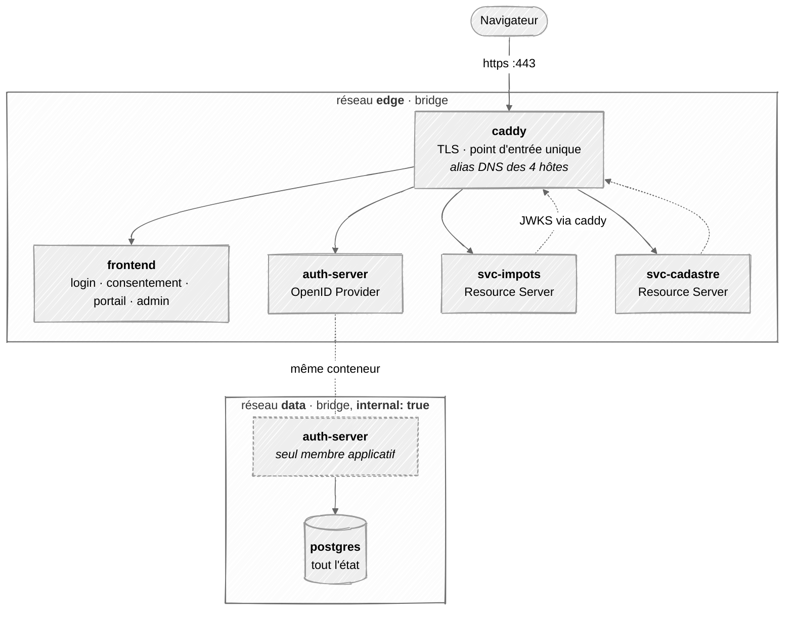

| Composant | Rôle | Réseaux | Port publié |
| --- | --- | --- | --- |
| `caddy` | Terminaison TLS, routage par nom d'hôte | `edge` | **`443` — le seul** |
| `frontend` | SPA React — tous les écrans | `edge` | aucun |
| `auth-server` | Émet et révoque les jetons. Détient la clé privée | `edge` + `data` | aucun |
| `svc-impots` · `svc-cadastre` | Services mockés. Valident les jetons localement | `edge` | aucun |
| `postgres` | Utilisateurs, sessions, jetons, audit, clés | `data` | aucun |

Trois propriétés tombent de ce découpage :

1. **`postgres` est injoignable** depuis les mocks, le frontend et l'hôte. Un
   mock compromis n'a aucune route vers la base d'identité.
2. **`data` est `internal: true`** — pas de passerelle, donc pas d'accès
   sortant. Postgres ne peut pas initier de connexion vers Internet.
3. **`auth-server` est le seul pont** entre les deux réseaux. C'est aussi le
   seul composant qui devrait l'être.

---

### 1.1 Noms d'hôte — identiques dedans et dehors

C'est le point qui fait fonctionner tout le reste. Le claim `iss`, le champ
`issuer` du document de découverte et l'URL réellement appelée doivent être
**identiques au caractère près** — que l'appelant soit le navigateur ou un
conteneur.

`caddy` porte donc les quatre noms comme **alias réseau** sur `edge` :

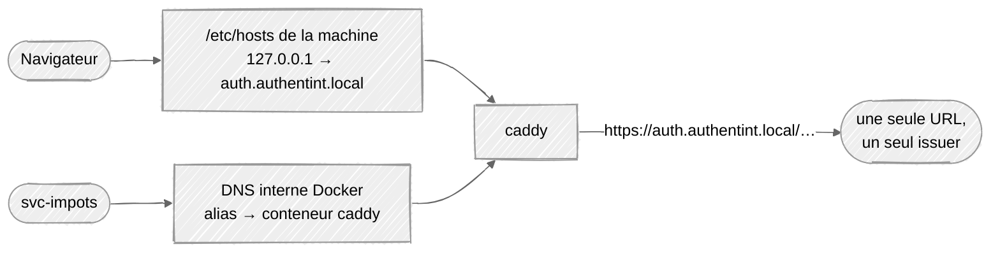

| Hôte | Routé vers | Résolu par |
| --- | --- | --- |
| `auth.authentint.local` | `auth-server:8000` | `/etc/hosts` (navigateur) · alias Docker (conteneurs) |
| `app.authentint.local` | `frontend:80` | idem |
| `impots.authentint.local` | `svc-impots:8001` | idem |
| `cadastre.authentint.local` | `svc-cadastre:8001` | idem |

Sans les alias, `svc-impots` devrait appeler `http://auth-server:8000/...`
pour récupérer le JWKS — une URL différente de l'`issuer`, en clair, et le
chemin TLS ne serait jamais exercé en développement.

> **Conséquence : les mocks doivent faire confiance à l'autorité interne de
> Caddy.** Le volume `caddy_data` est monté en lecture seule dans les mocks et
> le client JWKS pointe explicitement dessus. Le certificat est généré par
> Caddy au premier démarrage, donc les mocks attendent que `caddy` soit *healthy*.

---

### 1.2 Bloc réseau du `docker-compose.yml`

```yaml
networks:
  edge:
    driver: bridge
  data:
    driver: bridge
    internal: true          # aucune passerelle, aucun accès sortant

volumes:
  caddy_data:
  pg_data:

services:
  caddy:
    image: caddy:2-alpine
    ports:
      - "443:443"           # le seul port publié de toute la stack
    volumes:
      - ./caddy/Caddyfile:/etc/caddy/Caddyfile:ro
      - caddy_data:/data
    networks:
      edge:
        aliases:            # même URL pour le navigateur et les conteneurs
          - auth.authentint.local
          - app.authentint.local
          - impots.authentint.local
          - cadastre.authentint.local
    healthcheck:
      test: ["CMD", "test", "-f", "/data/caddy/pki/authorities/local/root.crt"]
      interval: 2s
      retries: 30

  frontend:
    networks: [edge]

  auth-server:
    environment:
      ISSUER: https://auth.authentint.local
      DATABASE_URL: postgresql+asyncpg://authentint_app@postgres:5432/authentint
    networks: [edge, data]  # le seul service sur les deux
    depends_on:
      postgres: { condition: service_healthy }

  svc-impots:
    environment:
      ISSUER: https://auth.authentint.local
      AUDIENCE: svc-impots
      CA_BUNDLE: /caddy-data/caddy/pki/authorities/local/root.crt
    volumes:
      - caddy_data:/caddy-data:ro
    networks: [edge]
    depends_on:
      caddy: { condition: service_healthy }

  svc-cadastre:                # même image, AUDIENCE différente
    networks: [edge]

  postgres:
    image: postgres:16-alpine
    volumes:
      - pg_data:/var/lib/postgresql/data
    networks: [data]        # invisible depuis l'hôte et depuis les mocks
```

**Aucune clé `ports:` ailleurs que sur `caddy`.** Pour inspecter la base :

```bash
docker compose exec postgres psql -U authentint_app authentint
```

Ouvrir `5432` sur l'hôte « juste pour DBeaver » annule la propriété n°1
ci-dessus. Si un outil graphique est indispensable, le lancer comme un service
de profil sur le réseau `data`, jamais en publiant le port :

```bash
docker compose --profile debug up adminer   # adminer sur data, exposé via caddy
```

---

## 2. Connexion et émission de jeton

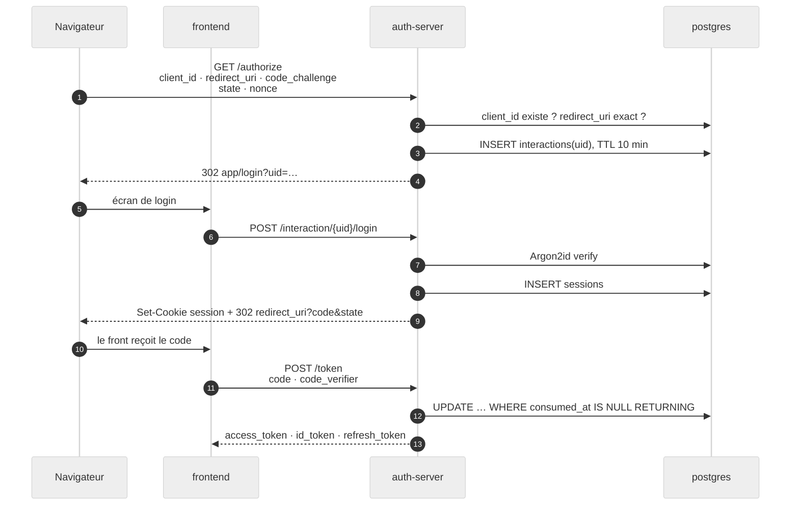

Le `uid` est une poignée opaque. Le navigateur ne reporte jamais `client_id`,
`scope` ni `redirect_uri` — ils restent dans `interactions`.

---

## 3. Accès à un service et validation JWKS

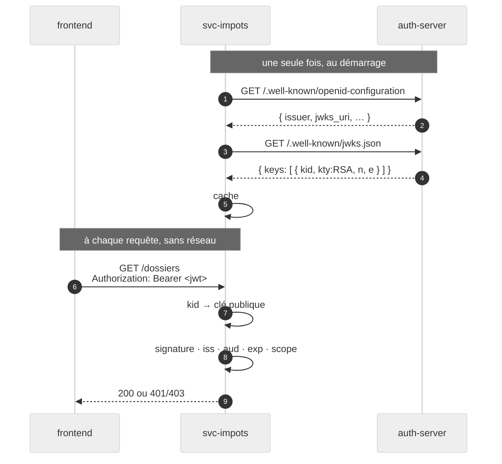

Le diagramme est logique. **Physiquement, les deux appels de `svc-impots` vers
`auth-server` passent par `caddy`** — via l'alias DNS `auth.authentint.local`
sur le réseau `edge` (§1.1). C'est ce qui garantit que l'URL du JWKS et le
claim `iss` sont la même chaîne, et que le chemin TLS est exercé en
développement.

### Ce que le Resource Server vérifie

| Vérification | Bloque |
| --- | --- |
| `algorithms=["RS256"]` épinglé | `alg: none` et confusion RS256→HS256 |
| `iss` | Jeton d'un autre émetteur |
| `aud` | Jeton de `svc-cadastre` rejoué sur `svc-impots` |
| `exp` | Rejeu d'un jeton ancien |
| `scope` | Authentifié mais non autorisé ici |

`kid` inconnu → un seul rafraîchissement du JWKS, avec anti-rebond.

---

## 4. Le parcours d'authentification

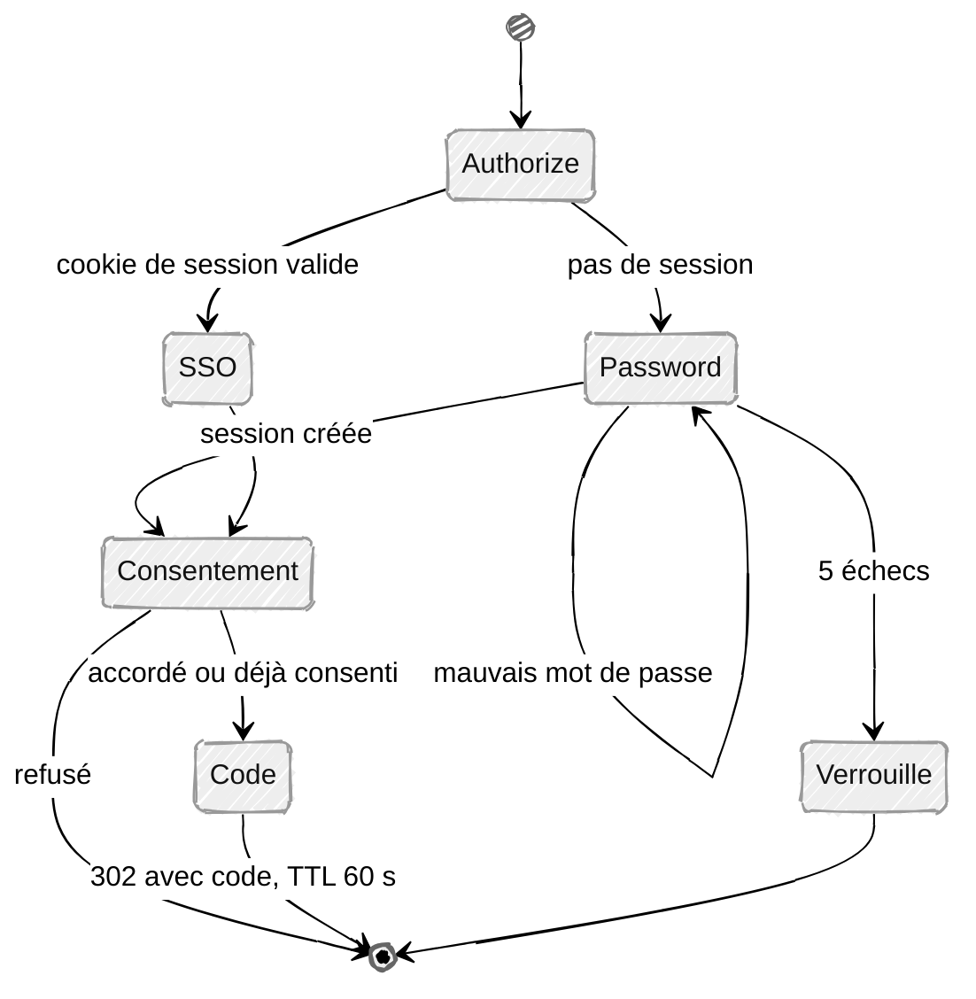

Le serveur seul décide de l'étape suivante. `GET /interaction/{uid}` répond
« qu'est-ce qu'il manque ». L'ajout d'un second facteur insère un état entre
`Password` et `Consentement`.

---

## 5. Modèle de données

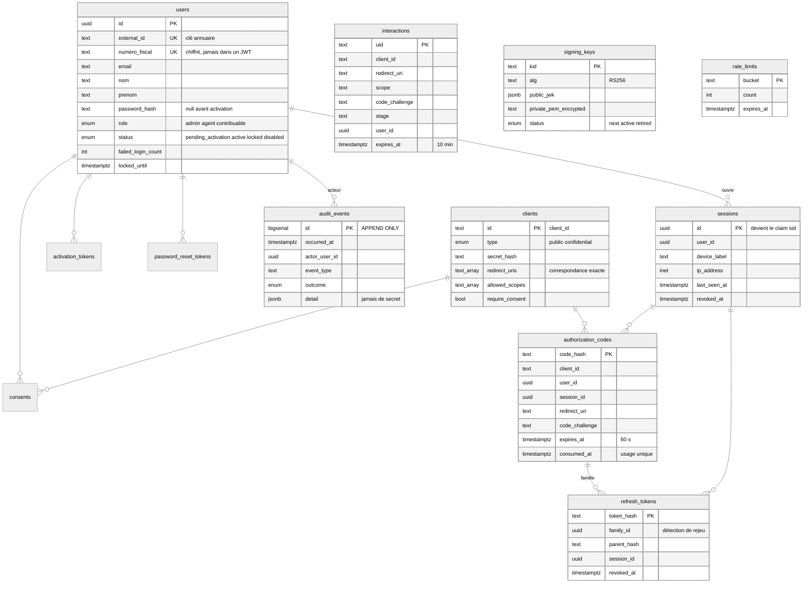

Deux règles portées par le schéma :

- Tout jeton (`code`, `refresh`, `activation`, `reset`) est stocké **haché**.
- `audit_events` est append-only au niveau des privilèges :
  `REVOKE UPDATE, DELETE ON audit_events FROM authentint_app;`

Toute table à `expires_at` est nettoyée paresseusement. Aucun CronJob.

---

## 6. Cycle de vie des clés de signature

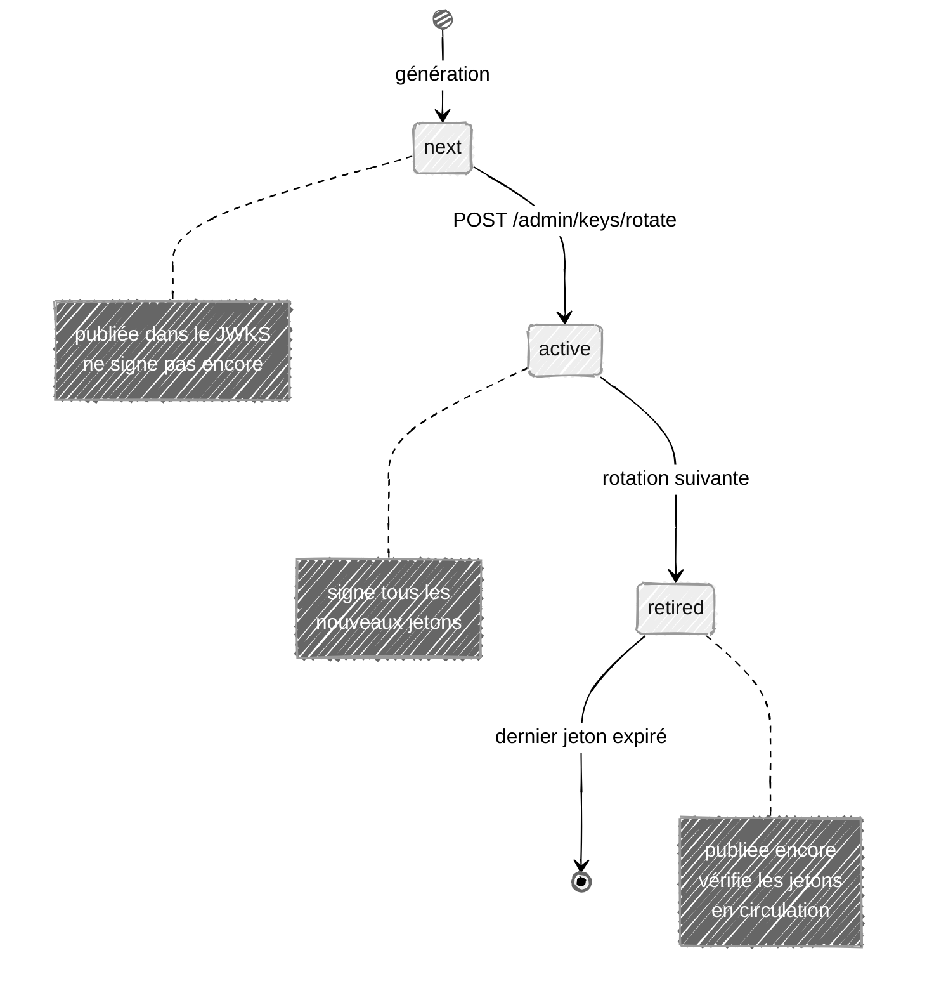

Les trois états sont publiés dans le JWKS en même temps. C'est ce qui rend la
rotation invisible : aucun jeton en circulation n'est invalidé.

---

## 7. Cycle de vie du refresh token

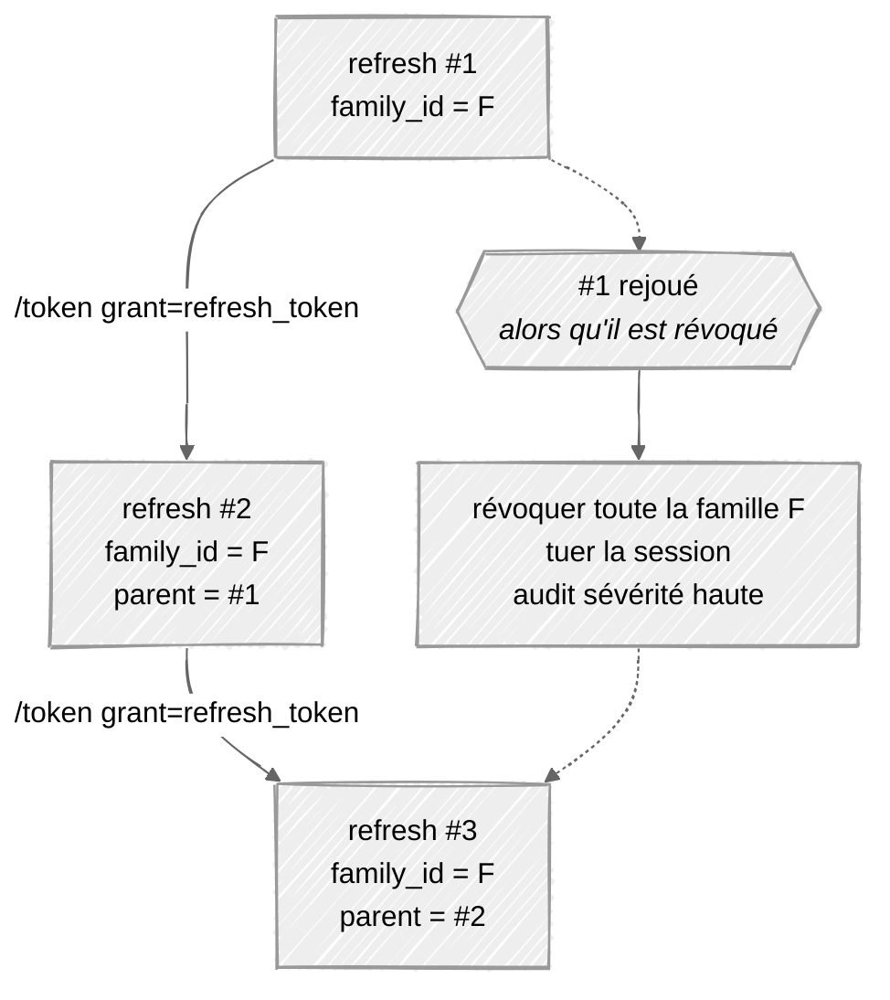

Chaque rafraîchissement révoque son parent. Présenter un jeton déjà révoqué
signifie qu'il a fuité → toute la famille tombe.

---

## 8. Carte des endpoints

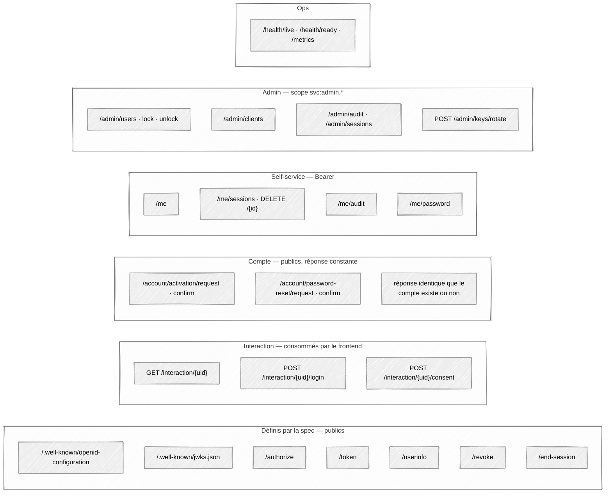

---

## 9. Rôles et scopes

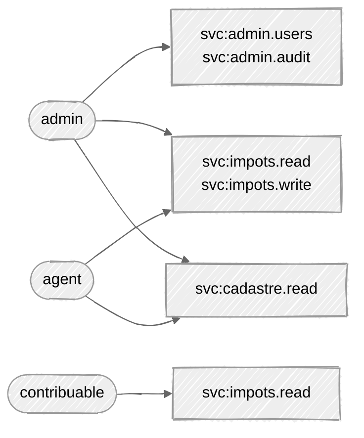

À `/authorize` :

```
granted = requested ∩ allowed(role) ∩ client.allowed_scopes
```

La table rôle → scopes est côté serveur. Une réduction est journalisée.

Filtrer les tuiles par rôle dans le frontend est de la **présentation**.
L'autorisation est appliquée par chaque Resource Server.

---

## 10. Identifiants

| Donnée | Où | Règle |
| --- | --- | --- |
| `numero_fiscal` | `users`, chiffré | Identifiant de login. **Jamais** dans un JWT, une URL, un log |
| `sub` | claim, = `users.id` | UUIDv4 opaque, stable, sans signification externe |
| `sid` | claim, = `sessions.id` | Sert au logout et à la révocation d'appareil |
| `external_id` | `users` | Clé de jointure vers l'annuaire. Jamais un DN |

---

## 11. Source des utilisateurs

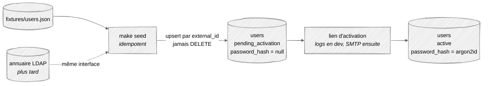

Une interface, `UserDirectory`, sans aucune méthode d'écriture. Implémentation
d'aujourd'hui : `JsonDirectory`. Le passage à `LdapDirectory` ne touche rien
d'autre.

Les mots de passe sont **chez nous**, jamais dans l'annuaire : activation et
réinitialisation sont des écritures, l'annuaire est en lecture seule. Effet de
bord recherché — une panne de l'annuaire ne verrouille personne dehors.

---

## 12. Déploiement Kubernetes

Les réseaux Compose du §1 deviennent des `NetworkPolicy`. Même cloisonnement,
mécanisme différent — ce qui est testé en local est ce qui est déployé.

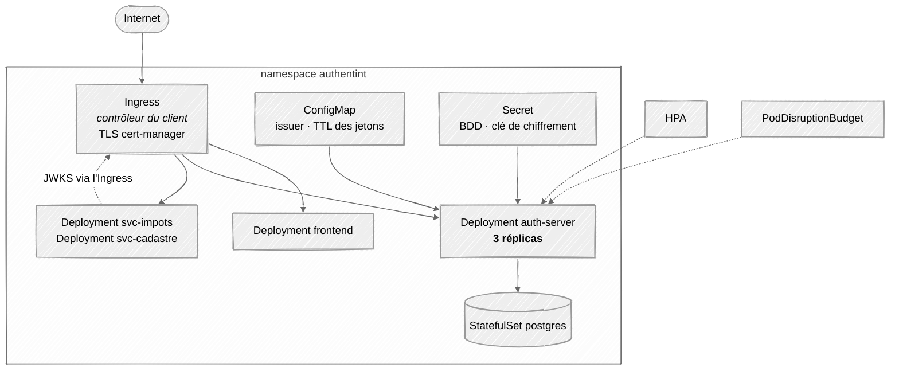

### Le cloisonnement, traduit

| Compose | Kubernetes |
| --- | --- |
| réseau `data`, membres `auth-server` + `postgres` | `NetworkPolicy` sur `postgres` : ingress autorisé depuis le seul label `app=auth-server` |
| `internal: true` sur `data` | `NetworkPolicy` egress sur `postgres` : DNS uniquement |
| aucun `ports:` sauf `caddy` | aucun `Service` de type `NodePort` / `LoadBalancer` — que du `ClusterIP` derrière l'Ingress |
| alias DNS de `caddy` | l'Ingress porte les mêmes noms d'hôte ; `issuer` inchangé |

```yaml
# deny par défaut sur tout le namespace, puis ouvertures explicites
kind: NetworkPolicy
metadata: { name: postgres-ingress }
spec:
  podSelector:
    matchLabels: { app: postgres }
  policyTypes: [Ingress, Egress]
  ingress:
    - from:
        - podSelector:
            matchLabels: { app: auth-server }
      ports:
        - { protocol: TCP, port: 5432 }
  egress:
    - to:
        - namespaceSelector: {}
          podSelector:
            matchLabels: { k8s-app: kube-dns }
      ports:
        - { protocol: UDP, port: 53 }
```

**[À VALIDER]** Le CNI du cluster applique-t-il bien les `NetworkPolicy` ?
Certains (Flannel par défaut) les acceptent sans les appliquer — la politique
existe et ne filtre rien.

### Compte des objets

| | |
| --- | --- |
| Deployments | 4 |
| StatefulSets | 1 |
| CronJobs | **0** |
| Services | 4, tous `ClusterIP` |
| Secrets | 2 |
| NetworkPolicies | 1 deny-all + 3 ouvertures |

Caddy ne part pas dans le cluster : l'Ingress du client le remplace.
`ingressClassName` et les annotations restent dans `values.yaml`.

`auth-server` est **sans état** — tout est en Postgres. Trois réplicas,
redémarrages progressifs, scaling horizontal.

Un seul processus doit générer la clé initiale : advisory lock Postgres. Sans
ça, trois réplicas produisent trois paires de clés et un jeton sur trois échoue.

---

## 13. Arborescence

Arborescence cible. Ce qui existe déjà, ce qui a changé et pourquoi : [current_architecture.md](current_architecture.md).

```
authentint/
├── README.md
├── docker-compose.yml
├── .env.example
├── Makefile                     # make up · make seed · make docs
├── docs/
│   ├── architecture.md          # ce fichier
│   ├── adr/
│   │   ├── 0001-choix-stack.md  # remplacé
│   │   └── 0002-stack-simplifiee.md
│   ├── threat-model.md
│   └── generated/               # db-schema.md + api-endpoints.md (livrables)
├── apps/
│   ├── auth-server/
│   │   ├── src/
│   │   │   ├── config.py        # Settings (variables d'environnement)
│   │   │   ├── infra/           # connexion db · modèles SQLAlchemy — rien d'autre
│   │   │   ├── domain/          # claims · scopes · erreurs — logique pure
│   │   │   ├── security/        # mots de passe · rate limit · vérification Bearer
│   │   │   ├── external/        # annuaire · mailer
│   │   │   ├── keys/            # keystore · rotation
│   │   │   ├── audit/           # emit · request_id · /admin/audit · /me/audit
│   │   │   ├── users/           # requêtes + /me · /admin/users
│   │   │   ├── clients/         # requêtes + /admin/clients
│   │   │   ├── sessions/        # requêtes + /me/sessions · /admin/sessions
│   │   │   ├── flows/           # interaction (login · consentement) · activation · reset
│   │   │   ├── oidc/            # discovery · jwks · authorize · token · userinfo · revoke · end_session
│   │   │   └── ops/             # /health/* · /metrics
│   │   ├── alembic/             # migrations versionnées (livrable)
│   │   └── tests/
│   ├── frontend/                # un seul build Vite
│   └── mock-services/           # une image, deux configurations
├── fixtures/
│   └── users.json
├── k8s/                         # chart Helm
└── load/                        # scripts k6
```

`docs/generated/` est produit par `make docs` depuis les modèles SQLAlchemy et
le schéma OpenAPI. Jamais édité à la main.

---

## 14. Stack

| Couche | Choix |
| --- | --- |
| Langage | Python 3.13 |
| HTTP | FastAPI · uvicorn |
| Base | PostgreSQL 16 · SQLAlchemy 2.0 · Alembic |
| JOSE | `joserfc` — RS256, JWKS |
| Mots de passe | `argon2-cffi` — Argon2id, **dans un thread pool** |
| Validation | Pydantic v2 |
| Frontend | React · Vite · TypeScript |
| Edge (dev) | Caddy, `tls internal` |
| Tests | pytest · httpx · Playwright |
| Charge | k6 |

Argon2id est volontairement coûteux. En Python il bloque la boucle
d'événements : chaque `hash()` et `verify()` passe par `run_in_executor`.

---

## 15. Invariants

Ce qui doit rester vrai. Chaque ligne est un test dans
[ADR 0002 §15](adr/0002-stack-simplifiee.md#15-tests).

1. `redirect_uri` est comparé par **égalité exacte**, avant toute redirection.
2. PKCE S256 est exigé de **tous** les clients, publics comme confidentiels.
3. Un code d'autorisation vit 60 s, sert une fois, et sa consommation est
   atomique.
4. Un code rejoué révoque tous les jetons qui en descendent.
5. Un refresh token rejoué révoque **toute sa famille**.
6. L'algorithme de vérification est **épinglé**, jamais lu depuis le jeton.
7. Le numéro fiscal n'apparaît dans aucun JWT, aucune URL, aucun log.
8. Les endpoints de demande d'activation et de reset répondent la même chose,
   dans le même temps, que le compte existe ou non.
9. Le rate limiting échoue **fermé**.
10. `audit_events` n'accepte que des `INSERT`.
11. `auth-server` reste sans état — il tourne correctement à `--scale 3`.
12. L'autorisation est appliquée au Resource Server, jamais seulement dans
    l'interface.
13. `postgres` n'est joignable que par `auth-server`. Un seul port publié dans
    toute la stack.
