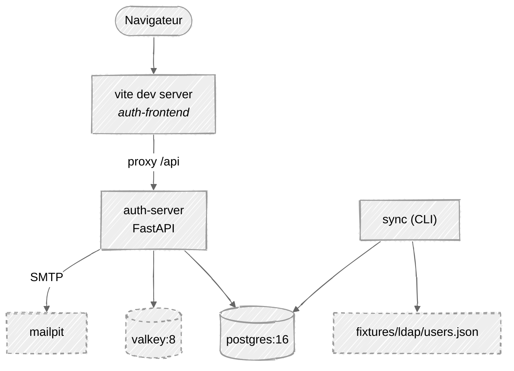
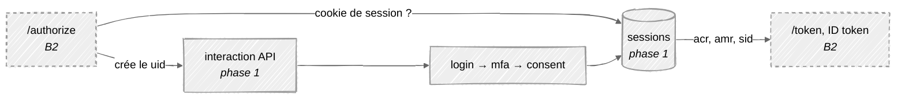

# Serveur d'authentification — phase 1

> Companion to `adr/0001-choix-stack.md` (referenced below as **§n**).
> Scope: the authentication core, built and testable **before** any OAuth2/OIDC
> protocol work.

---

## 0. Why this document exists

§16 builds the system as eleven bricks and starts four lanes at once. This document
describes the **first vertical slice** through that plan: a *resource owner*
authenticating for real — Postgres, a login form, a session cookie, an e-mail
second factor — with usernames and 2FA addresses coming from a **mocked
directory**.

Nothing here replaces §16. It is a sequencing decision: build the thing that
authenticates a human before building the thing that issues tokens to a machine.
§11 explains why the two are separable — the token layer is stateless and sits
*above* an authenticated session, so the session comes first.

The last section (§12 below) is the part that matters most: **what in this phase
is final, what is a fake, and the exact event that kills each fake.**

---

## 1. Scope

### In

| | |
| --- | --- |
| Directory sync | JSON fixture → `users`, idempotent, never deletes |
| Account activation | User exists, no password → mail with a one-shot token |
| Password login | Numéro fiscal + mot de passe, Argon2id |
| MFA | 6-digit OTP by e-mail, Mailpit in dev |
| Session | Server-side row in Postgres + `HttpOnly` cookie |
| `/me`, logout | Proves the cookie works end to end |
| Lockout | N wrong passwords → `status = locked` + `locked_until`, backoff |
| Rate limiting | Per IP **and** per account, Valkey, fails closed |
| Structured logs | One JSON line per authentication event, on stdout |
| Health | `/health/live`, `/health/ready` |

### Out — and which brick brings it back

| Deferred | Comes back in | Why it can wait |
| --- | --- | --- |
| Caddy, TLS, `*.authentint.local` | §2 / B0 | Nothing in this phase depends on issuer identity — there is no `iss` claim yet |
| `/authorize`, `/token`, JWKS, clients, consent | **B2** | They sit above an authenticated session; there is nothing to sit above yet |
| `portal-frontend`, `svc-impots`, `svc-cadastre` | B5, B6 | They consume tokens |
| `audit_events` table | **B8** | Structured JSON login logs on stdout give the same evidence at zero schema cost |
| Password reset | B1 (second half) | Activation is what unblocks login; reset is the same machinery a week later |
| Valkey `sid:*` session index | B9 | A cache in front of a query nobody has measured |
| OpenLDAP container, `bonsai` | **B7** | §16 already says B7 starts against `FixtureDirectory`, no container |
| `/metrics` | B9 | Nothing scrapes it yet, and §3's *montée en charge* evidence is the k6 report, which k6 produces itself — also B9 |
| Numéro fiscal protected at rest | B1 (second half), gated on **§17 Q3** | The column and its unique index are final; §5 asks for encryption or hashing at rest and the client has not said which. Deciding wrong now is a migration *and* a re-index |
| `gen:api` → `src/api/types.ts` (`openapi-typescript`, §4) | B3 / B6 | `make docs` already exports the OpenAPI document — the §16 B0 contract B6 will mock against. Five pages typing four response shapes by hand do not yet earn a codegen step |
| `POST /account/activation/request` | B6 | Its first real caller is `/admin/users/{id}/resend-activation`; until then the login attempt is the trigger (§6) |
| Playwright happy path (§14, B3's definition of done) | B3 | The five pages land here; the e2e run wants the consent stage and the static build behind Caddy |
| Admin unlock | B6 | Lockout releases itself through `locked_until`; the manual override arrives with the admin screens |

**Rule for this phase:** an omission is only legitimate if the line above names
the brick that restores it. Anything cut without a destination is scope loss.

---

## 2. Containers



Four services in compose plus the Vite dev server: `postgres:16-alpine`,
`valkey/valkey:8-alpine`, `axllent/mailpit`, `auth-server` (Python 3.13,
`uvicorn`).

### Consequence of skipping Caddy — read this once

No proxy means no TLS and no stable public hostname. §2 warns this is exactly how
you end up patching URL mismatches for the rest of the project. One rule prevents
all of it:

> **Every externally visible URL comes from configuration, never from a literal
> in the code.** `PUBLIC_BASE_URL` (link building in mails) and, later, `ISSUER`.

Get that right now and inserting Caddy is an `.env` change plus a compose block.
Get it wrong and it is a grep through the codebase during B2, when the
conformance suite is the thing telling you.

`auth-server` publishes `${AUTH_SERVER_PORTS:-8000:8000}`. A variable rather
than a second compose file, because Compose *merges* `ports` across files
instead of replacing them: an override would leave every replica also trying to
bind 8000, and the `!override` tag that fixes that needs Compose 2.24+.
`make scale` sets it to `8000-8002:8000` for the §9 check.

Valkey runs with the §11b settings — `maxmemory-policy noeviction`, `appendonly no`
— passed as two `command:` flags in compose, not as a mounted `valkey.conf`.

---

## 3. The frontend talks to the API through Vite's proxy

`auth-frontend` is **React + TypeScript** (Vite), talking to the **FastAPI**
`auth-server` — the stack locked in §3.

```ts
// vite.config.ts
server: { proxy: { '/api': {
  target: 'http://localhost:8000',
  rewrite: (p) => p.replace(/^\/api/, ''),   // the server owns `/interaction`, not `/api/interaction`
} } }
```

The rewrite is not cosmetic: keeping the API at the root is what lets
`/authorize` land there unprefixed at B2, where the path is fixed by the spec
and by the conformance suite.

The browser only ever sees one origin. That means **no CORS configuration and no
cross-site cookie semantics to reason about** — two of the easiest things to get
subtly wrong in a login flow, removed rather than solved. The proxy disappears
the day Caddy lands; the frontend code does not change, because it calls
relative `/api/...` paths either way.

### What the UI actually contains

Five screens, one per state the interaction API can be in — the UI is a thin
renderer of the stage machine of §7, and holds no identity state of its own.
**Activate** is where the mailed activation link lands: it reads the token from
the query string, asks for a password twice, and posts
`/account/activation/confirm`. **Login** collects numéro fiscal + mot de passe;
it renders the single failure constant of §6 verbatim and never composes a
message of its own, because the enumeration property of §7 step 4 dies the
moment the frontend says « compte inconnu » on its own initiative. **MFA** is a
six-digit field plus a resend button subject to the same rate limit, and it too
shows one message for *wrong*, *expired* and *exhausted*. **Home** is the
phase-1 dashboard: it calls `GET /me` and renders what the session resolves to
— nom, prénom, rôle, statut, session started at — with a logout button. It
exists to prove the cookie works end to end, **not** to be the contribuable
portal; that is `portal-frontend` in B6, and the admin console is B6 as well.
**Error** catches the dead ends — expired `uid`, consumed activation token —
and offers exactly one action: start again at Login.

The stage returned by `GET /interaction/{uid}` decides which screen renders, so
a new stage (consent, in B2) is a new route and a new file, not a rewrite. There
is no auth state in `localStorage` and no client-side route guard worth the
name: the cookie is the state, and a `401` from `api.ts` sends the user to
Login.

---

## 4. Data model

Alembic revision `0001` creates **only the phase-1 tables**. The OAuth tables of
§6 land in their own revision when B2 starts — versioned migrations exist
precisely so the schema can arrive in the order the code needs it. Freezing
tables nine weeks before their first `INSERT` buys nothing and guarantees they
are wrong by the time they are used.

```
users                                 -- §6 columns, no additions
  id                uuid pk
  external_id       text unique null  -- directory join key, never the DN
  numero_fiscal     text unique       -- login identifier, never the `sub`.
                                      -- Plaintext for now — §5 wants it protected
                                      -- at rest, §17 Q3 decides how (§1)
  email             citext unique     -- the 2FA destination
  nom, prenom       text
  password_hash     text null         -- null = pending_activation. Ours, not LDAP's.
  role              enum(admin, agent, contribuable)
  status            enum(pending_activation, active, locked, disabled)
  password_changed_at, failed_login_count, locked_until
  synced_at         timestamptz null
  created_at, updated_at

activation_tokens
  id, user_id, token_hash, expires_at, consumed_at, requested_ip

sessions
  id                uuid pk           -- future `sid` claim
  token_hash        text unique       -- SHA-256 of the cookie value, NOT `id`
  user_id
  device_label, user_agent, ip_address
  created_at, last_seen_at, expires_at, revoked_at, revocation_reason
  acr, amr                            -- written now, read by B2 for free
```

`sessions.token_hash` is the one column here beyond §6, and it is the reason
`id` can safely become a published `sid` claim at B2: if the cookie carried `id`,
everyone holding an ID token would hold the session cookie. §6's rule — never
store a token in plaintext — covers this one too. One column now, or a migration
plus every live session invalidated later.

`acr`/`amr` are populated in this phase even though nothing reads them yet. They
are two columns and one assignment; they are also the only proof a Resource
Server will ever have that MFA actually happened (§5). Adding them later means a
migration *and* backfilling sessions that cannot be backfilled.

### Valkey

| Key | Content | TTL |
| --- | --- | --- |
| `int:{uid}` | interaction state: `user_id`, `stage`, `auth_time` | 10 min |
| `otp:{uid}` | `code_hash`, `purpose`, `attempts` | 10 min |
| `rl:{scope}:{key}` | counter | window |

Never the plaintext OTP (§6). `INCR` gives atomic attempt counting; the TTL
removes the cleanup job. **Rate limiting fails closed** (§11b rule 3): Valkey
unreachable → reject the login. This is the one place degradation is deliberately
ungraceful.

---

## 5. The directory mock

§5b is unchanged and is the contract. This phase implements the fixture half of
brick **B7**.

```
fixtures/ldap/users.json     →  FixtureDirectory  →  sync  →  users
```

`FixtureDirectory` implements the `UserDirectory` Protocol of §5b **as written** —
`find_by_numero_fiscal`, `list`, and no write method. The production
`LdapDirectory` is a second implementation of the same Protocol; nothing else in
the codebase changes when it arrives.

**JSON, not LDIF.** The real adapter will receive dicts from `bonsai`, not LDIF
text, so an LDIF parser would be code written for a consumer that never
materialises. When the OpenLDAP container arrives in B7 it needs an LDIF seed —
generate it from this file then, in a dozen lines.

Fixture contents, chosen to break things early: an admin, two agents, two
contribuables, a name with accented characters, an entry missing an optional
attribute, and an entry that disappears on the second run.

The `sync` CLI command (`python -m app.sync`):

- upserts by `external_id`, **never deletes** — a vanished entry sets
  `status = disabled` (§5b). A transient directory error must not be able to
  empty the user base.
- maps group → role from configuration, not from code — the real mapping is
  §17 Q6 and has not come back.
- is idempotent: running it twice changes nothing the second time. This is the
  brick's definition of done in §16.

### The rule that keeps this honest

> **LDAP is a provisioning feed, not the authentication backend.**
> No request handler ever talks to the directory. The login path reads Postgres.

§5b rule 1 states it; this phase is where it is either respected or quietly
broken. Breaking it puts an external system on the login hot path and makes a
directory outage a total outage.

---

## 6. Endpoints

Built as the **§7 interaction API from the start**, not as an ad-hoc login route.
The shape costs nothing extra today and means the frontend, the stage machine and
every test written in this phase survive B2 untouched.

| Method | Path | Note |
| --- | --- | --- |
| POST | `/interaction` | **Temporary.** Mints a `uid`. `/authorize` takes this over at S2 |
| GET | `/interaction/{uid}` | What does this pending authentication need next? |
| POST | `/interaction/{uid}/login` | numéro fiscal + mot de passe |
| POST | `/interaction/{uid}/mfa/send` | e-mails an OTP |
| POST | `/interaction/{uid}/mfa/verify` | verify → session + cookie |
| POST | `/account/activation/confirm` | token + chosen password |
| GET | `/me` | cookie-authenticated |
| POST | `/logout` | revokes the session row |
| GET | `/health/live`, `/health/ready` | |

The `uid` is an opaque handle to server-side state. **The client never carries
identity state back to us** (§7) — it cannot tamper with what it does not hold.

There is deliberately **no `/account/activation/request`**: §7 below makes the
login attempt itself the trigger, which removes an endpoint *and* removes an
enumeration oracle.

---

## 7. The flow

Order matters.

1. `POST /interaction` → `uid`, empty state in Valkey, 10 min TTL.
2. `POST /interaction/{uid}/login` with numéro fiscal + password.
3. Rate limit check: `rl:login:{ip}` **and** `rl:login:{hash(nf)}`, separately.
   Valkey down → reject.
4. Look up the user. **Five** failure branches — unknown, wrong password,
   `pending_activation`, `locked`, `disabled` — and **all five return the
   identical body with the identical latency**:

   > « Identifiants invalides, ou compte non activé. Si un compte correspond, un
   > e-mail vient de vous être envoyé. »

   Always run the Argon2 verification, against a dummy hash when the user does
   not exist, so timing does not become the oracle the response body is not.
   `disabled` is the branch §5's sync writes: a user whose directory entry
   vanished must not be able to log in — and must not learn that this is why.
   Checking `status` here is what makes disable-never-delete an actual control
   rather than a column.
5. Wrong password → `failed_login_count + 1`. At `LOGIN_MAX_FAILURES`
   (default 5), set `status = locked` and
   `locked_until = now() + LOGIN_LOCKOUT_BACKOFF`. A correct password resets the
   counter to 0. A `locked_until` in the past reads as unlocked, so there is no
   unlock job; the manual override is `/admin/users/{id}/unlock` in B6.
   This is per account; step 3's `rl:` counters are per attempt — two different
   controls, and §15 asks for both.
6. `pending_activation` → mint an activation token (store the **hash**, 30 min
   TTL) and send the mail out of band. The user is told to check their inbox by
   the constant text above; an attacker learns nothing. Retrying the login
   resends, subject to the same rate limit. **Only this branch mails anything** —
   `locked` and `disabled` send nothing at all.
7. Password correct → advance the stage to `mfa`, record `auth_time`.
8. `POST .../mfa/send`: 6 digits from `secrets`, store the **hash** in
   `otp:{uid}`, mail it. Mail send fails → the request fails loudly. **Never fall
   back to skipping MFA** (§11.6).
9. `POST .../mfa/verify`: constant-time compare, `INCR` attempts, max 5. Consume
   the challenge on success **and** on exhaustion. Never distinguish *wrong* from
   *expired* in the response (§9).
10. Success → insert a `sessions` row with `acr = urn:authentint:acr:mfa`,
    `amr = ["pwd","otp"]`, then `Set-Cookie`.

**Two hash families, and the split is deliberate.** Argon2id for anything a
human chose or could guess — the password, and the six-digit OTP. A 6-digit code
carries 20 bits of entropy; a plain digest of one is brute-forced from a cache
dump in about a second, and Argon2 is what makes that dump worthless. It also
needs no shared secret, so it survives `--scale 3` where a per-worker HMAC key
would not (§14). SHA-256 for the high-entropy handles we mint ourselves —
activation tokens and the session cookie — where the entropy is in the token and
the lookup has to be deterministic.

Argon2id `hash()` and `verify()` run in `asyncio.to_thread` — §3 flags this as a
day-one decision, not a post-k6 fix: hashing on the event loop stalls every
concurrent request, not just the login being hashed.

### The cookie

```
http  →  Set-Cookie: authentint_session=<opaque>; HttpOnly; SameSite=Lax; Path=/
https →  Set-Cookie: __Host-session=<opaque>; HttpOnly; Secure; SameSite=Lax; Path=/
```

**The name and the `Secure` flag are derived from the scheme in
`PUBLIC_BASE_URL`, not configured separately.** `__Host-` is only legal
alongside `Secure`, and `Secure` is only usable on an origin the browser
considers trustworthy — so all three have to move together or the cookie is
silently dropped.

An earlier draft of this section hardcoded `__Host-` + `Secure` and reasoned
that "browsers treat `localhost` as a secure context". That is true of Chromium
and Firefox and **false of Safari**, which refuses to send a `Secure` cookie
over plain http, `localhost` included. The result was a login that worked in one
browser and, in the other, accepted the password, accepted the OTP, and then
bounced the user back to the login page from the dashboard — because `/me` never
received the cookie. Two browsers, one of them silently wrong, is exactly the
class of bug a derived value removes and a hand-set pair of env vars invites.

`SESSION_COOKIE_NAME` and `SESSION_COOKIE_SECURE` remain as overrides. Neither
is needed: the cookie hardens itself the day `PUBLIC_BASE_URL` becomes https,
which is the day Caddy lands.

Without the prefix the cookie is scoped to the host and ignores the port, so on
bare `localhost` it is shared with anything else served there — one more reason
§2 wants real hostnames behind a proxy.

`SESSION_IDLE_TTL` (default 30 min, slid on `last_seen_at`) and
`SESSION_ABSOLUTE_TTL` (default 12 h) both come from `config.py`. Both are
guesses until §17 Q8 comes back with a per-role answer — which is precisely why
they are two environment variables and not two literals.

**Postgres is the source of truth for sessions** (§11b rule 1). Revocation must
survive a Valkey restart, so there is no Valkey copy in this phase at all.

### Logs

One JSON line on stdout per authentication event, through stdlib `logging` with
a `dictConfig` formatter set up in `main.py` — no dependency, and no
`audit_events` table until B8. Fields: `event_type` (`login.success`,
`login.failure`, `account.locked`, `mfa.failure`, `activation.issued`,
`session.revoked`), `outcome`, `user_id` when known, `ip`, `request_id`. §6
calls `request_id` a correlation id *injected at the edge* — there is no edge
until Caddy, so `main.py` generates one per request and Caddy overrides it
later.

**Never the numéro fiscal, never an OTP, never a token.** §5 puts the numéro
fiscal in the same class as a password and §6's `audit_events.detail` says the
same thing about the table that replaces these lines; this is the phase that
decides whether it stays out. §1 defers `audit_events` *because* these lines
exist — an omission that only holds while they actually do.

---

## 8. Mail

Standard library: `smtplib` + `email.message`, called inside `asyncio.to_thread`.
Mailpit catches everything in dev and gives a web inbox to click through. The
switch to an internal relay or a third-party provider (§17 Q2) is host and
credentials.

Two HTML mails, both linking through `PUBLIC_BASE_URL`: the activation link and
the OTP code. Each is one Jinja file in `infra/templates/` — the `<title>` is the
subject, so a single file holds the whole mail and can be edited and versioned
on its own. `python -m app.infra.mailer otp > /tmp/otp.html` renders a preview
with sample values (`activation` likewise). The logo is ``, served by the frontend — no attachment. The only dependency this adds is
`jinja2`; `autoescape` is on because `prenom` and `email` are user data.

---

## 9. Tests

pytest + httpx `ASGITransport` against **the compose Postgres and Valkey**
(§14 — no testcontainers; the stack is already up). One assertion per line below:

- sync → activate → login → OTP → `/me` — the happy path, end to end
- wrong password, `pending_activation`, `locked` and `disabled` produce
  **byte-identical** responses
- unknown user produces the same response, and the timing distribution overlaps
- an entry removed from the fixture, then synced → `disabled` → login refused,
  with that same response and no mail sent
- 5 wrong passwords → `status = locked`; the 6th attempt fails **even with the
  correct password**; a `locked_until` in the past lets the correct one through
- a failed login emits exactly one JSON line, and that line contains no numéro
  fiscal, no OTP and no token
- OTP: 5 wrong attempts → challenge consumed, further attempts rejected
- an OTP issued for one `uid` cannot be replayed against another
- sync run twice → no change; entry removed from the fixture → `disabled`, never
  deleted
- Valkey stopped → login rejected, not allowed
- logout → the cookie no longer resolves to a live session

Then, once: `docker compose up --scale auth-server=3`. §14 wants this at the
first seam rather than in B10, and this phase is the first moment it can run.
It catches per-process state — an in-memory rate limiter, a per-worker secret —
while the fix is still one file.

---

## 10. Code layout — what lives where

A strict subset of ADR §4. Only folders that hold a file today exist; the others
arrive with the brick that needs them.

```
authentint/
├── docker-compose.yml              postgres · valkey · mailpit · auth-server
├── .env.example                    every variable config.py reads
├── Makefile                        up · migrate · sync · test · docs
├── .github/workflows/ci.yml        pytest, pip-audit, npm audit (§15)
├── fixtures/
│   └── ldap/users.json             the mocked directory (§5)
├── docs/
│   └── generated/                  emitted by `make docs`, never hand-edited (§4)
└── apps/
    ├── auth-server/
    │   ├── Dockerfile
    │   ├── pyproject.toml          deps + uv.lock
    │   ├── .python-version         3.13, pinned per §3
    │   ├── alembic.ini
    │   ├── alembic/
    │   │   └── versions/0001_identity.py
    │   ├── src/app/
    │   │   ├── main.py             app factory, routers, lifespan, /health/*, logs
    │   │   ├── config.py           Settings (pydantic-settings)
    │   │   ├── models.py           User · ActivationToken · Session
    │   │   ├── schemas.py          request/response models
    │   │   ├── security.py         hashing, OTP + token generation, comparison
    │   │   ├── sessions.py         session lifecycle + cookie
    │   │   ├── directory.py        UserDirectory · DirectoryUser · FixtureDirectory
    │   │   ├── sync.py             python -m app.sync
    │   │   ├── infra/
    │   │   │   ├── db.py           engine, sessionmaker, get_db
    │   │   │   ├── cache.py        Valkey: interaction · OTP · rate limit
    │   │   │   ├── mailer.py       SMTP, renders templates/
    │   │   │   └── templates/      activation.html · otp.html (Jinja)
    │   │   └── flows/
    │   │       ├── interaction.py  /interaction/*
    │   │       ├── activation.py   /account/activation/confirm
    │   │       └── me.py           /me, /logout
    │   └── tests/
    │       ├── conftest.py         app · db · valkey fixtures, truncate between tests
    │       └── test_sync.py · test_login.py · test_mfa.py · test_session.py
    └── auth-frontend/
        ├── package.json  tsconfig.json  vite.config.ts  index.html
        └── src/
            ├── main.tsx            router: the five routes below
            ├── api.ts              fetch wrapper, relative /api, credentials
            ├── styles.css          design tokens, light and dark
            └── pages/
                ├── Shell.tsx       the card and the live-region banner
                ├── Activate.tsx    token from the query string → new password
                ├── Login.tsx       numéro fiscal + mot de passe
                ├── Mfa.tsx         6-digit code + resend
                ├── Home.tsx        GET /me + logout — the phase-1 dashboard
                └── Error.tsx       expired uid / dead token → back to Login
```

`make docs` exports the FastAPI OpenAPI document into `docs/generated/`, which
is where §4's `api-endpoints.md` deliverable comes from — generated, never
hand-written. It is also the §16 B0 interaction contract that B6 mocks against,
so this phase owes it to the other lanes. The `openapi-typescript` step that
turns it into `src/api/types.ts` waits for a second frontend (§1).

**Absent from ADR §4, on purpose:** `src/oidc/` (B2), `src/admin/` (B6),
`src/audit/` (B8), `src/domain/` (when a rule outgrows `models.py`),
`apps/portal-frontend/` (B6), `apps/mock-services/` (B5), `k8s/` (B9),
`load/` (B9). An empty package is a promise the tree cannot keep.

### Responsibilities

Each line says what the module owns **and** what it is not allowed to do. That
second half is the part that keeps the tree from collapsing into one file with
seven imports.

| Module | Owns | Never |
| --- | --- | --- |
| `main.py` | App factory, router mounting, startup/shutdown of the DB and Valkey pools, `/health/live`, `/health/ready`, the JSON log `dictConfig` (§7) | Contains business logic |
| `config.py` | **Every** environment variable, with defaults and types | — a URL, TTL, limit or cookie name literal anywhere else is a bug |
| `models.py` | Columns, enums, constraints | Holds logic or queries |
| `schemas.py` | Request/response shapes, and the **single failure-response constant** | — |
| `security.py` | `hash_password` / `verify_password` (both via `asyncio.to_thread`), OTP and token generation, their hashing, constant-time comparison | — it is the *only* module importing `argon2`, `hashlib`, `secrets`, `hmac` |
| `sessions.py` | Create, resolve, revoke a session; set and clear the cookie | Reads Valkey — Postgres is the source of truth (§11b) |
| `directory.py` | The §5b `UserDirectory` Protocol, `DirectoryUser`, and `FixtureDirectory` over `users.json` | Imports the database, or exposes a write method |
| `sync.py` | The upsert loop: create, update, disable-never-delete, group→role mapping | Runs inside a request |
| `infra/db.py` | Async engine, sessionmaker, the `get_db` dependency | — |
| `infra/cache.py` | Valkey client and **every key name**: interaction state, OTP challenge, rate limiter | Lets a key name leak into a caller |
| `infra/mailer.py` | `smtplib` inside `asyncio.to_thread`; renders the two Jinja templates and sends them | Swallows a send failure (§8) |
| `flows/interaction.py` | The stage machine — the ordering of §7, step by step, including the `status` check and the lockout counter | Hashes, mails, or builds a Valkey key itself, or logs the numéro fiscal |
| `flows/activation.py` | `issue_activation()` (called by the login flow) and `/account/activation/confirm` | — |
| `flows/me.py` | `/me`, `/logout` | — |
| `api.ts` | One `fetch` wrapper: relative `/api`, `credentials: 'include'`, error normalisation | Stores identity in `localStorage` |
| `pages/Shell.tsx` | The card, the wordmark, and the `aria-live` banner every screen renders into | — |
| `pages/*.tsx` | Rendering one stage each (§3), and the forms that post to it | Composes its own failure text, or decides a stage the server did not return |

### Six boundaries worth stating

1. **`flows/` orchestrates, nothing more.** It calls `security`, `infra.cache`,
   `infra.mailer`, `sessions`. It never hashes, mails, or builds a key inline.
2. **`security.py` is the only crypto importer.** "Is every token stored hashed?"
   (ADR §15) is then one file to read instead of a grep with a false-negative
   rate.
3. **`infra/cache.py` owns key names.** Key-format drift is how a `rl:` counter
   quietly stops matching the key that increments it — and a rate limiter that
   silently stops counting is the failure you find during the incident.
4. **`directory.py` ⊥ `models.py`.** `sync.py` is the only module that imports
   both. That single join point is what makes ADR §5b's "no request handler ever
   talks to the directory" true by construction rather than by discipline — and
   it is exactly seam S5.
5. **No repository, service or DTO-mapper layer.** SQLAlchemy queries live in the
   flow that needs them. A query needed in two places moves onto `models.py` as a
   classmethod *then*, not in anticipation. Three files of indirection around
   four tables is how a codebase stops being readable in week two.
6. **One failure object, not one failure string.** Every failure branch of §7
   returns *the same instance* from `schemas.py`. The enumeration property is
   then structural — a fourth handler cannot accidentally paraphrase it, and the
   byte-identical test in §9 tests something real.

### Dependencies

Backend (`pyproject.toml`, locked with `uv`): `fastapi`, `uvicorn[standard]`,
`sqlalchemy[asyncio]`, `asyncpg`, `alembic`, `argon2-cffi`, `redis`
(API-compatible with Valkey — §11b), `pydantic-settings`, `email-validator`,
`jinja2` (mail templates as editable HTML files, not f-strings — §8).
Dev: `pytest`, `pytest-asyncio`, `httpx`.

Frontend: `react`, `react-dom`, `react-router-dom`, `vite`, `typescript`. No UI
kit, no state library, no form library, no HTTP client — five pages of `useState`
and `fetch` do not need any of them, and each one is a decision the team inherits
for the whole project.

Deliberately absent: `aiosmtplib` (stdlib `smtplib` in a thread), a `valkey.conf`
file (two `command:` flags in compose), `joserfc` and `argon2` outside
`security.py`, and any testcontainers library (§14 — the compose stack is already
up).

### What runs where

| Entry point | Kind | Later |
| --- | --- | --- |
| `uvicorn app.main:app` | long-running service | unchanged |
| `python -m app.sync` | one-shot CLI | a k8s `CronJob` in B7 (§5b) |
| `alembic upgrade head` | one-shot | an init container / job |

---

## 11. Order of work

Each step ends with a green test; nothing starts before the previous one is
green. The right-hand column is the same tree as §10 — build order and layout are
one list, not two.

| # | Step | Files |
| --- | --- | --- |
| 1 | Stack up, health, JSON logs, CI | `docker-compose.yml`, `.env.example`, `Makefile`, `ci.yml`, `main.py`, `config.py`, `infra/db.py`, `infra/cache.py` |
| 2 | Schema | `models.py`, `alembic/versions/0001_identity.py` |
| 3 | Directory + sync | `fixtures/ldap/users.json`, `directory.py`, `sync.py`, `tests/test_sync.py` |
| 4 | Activation | `security.py`, `infra/mailer.py`, `flows/activation.py` |
| 5 | Password login, the `status` check, lockout, the uniform failure branch | `schemas.py`, `flows/interaction.py`, `tests/test_login.py` |
| 6 | OTP send / verify | `infra/cache.py`, `flows/interaction.py`, `tests/test_mfa.py` |
| 7 | Session, cookie, `/me`, `/logout` | `sessions.py`, `flows/me.py`, `tests/test_session.py` |
| 8 | Frontend | `apps/auth-frontend/**` |
| 9 | Rate limits, per IP and per account | `infra/cache.py`, wired in `flows/interaction.py` |
| 10 | `docker compose up --scale auth-server=3` | — |

Steps 1–3 are the ones that unblock everyone else: after step 3 there are real
users in a real database, which is what every later step needs to be testable.

---

## 12. How this phase becomes the full stack

### What it already is, in §16 terms

| §16 brick | Covered here |
| --- | --- |
| **B0** | partly — compose, PG, Valkey, health, CI. No Caddy, no token contracts |
| **B1** | identity, Argon2id, activation, lockout. Reset still to do |
| **B3** | the stage machine and `auth-frontend`, minus consent and minus the Playwright run |
| **B4** | complete — OTP, Mailpit, `acr`/`amr` |
| **B7** | the fixture half — Protocol, sync job, no container, no LDAPS |
| **B9** | the rate limiters only — no key rotation, no k6, no Helm |

So this phase is one lane cutting vertically through six bricks instead of six
lanes cutting horizontally. That is the trade: less parallelism now, a working
login sooner.

### The fakes, and what kills each one

§16's fake rule: every fake is deleted at its seam, and a fake still in the tree
at B10 is a lie the conformance suite will find. This phase introduces five.

| Fake | Dies at | Becomes |
| --- | --- | --- |
| `POST /interaction` | **S2 / B2** | `/authorize` mints the `uid` (§8 step 7) after validating `client_id`, `redirect_uri` and PKCE |
| Cookie-authenticated `/me` | **B2** | Bearer-protected. The session lookup itself becomes §8 step 6 — the SSO check |
| Vite proxy over plain `http` | **Caddy / B0** | `login.authentint.local` behind `tls internal`; the frontend becomes a static build |
| `FixtureDirectory` | **S5 / B7** | `LdapDirectory` over LDAPS, same Protocol, gated on §17 Q5–Q6 |
| Structured login logs | **B8** | `audit_events`, append-only at DB privilege level |

### What B2 plugs into

When the protocol layer arrives it does not modify this phase, it sits on top:



Three concrete joins:

1. **`/authorize` replaces `POST /interaction`.** Same Valkey key, same stages,
   same frontend. The stage machine was built to this shape on purpose.
2. **The session cookie becomes SSO.** §8 step 6 asks "is there a live session
   satisfying the required `acr`?" — that lookup is written in this phase, and
   `acr`/`amr` are already on the row. This is the branch §11 expects to carry
   90 % of peak traffic.
3. **Consent becomes a third stage.** §9's *seam, not scaffolding* argument:
   because the flow is already staged, a new stage is a new class, not a
   refactor. The same is true if §17 Q10 comes back asking for TOTP.

Nothing built in this phase is throwaway except the five fakes above, each of
which has a named owner-event. The Protocol, the interaction API shape, the
session table and the stage machine are the final versions.
