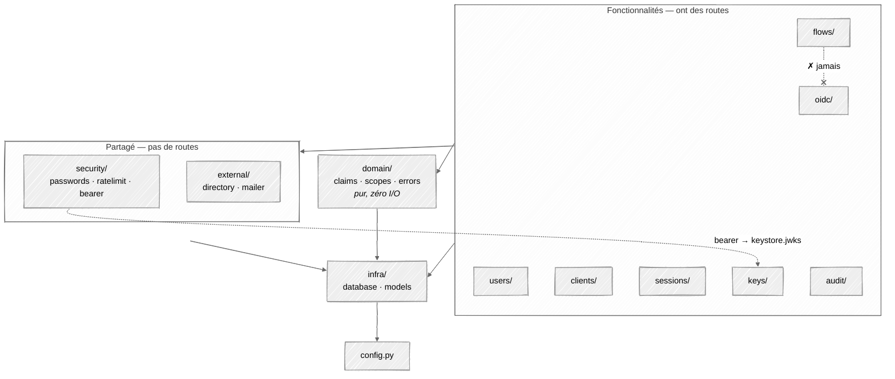
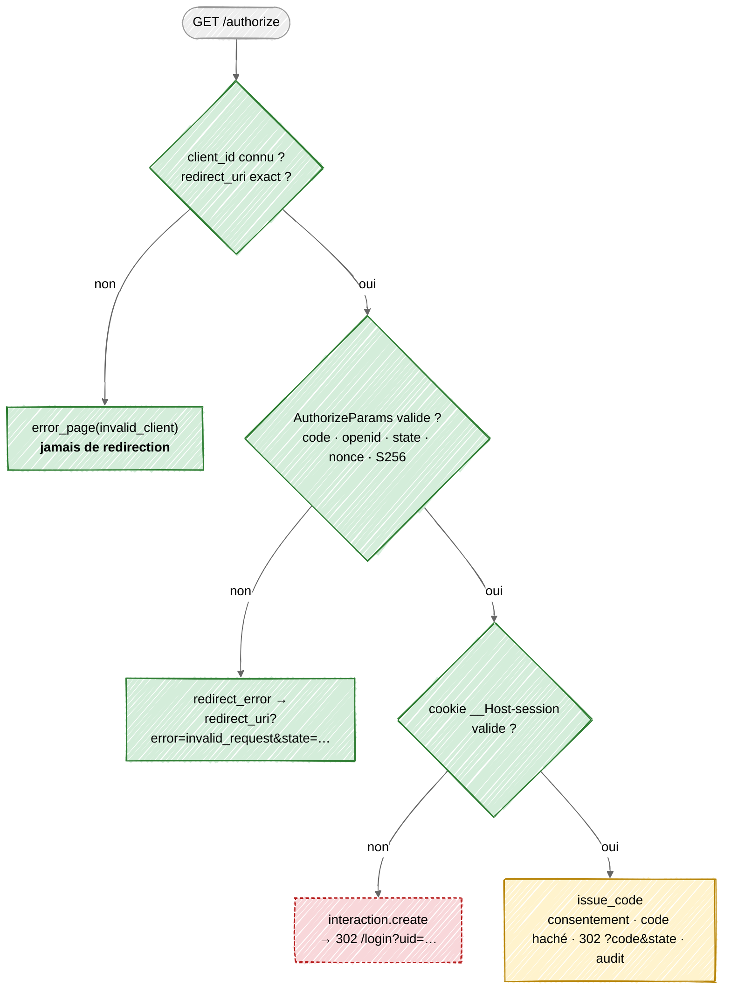
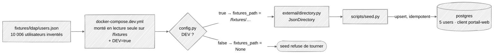

# Architecture actuelle de l'auth-server

État de `apps/auth-server/src/authentint/` au commit
`feat(auth-server): lay out the feature packages and start /authorize (WIP)`,
comparé au commit précédent. La cible est décrite dans
[architecture.md](architecture.md) ; l'ordre de construction et le *pourquoi*
de chaque fichier sont dans [learning-plan.md](learning-plan.md). Ce document
dit **où on en est**.

---

## 1. Résumé

Avant, l'auth-server était une démo : un seul `main.py` qui émettait des JWT
HS256 signés avec un secret écrit en dur. Aujourd'hui, le code est découpé
en **un dossier par fonctionnalité**, et le code partagé est rangé à part.
Les briques de base sont écrites : configuration, domaine, mots de passe, rate
limit, clés de signature, audit, annuaire. `/authorize` a ses vérifications
dans l'ordre de l'ADR.

**L'application démarre** (après `alembic upgrade head`) : discovery, JWKS et
les deux premières vérifications de `/authorize` répondent. Le chemin « pas de
session » de `/authorize` plante encore : voir [§6](#6-problèmes-connus).

---

## 2. Avant / maintenant

```
AVANT (HEAD~1)                          MAINTENANT
src/authentint/                         src/authentint/
├── __init__.py                         ├── __init__.py
├── main.py      ← tout était ici       ├── main.py          assemble l'app, lifespan
└── infra/                              ├── config.py        Settings (pydantic-settings)
    ├── database.py                     ├── infra/           connexion + modèles, rien d'autre
    └── models/                         │   ├── database.py
        identity · oauth ·              │   └── models/      identity · oauth · audit · keys
        audit · keys                    ├── domain/          claims · scopes · errors — pur, sans I/O
                                        ├── security/        passwords · ratelimit · bearer
                                        ├── external/        directory · mailer
                                        ├── audit/           audit (emit) · middleware (request_id)
                                        ├── keys/            keystore · routes
                                        ├── users/           queries · routes
                                        ├── clients/         queries · routes
                                        ├── sessions/        queries · routes
                                        ├── flows/           (à venir : interaction · activation · reset)
                                        └── oidc/            discovery · jwks · authorize · codes · token
scripts/seed.py (vide)                  scripts/seed.py      utilisateurs + client portail-web
                                        fixtures/ldap/users.json   10 006 utilisateurs inventés (dev)
```

### Ce que faisait `main.py`, et où ça vit maintenant

| Avant, dans `main.py` | Maintenant | Pourquoi |
| --- | --- | --- |
| `bcrypt.hashpw` synchrone | `security/passwords.py` : Argon2id via `run_in_executor` | Argon2id est la recommandation actuelle (mémoire-dure, résiste aux GPU). Il bloque le CPU ~100 ms : dans le thread pool, il ne gèle pas la boucle async pour toutes les autres requêtes. |
| — | `security/passwords.py` : `hash_token` (SHA-256) | Codes et refresh tokens sont stockés **hachés**. Ils ont 256 bits d'entropie, donc un hash rapide suffit ; un dump de la base ne donne aucun jeton utilisable. |
| `SECRET_KEY = "your_secret_key"`, HS256, `python-jose` | `keys/keystore.py` : RS256 via `joserfc`, clés en base chiffrées par Fernet, cycle `next → active → retired`, publiées dans le JWKS | Avec HS256, quiconque peut **vérifier** un jeton peut aussi en **forger** un : chaque service aurait eu le secret. Avec RS256, les services ne voient que la clé publique (JWKS). Le chiffrement Fernet protège la clé privée si un dump fuit. L'advisory lock évite que trois réplicas génèrent chacun leur clé. |
| `verify_token` (décode avec le secret) | `security/bearer.py` : `verify_access_token` + `require_scope(scope)` | Vérifie contre le JWKS avec `algorithms=["RS256"]` épinglé (bloque `alg: none` et la confusion RS256→HS256), plus `iss` et `exp`. `require_scope` est la dépendance FastAPI qui protège `/admin/*`. |
| `/token` avec `OAuth2PasswordRequestForm` (mot de passe envoyé à l'API) | `oidc/` : `/authorize` + code + PKCE ; `token.py` à écrire | Le *password grant* est retiré d'OAuth 2.1 : le client voit le mot de passe. Avec le flux *authorization code + PKCE*, seul l'auth-server voit le mot de passe, et un code volé est inutilisable sans le `code_verifier`. |
| `/register` public | rien pour l'instant (`flows/activation.py` à venir) | Les utilisateurs viennent de l'annuaire du client, pas d'une inscription libre. Un compte est **activé** par lien mail, pas créé. |
| `Base.metadata.create_all` au démarrage | migrations Alembic ; le lifespan ne fait plus que `keystore.ensure_active_key` | `create_all` ne modifie jamais une table existante et ne sait pas faire de partitions ni de `REVOKE`. Le schéma est un livrable versionné. |
| `os.environ["..."]` éparpillés | `config.py` : `Settings` (pydantic-settings) | La configuration est lue et validée **une fois**, au démarrage : une variable manquante fait échouer le boot, pas la première requête qui l'utilise. |
| `get_user_by_username` dans `main.py` | `users/`, `clients/`, `sessions/` → `queries.py` | Chaque fonctionnalité possède ses requêtes. Une autre fonctionnalité peut importer ce `queries.py`, jamais ses routes. |
| CORS `allow_origins=[PUBLIC_BASE_URL]` | **perdu** dans la réécriture de `main.py`, à remettre | Le frontend (`app.`) appelle `/token` sur `auth.` : c'est une autre origine, donc sans CORS le navigateur bloque la réponse. Liste blanche, jamais `*` (ADR §16). |
| — | `domain/` | Les règles (scopes accordés par rôle, forme de l'ID token, trois façons de répondre une erreur OAuth) sont testables en une milliseconde, sans base ni réseau. |
| — | `security/ratelimit.py` | Compteur atomique dans Postgres (`INSERT … ON CONFLICT … RETURNING`), partagé par tous les réplicas. **Échoue fermé** : si la base ne répond pas, on refuse. |
| — | `external/` | Un `Protocol` par système extérieur (`UserDirectory`, `Mailer`). Le JSON deviendra un LDAP, la console un SMTP, sans toucher au code métier. |
| — | `audit/` | `emit()` refuse tout `detail` contenant un secret ; le middleware pose un `request_id` pour corréler une requête à travers les logs. La table est append-only au niveau SQL (migration). |
| `infra/` = connexion + modèles | inchangé, et **seulement** ça | Règle du learning plan : dès qu'un fichier *fait* quelque chose avec la base (requête, verrou, compteur), il appartient à la fonctionnalité qui en a besoin. |

Dépendances : `bcrypt` → `argon2-cffi`, `python-jose` → `joserfc`, ajout de
`pydantic-settings` et `pydantic[email]` (pour `EmailStr` dans l'annuaire).

---

## 3. Qui a le droit d'importer qui



Trois règles :

- Une fonctionnalité peut importer le `queries.py` d'une autre (`oidc` →
  `clients.queries.get`), **jamais ses routes**.
- `domain/` ne fait aucune I/O. Il importe seulement les enums des modèles
  (`Role`) et les types de réponse FastAPI.
- `flows/` n'importe rien d'`oidc/`. Quand l'interaction est terminée, le
  navigateur est renvoyé sur `/authorize`, qui trouve alors le cookie de
  session (chemin SSO) et émet le code. C'est pour ça qu'`issue_code` peut
  vivre côté `oidc/` sans créer d'import circulaire.

---

## 4. `/authorize` aujourd'hui



Légende : vert = écrit · jaune = stub (`oidc/codes.py`, signature seulement) ·
rouge pointillé = n'existe pas encore (`flows/interaction.py`).

**Pourquoi cet ordre.** Les étapes 1-2 passent avant tout le reste : rediriger
vers un `redirect_uri` non vérifié, c'est envoyer le code ou l'erreur chez
l'attaquant. C'est la vulnérabilité n°1 des IdP. Le cookie est vérifié
**avant** de créer une interaction, parce que le chemin SSO est le plus
fréquent en pic, et qu'une ligne jamais relue coûte une écriture par requête.

---

## 5. Données de dev



Le seed n'insère que les 5 premiers utilisateurs : hacher 10 006 mots de passe
en Argon2 prendrait plusieurs minutes. Tous ont le mot de passe
`DEV_PASSWORD`. Sans le client `portail-web`, `/authorize` répond
`invalid_client` à toute requête.

Le garde-fou est dans `config.py` et pas seulement dans le compose : même si
quelqu'un monte le fichier en production, `DEV` vaut `False` par défaut et
`fixtures_path` est forcé à `None`.

---

## 6. Problèmes connus

Vérifié sur la stack lancée (`docker compose up`, migration, seed, `curl`).

**Reste ouvert :**

| Fichier | Problème |
| --- | --- |
| `oidc/authorize.py` | Chemin sans cookie : `NameError: interaction` → 500 (`flows/interaction.py` n'existe pas). Remplacé à l'étape 3 par `fake_authenticate()`, puis à l'étape 4 par le vrai `flows/interaction.py`. |
| `oidc/codes.py` | `issue_code` et `consume_code` sont des `pass`. |
| `oidc/token.py` | Docstring seulement, pas importé par `oidc/__init__.py`. |
| démarrage | Les migrations ne tournent pas au boot : base vide → `relation "signing_keys" does not exist`. Lancer `alembic upgrade head` à la main (README de l'auth-server). |
| `keys/routes.py` | `/admin/keys/rotate` est protégé par `svc:admin.users` : pas de scope dédié aux clés. |
| `domain/scopes.py` | `svc:cadastre.write` est accordé à `admin` mais absent de [architecture.md §9](architecture.md#9-rôles-et-scopes). Choisir lequel fait foi. |
| `flows/claims.py`, `flows/scopes.py` | Vides et redondants avec `domain/`. À supprimer. |

**Corrigé dans `chore/b0-baseline` :**

| Fichier | Correction |
| --- | --- |
| `main.py` | `RequestIdMiddleware` branché, `CORSMiddleware` remis (liste blanche `PUBLIC_BASE_URL`, jamais `*`). Le `router` fantôme avait déjà disparu. |
| `config.py` | `public_base_url` déclaré : `authorize.py` l'utilise, le compose le fournit déjà. |
| `oidc/discovery.py` | `scopes_supported` / `claims_supported` dérivés de `domain/` au lieu de `[...]` (500). |
| `oidc/token.py` | Décorateur orphelin retiré (erreur de syntaxe). |
| `audit/audit.py` | `occured_at` → `occurred_at`. |
| `external/mailer.py` | `logging.getLogger(__name__)` au lieu de la fonction `log`. |
| `domain/scopes.py` | (déjà corrigé avant cette branche) virgule de `Role.agent`, annotation de `grant()`. |

---

## 7. État d'avancement

| Module | État |
| --- | --- |
| `config.py`, `infra/`, migration Alembic | fait |
| `domain/` claims · scopes · errors | fait |
| `security/` passwords · ratelimit · bearer | fait |
| `external/` directory · mailer | fait |
| `audit/` emit · middleware | fait, middleware branché |
| `keys/` keystore · routes | fait |
| `clients/queries.py` | `get` seulement |
| `sessions/queries.py` | `from_cookie` seulement — manque `create`, `list_for_user`, `revoke` |
| `users/queries.py` | vide — manque `by_id`, `by_numero_fiscal` |
| `*/routes.py` sauf `keys/` | vides |
| `scripts/seed.py` + fixtures | fait |
| `oidc/` discovery · jwks | fait |
| `oidc/authorize.py` | vérifications écrites ; dépend de `issue_code` et `interaction` |
| `oidc/codes.py`, `oidc/token.py` | stubs |
| `oidc/` userinfo · revoke · end_session | manquants |
| `flows/` interaction · activation · reset | manquants |
| `ops/` | manquant |
| `tests/` | vide |

---

## 8. Prochaines étapes

Dans l'ordre du [learning plan](learning-plan.md) (étapes 13 à 17), chacune
n'utilisant que ce que les précédentes ont construit :

1. ~~**Réparer le démarrage**~~ — fait dans `chore/b0-baseline`. Reste :
   appliquer les migrations au boot (advisory lock, comme la clé initiale).
2. **Requêtes** (section *`users/` · `clients/` · `sessions/`*) :
   `users.by_numero_fiscal`, `users.by_id`, `sessions.create`.
3. **`oidc/`** (section *`src/oidc/` — brick B2*), contre un
   `fake_authenticate()` à la place d'`interaction.create` :
   `issue_code` → `token.py` (échange du code atomique, PKCE, signature,
   premier refresh token) → rotation du refresh token → `userinfo`, `revoke`,
   `end_session`.
4. **`flows/`** (section *`src/flows/` — brick B1*) : `interaction.py`
   (`create`, `load`, `next_step`, login, consentement), qui remplace
   `fake_authenticate()` ; puis `activation.py` et `reset.py`.
5. **Routes `/me` et `/admin`** dans chaque fonctionnalité.
6. **`ops/`** : `/health/live`, `/health/ready`, `/metrics`.

En parallèle : un test par invariant de sécurité, à commencer par « un
`redirect_uri` non enregistré donne une page d'erreur, jamais une
redirection ».
