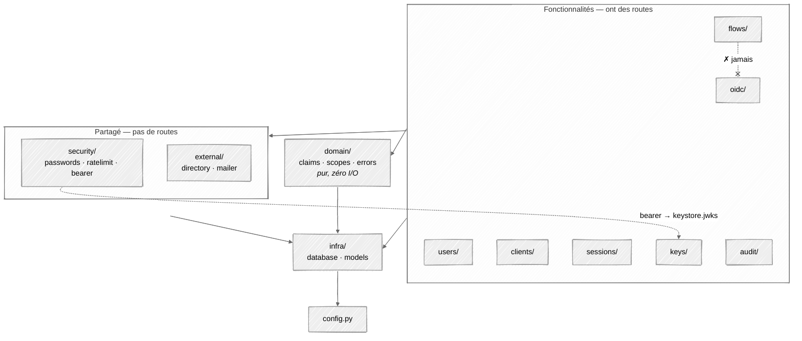
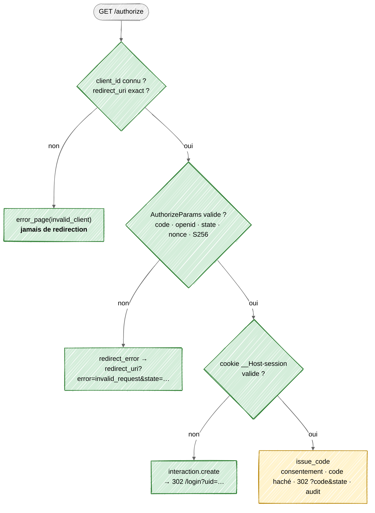
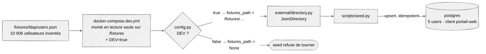

# Architecture actuelle de l'auth-server

État de `apps/auth-server/src/authentint/` à la fin de **B0** (branche
`chore/b0-baseline`). La cible est décrite dans
[architecture.md](architecture.md) ; l'ordre de construction et le *pourquoi*
de chaque fichier sont dans [learning-plan.md](learning-plan.md). Ce document
dit **où on en est**.

---

## 1. Résumé

Avant, l'auth-server était une démo : un seul `main.py` qui émettait des JWT
HS256 signés avec un secret écrit en dur. Aujourd'hui, le code est découpé
en **un dossier par fonctionnalité**, et le code partagé est rangé à part.
Les briques de base sont écrites : configuration, domaine, mots de passe, rate
limit, clés de signature, audit, annuaire. `/authorize` a ses vérifications
dans l'ordre de l'ADR.

**B0 est terminé** : `make up` construit, migre et démarre la stack ; les
quatre contrats de l'[ADR §17](adr/0002-stack-simplifiee.md#17-plan-de-construction--6-bricks)
sont gelés ; 27 tests tournent en CI. Chaque brick B1–B6 peut démarrer en
parallèle contre son faux : voir [§8](#8-les-couloirs--qui-prend-quoi).

---

## 2. Avant / maintenant

```
AVANT (HEAD~1)                          MAINTENANT
src/authentint/                         src/authentint/
├── __init__.py                         ├── __init__.py
├── main.py      ← tout était ici       ├── main.py          assemble l'app, lifespan
└── infra/                              ├── config.py        Settings (pydantic-settings)
    ├── database.py                     ├── infra/           connexion + modèles, rien d'autre
    └── models/                         │   ├── database.py
        identity · oauth ·              │   └── models/      identity · oauth · audit · keys
        audit · keys                    ├── domain/          claims · scopes · errors — pur, sans I/O
                                        ├── security/        passwords · ratelimit · bearer
                                        ├── external/        directory · mailer
                                        ├── audit/           audit (emit) · middleware (request_id)
                                        ├── keys/            keystore · routes
                                        ├── users/           queries · routes
                                        ├── clients/         queries · routes
                                        ├── sessions/        queries · routes
                                        ├── flows/           (à venir : interaction · activation · reset)
                                        └── oidc/            discovery · jwks · authorize · codes · token
scripts/seed.py (vide)                  scripts/seed.py      utilisateurs + client portail-web
                                        fixtures/ldap/users.json   10 006 utilisateurs inventés (dev)
```

### Ce que faisait `main.py`, et où ça vit maintenant

| Avant, dans `main.py` | Maintenant | Pourquoi |
| --- | --- | --- |
| `bcrypt.hashpw` synchrone | `security/passwords.py` : Argon2id via `run_in_executor` | Argon2id est la recommandation actuelle (mémoire-dure, résiste aux GPU). Il bloque le CPU ~100 ms : dans le thread pool, il ne gèle pas la boucle async pour toutes les autres requêtes. |
| — | `security/passwords.py` : `hash_token` (SHA-256) | Codes et refresh tokens sont stockés **hachés**. Ils ont 256 bits d'entropie, donc un hash rapide suffit ; un dump de la base ne donne aucun jeton utilisable. |
| `SECRET_KEY = "your_secret_key"`, HS256, `python-jose` | `keys/keystore.py` : RS256 via `joserfc`, clés en base chiffrées par Fernet, cycle `next → active → retired`, publiées dans le JWKS | Avec HS256, quiconque peut **vérifier** un jeton peut aussi en **forger** un : chaque service aurait eu le secret. Avec RS256, les services ne voient que la clé publique (JWKS). Le chiffrement Fernet protège la clé privée si un dump fuit. L'advisory lock évite que trois réplicas génèrent chacun leur clé. |
| `verify_token` (décode avec le secret) | `security/bearer.py` : `verify_access_token` + `require_scope(scope)` | Vérifie contre le JWKS avec `algorithms=["RS256"]` épinglé (bloque `alg: none` et la confusion RS256→HS256), plus `iss` et `exp`. `require_scope` est la dépendance FastAPI qui protège `/admin/*`. |
| `/token` avec `OAuth2PasswordRequestForm` (mot de passe envoyé à l'API) | `oidc/` : `/authorize` + code + PKCE ; `token.py` à écrire | Le *password grant* est retiré d'OAuth 2.1 : le client voit le mot de passe. Avec le flux *authorization code + PKCE*, seul l'auth-server voit le mot de passe, et un code volé est inutilisable sans le `code_verifier`. |
| `/register` public | rien pour l'instant (`flows/activation.py` à venir) | Les utilisateurs viennent de l'annuaire du client, pas d'une inscription libre. Un compte est **activé** par lien mail, pas créé. |
| `Base.metadata.create_all` au démarrage | migrations Alembic ; le lifespan ne fait plus que `keystore.ensure_active_key` | `create_all` ne modifie jamais une table existante et ne sait pas faire de partitions ni de `REVOKE`. Le schéma est un livrable versionné. |
| `os.environ["..."]` éparpillés | `config.py` : `Settings` (pydantic-settings) | La configuration est lue et validée **une fois**, au démarrage : une variable manquante fait échouer le boot, pas la première requête qui l'utilise. |
| `get_user_by_username` dans `main.py` | `users/`, `clients/`, `sessions/` → `queries.py` | Chaque fonctionnalité possède ses requêtes. Une autre fonctionnalité peut importer ce `queries.py`, jamais ses routes. |
| CORS `allow_origins=[PUBLIC_BASE_URL]` | **perdu** dans la réécriture de `main.py`, à remettre | Le frontend (`app.`) appelle `/token` sur `auth.` : c'est une autre origine, donc sans CORS le navigateur bloque la réponse. Liste blanche, jamais `*` (ADR §16). |
| — | `domain/` | Les règles (scopes accordés par rôle, forme de l'ID token, trois façons de répondre une erreur OAuth) sont testables en une milliseconde, sans base ni réseau. |
| — | `security/ratelimit.py` | Compteur atomique dans Postgres (`INSERT … ON CONFLICT … RETURNING`), partagé par tous les réplicas. **Échoue fermé** : si la base ne répond pas, on refuse. |
| — | `external/` | Un `Protocol` par système extérieur (`UserDirectory`, `Mailer`). Le JSON deviendra un LDAP, la console un SMTP, sans toucher au code métier. |
| — | `audit/` | `emit()` refuse tout `detail` contenant un secret ; le middleware pose un `request_id` pour corréler une requête à travers les logs. La table est append-only au niveau SQL (migration). |
| `infra/` = connexion + modèles | inchangé, et **seulement** ça | Règle du learning plan : dès qu'un fichier *fait* quelque chose avec la base (requête, verrou, compteur), il appartient à la fonctionnalité qui en a besoin. |

Dépendances : `bcrypt` → `argon2-cffi`, `python-jose` → `joserfc`, ajout de
`pydantic-settings` et `pydantic[email]` (pour `EmailStr` dans l'annuaire).

---

## 3. Qui a le droit d'importer qui



Trois règles :

- Une fonctionnalité peut importer le `queries.py` d'une autre (`oidc` →
  `clients.queries.get`), **jamais ses routes**.
- `domain/` ne fait aucune I/O. Il importe seulement les enums des modèles
  (`Role`) et les types de réponse FastAPI.
- `flows/` n'importe rien d'`oidc/`. Quand l'interaction est terminée, le
  navigateur est renvoyé sur `/authorize`, qui trouve alors le cookie de
  session (chemin SSO) et émet le code. C'est pour ça qu'`issue_code` peut
  vivre côté `oidc/` sans créer d'import circulaire.

---

## 4. `/authorize` aujourd'hui



Légende : vert = écrit et testé · jaune = stub (`oidc/codes.py`, B2).

**Pourquoi cet ordre.** Les étapes 1-2 passent avant tout le reste : rediriger
vers un `redirect_uri` non vérifié, c'est envoyer le code ou l'erreur chez
l'attaquant. C'est la vulnérabilité n°1 des IdP. Le cookie est vérifié
**avant** de créer une interaction, parce que le chemin SSO est le plus
fréquent en pic, et qu'une ligne jamais relue coûte une écriture par requête.

---

## 5. Données de dev



Le seed n'insère que les 5 premiers utilisateurs : hacher 10 006 mots de passe
en Argon2 prendrait plusieurs minutes. Tous ont le mot de passe
`DEV_PASSWORD`. Sans le client `portail-web`, `/authorize` répond
`invalid_client` à toute requête.

Le garde-fou est dans `config.py` et pas seulement dans le compose : même si
quelqu'un monte le fichier en production, `DEV` vaut `False` par défaut et
`fixtures_path` est forcé à `None`.

---

## 6. Ce que B0 a gelé

Les contrats de l'[ADR §17](adr/0002-stack-simplifiee.md#b0--socle-et-contrats).
**Les modifier, c'est une PR relue par les couloirs qui les consomment.**

| Contrat | Où | Consommé par | Garde-fou |
| --- | --- | --- | --- |
| Schéma v1 | `alembic/versions/f93b4b48fcc6_initial_schema.py` | B1, B4 | appliqué par le service `migrate` à chaque `make up` |
| ID token | `domain/claims.py` → `IdToken` | B2, frontend | `tests/unit/test_domain.py` |
| Access token | `domain/claims.py` → `AccessToken` (RFC 9068, `typ: at+jwt`, `aud` = `domain.scopes.audiences()`) | B2 signe, B3 valide | idem : pas de `role` ni de donnée personnelle |
| Scopes | `domain/scopes.py` → `OIDC_SCOPES`, `ALLOWED`, `grant()`, `audiences()` | B2, B3, B5 | idem |
| Codes d'erreur OAuth | `domain/errors.py` → `AuthorizeErrorCode`, `TokenErrorCode` | B2, B5 | typés : un code hors RFC ne passe pas le typage |
| API d'interaction | `flows/interaction.py` → `docs/generated/openapi.json` | B1 implémente, B5 mocke | CI échoue si `openapi.json` n'est pas régénéré (`make openapi`) |

Aussi livré en B0 : service `migrate` (one-shot, rôle d'un Job Kubernetes),
`/health/live` · `/health/ready`, healthcheck compose, `Makefile`, CI GitHub
Actions, `tests/` (unit · integration · security) avec une transaction
annulée par test.

**Encore ouvert, à trancher :**

| Sujet | Question |
| --- | --- |
| `domain/scopes.py` | `svc:cadastre.write` est accordé à `admin` mais absent de [architecture.md §9](architecture.md#9-rôles-et-scopes). Lequel fait foi ? |
| `keys/routes.py` | `/admin/keys/rotate` est protégé par `svc:admin.users` : faut-il un scope `svc:admin.keys` ? |
| `flows/claims.py`, `flows/scopes.py` | Vides, redondants avec `domain/`. À supprimer. |
| `numero_fiscal` | « Chiffré au repos » (ADR §8), mais il faut le retrouver au login : chiffrement déterministe ou index aveugle (HMAC) ? Décision B1. |

---

## 7. État d'avancement

| Module | État |
| --- | --- |
| `config.py`, `infra/`, migration, service `migrate` | fait |
| `domain/` claims · scopes · errors | fait, testé |
| `security/` passwords · ratelimit · bearer | fait |
| `external/` directory · mailer | fait |
| `audit/` emit · middleware | fait, branché |
| `keys/` keystore · routes | fait |
| `oidc/` discovery · jwks | fait, testé |
| `oidc/authorize.py` | vérifications 1-7 faites et testées ; chemin SSO → `issue_code` (stub, B2) |
| `flows/interaction.py` | `create` · `load` · `next_step` · `GET` faits ; `login` · `consent` → 501 (B1) |
| `ops/` | `/health/live`, `/health/ready` ; `/metrics` manquant (B6) |
| `oidc/` codes · token · userinfo · revoke · end_session | B2 |
| `flows/` activation · reset | B1 |
| `users/` · `clients/` · `sessions/` queries + routes `/me` `/admin` | B1 · B4 |
| `apps/mock-services/` | stub qui répond 200 à tout (B3) |
| frontend | écran de login de démonstration (B5) |

---

## 8. Les couloirs — qui prend quoi

Chaque couloir **démarre contre un faux**, sur sa propre branche partie de
`main`, et ouvre ses PR vers `main`. Personne n'attend personne : les faux
disparaissent aux *seams*, à deux personnes. Détail et justification :
[ADR §17](adr/0002-stack-simplifiee.md#les-bricks).

| Couloir | Possède | Démarre contre | Première PR | Fini quand |
| --- | --- | --- | --- | --- |
| **B1 · Identité** | `flows/interaction.py` (`login`, `consent`), `flows/activation.py`, `flows/reset.py`, `users/queries.py`, `sessions.create` | `scripts/seed.py` + `fixtures/` | `POST /interaction/{uid}/login` : `DUMMY_HASH` à temps constant, verrouillage à 5 échecs, rate limit, cookie `__Host-session` | seed → activé → mot de passe vérifié, en pytest |
| **B2 · Cœur OIDC** | `oidc/codes.py`, `oidc/token.py`, rotation refresh, `userinfo`, `revoke`, `end_session` | `fake_authenticate()` : crée une session pour un utilisateur seedé, à la place de `interaction.create` | `issue_code` + `/token` `authorization_code` (échange atomique, PKCE, signature `AccessToken`/`IdToken`) | smoke spec vert ; `docker compose up --scale auth-server=3` propre |
| **B3 · Ressources** | `apps/mock-services/` : validation JWKS, `aud`, `scope` | un JWT signé à la main + un `jwks.json` commité | `GET /dossiers` : 401 sans jeton, 403 sous-scopé | `alg: none` rejeté ; jeton de `svc-cadastre` rejeté par `svc-impots` |
| **B4 · Traçabilité** | `sessions/` (`/me/sessions`, `/admin/sessions`), `/me/audit`, `/admin/audit`, `users/routes.py` admin | les événements que `audit.emit` produit déjà | `GET /me/sessions` + `DELETE /me/sessions/{id}` | append-only vérifié par un test (`UPDATE audit_events` refusé) |
| **B5 · Frontend** | `apps/frontend/` : étapes login/consentement, callback PKCE, portail, activation, reset, admin | MSW généré depuis `docs/generated/openapi.json` | machine à étapes pilotée par `GET /interaction/{uid}` → `prompt` | parcours Playwright vert contre le mock |
| **B6 · Ops** | `/metrics`, k6, chart Helm, suite de régression sécurité | le système tel qu'il est | `/metrics` + un script k6 sur `/authorize` | rapport k6 ; assertions de sécurité vertes |

**Équipe réduite ?** Fusionner B3 dans B2 et B4 dans B1 (ADR §17).

### Seams — quand un faux meurt

| Seam | Faux supprimé | Porté par |
| --- | --- | --- |
| S1 | `fake_authenticate()` → `POST /interaction/{uid}/login` réel | B1 + B2 |
| S2 | JWKS commité de B3 → `/.well-known/jwks.json` réel | B3 + B2 |
| S3 | MSW → vraie API d'interaction | B5 + B1 |
| S4 | données bouchonnées du front → vraies sessions et audit | B5 + B4 |

### Règles de travail

- Une branche par couloir et par sujet, nommée `b1/login`, `b2/token`… PR vers
  `main`, CI verte obligatoire.
- `make up` · `make test` · `make seed` · `make openapi` — rien d'autre à
  connaître pour démarrer ([README de l'auth-server](../apps/auth-server/README.md)).
- Un invariant de [architecture.md §15](architecture.md#15-invariants) = un
  test dans `tests/security/`, écrit **avant** le code qui le respecte.
- Toucher un contrat de [§6](#6-ce-que-b0-a-gelé) : prévenir les couloirs
  consommateurs dans la PR.
