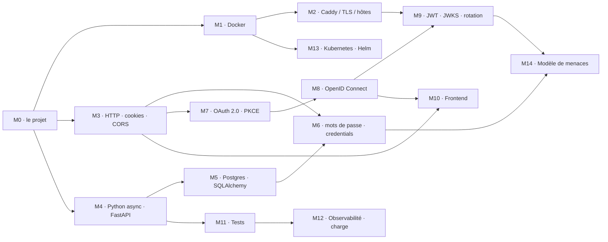

# Parcours d'apprentissage — construire Authent'INT de zéro

Ce document est écrit pour quelqu'un qui n'a jamais touché à la plupart des
outils de la stack. Il ne remplace pas l'[ADR 0002](adr/0002-stack-simplifiee.md)
(les décisions) ni [architecture.md](architecture.md) (ce que le système est) :
il explique **pourquoi chaque outil est là** et **comment on s'en sert ici**,
puis renvoie à la bonne page pour aller plus loin.

Deux parties :

- **[Partie 1 — l'arborescence, fichier par fichier](#partie-1--larborescence-fichier-par-fichier)**.
  Pour chaque dossier de [architecture.md §13](architecture.md#13-arborescence),
  toujours dans le même ordre : *le problème* qu'il résout → *l'outil* choisi et
  ce qu'il fait → *comment on s'en sert ici*, avec du code → *les pièges* →
  *à lire*.
- **[Partie 2 — les concepts](#partie-2--les-concepts)**. 15 modules, un par
  idée à comprendre (OAuth, JWKS, Argon2, réseaux Docker…). Chaque module
  commence par une explication en deux paragraphes, puis les ressources, puis
  un exercice.

Les deux parties se renvoient l'une à l'autre : un fichier dit quel concept il
suppose, un concept dit quels fichiers il construit.

Règle : **lire la section du projet avant la ressource.** Le projet dit ce
qu'on construit ; la ressource dit comment. Dans l'autre sens on lit tout et on
ne retient rien.

---

# Partie 1 — l'arborescence, fichier par fichier

## Comment on construit n'importe quel fichier ici

Quatre étapes, toujours les mêmes. Elles existent parce que le projet est
construit en parallèle par plusieurs personnes ([ADR §17](adr/0002-stack-simplifiee.md#17-plan-de-construction--6-bricks))
et que chacune doit pouvoir avancer sans lire le code des autres.

1. **Le contrat d'abord.** La forme de la table, du claim, de la route est
   gelée en B0. On ne l'invente pas dans le fichier, on la recopie depuis
   l'ADR. *Pourquoi :* si deux personnes inventent chacune la forme d'un
   jeton, l'intégration finale est une réécriture.
2. **Le test ensuite.** L'invariant de [architecture.md §15](architecture.md#15-invariants)
   que ce fichier porte devient un `test_*.py` rouge. *Pourquoi :* un
   invariant de sécurité sans test est une phrase dans un document, pas une
   garantie.
3. **Le fichier enfin**, le plus court qui rend le test vert.
4. **`docker compose up --scale auth-server=3`** dès que ça répond. *Pourquoi :*
   le déploiement final est un cluster avec plusieurs réplicas. Tout ce qui
   marche à un seul processus et casse à trois (clé générée en mémoire,
   compteur en mémoire, état collé à un processus) est un bug Kubernetes
   trouvé en avance ([ADR §15](adr/0002-stack-simplifiee.md#le-test-multi-réplicas--à-lancer-tôt)).

```
authentint/
├── docker-compose.yml  .env.example  Makefile  caddy/Caddyfile   → §racine
├── docs/                                                        → §docs
├── apps/auth-server/                                            → §auth-server
├── apps/frontend/                                               → §frontend
├── apps/mock-services/                                          → §mock-services
├── fixtures/users.json                                          → §fixtures
├── k8s/                                                         → §k8s
├── load/                                                        → §load
└── .github/workflows/                                           → §ci
```

---

## Racine — `docker-compose.yml` · `.env.example` · `Makefile` · `caddy/`

**État :** compose et Caddyfile existent et démarrent (brick B0 en cours). Les
trois `Dockerfile` d'`apps/` sont des stubs qui répondent 200 à tout.

### `docker-compose.yml`

**Le problème.** Cinq programmes (Caddy, Postgres, trois apps Python/JS) doivent
tourner ensemble, se parler par leur nom, démarrer dans le bon ordre, et
présenter exactement la même topologie que le cluster final — sinon ce qu'on
teste en local n'est pas ce qu'on déploie.

**L'outil.** Docker exécute chaque programme dans un conteneur : un processus
isolé avec son propre système de fichiers, construit depuis une image. Compose
décrit dans un fichier YAML *l'ensemble* des conteneurs, les réseaux qui les
relient et les volumes qui gardent leurs données, et les démarre d'une seule
commande.

**Comment on s'en sert ici.** Le fichier existe déjà ; ce qu'il faut savoir
lire dedans :

```yaml
networks:
  edge: { driver: bridge }
  data: { driver: bridge, internal: true }   # pas de passerelle → aucun accès sortant
```

Deux réseaux, c'est le cloisonnement de [architecture.md §1](architecture.md#1-vue-densemble).
Un conteneur ne voit que les conteneurs des réseaux dont il est membre.
`postgres` n'est que sur `data`, `svc-impots` n'est que sur `edge` : il n'existe
**aucune route** entre eux, quoi que fasse le code. `auth-server` est sur les
deux, c'est le seul pont.

```yaml
  caddy:
    networks:
      edge:
        aliases: [auth.authentint.local, app.authentint.local, …]
```

Docker fournit un DNS interne : chaque conteneur est joignable par son nom de
service. Un *alias* ajoute d'autres noms. Ici `caddy` répond aussi à
`auth.authentint.local`, donc quand `svc-impots` appelle
`https://auth.authentint.local/…`, il tombe sur Caddy, **exactement comme le
navigateur**. C'est ce qui fait que l'`issuer` est la même chaîne dedans et
dehors ([M2](#m2--caddy-tls-et-noms-dhôte)).

```yaml
  svc-impots:
    depends_on:
      caddy: { condition: service_healthy }
```

`depends_on` seul ne garantit que l'*ordre de lancement*. Avec `condition:
service_healthy`, Compose attend que le `healthcheck` du conteneur passe. Ici
les mocks attendent que Caddy ait généré sa CA, sinon leur premier appel TLS
échoue.

```yaml
      DATABASE_URL: postgresql+asyncpg://authentint_app:${POSTGRES_PASSWORD:-authentint}@postgres:5432/authentint
```

`${VAR:-défaut}` est lu depuis `.env` au moment du `docker compose up`. Le
code Python ne voit qu'une variable d'environnement toute faite.

**Pièges.**
- Ajouter `ports:` sur `postgres` « pour DBeaver » annule tout le
  cloisonnement. `docker compose exec postgres psql -U authentint_app authentint`
  à la place.
- `docker compose up` sans `--build` réutilise l'ancienne image après un
  changement de `Dockerfile`.
- Le nom du réseau vu de l'extérieur est préfixé par le dossier :
  `authent-int_edge`. Ça compte pour k6 ([§load](#load--k6)).

**Lire.**
- Réseaux Docker (bridge, `internal`, DNS intégré) : <https://docs.docker.com/engine/network/>
- Réseaux dans Compose, alias : <https://docs.docker.com/compose/how-tos/networking/>
- `depends_on` et `condition` : <https://docs.docker.com/reference/compose-file/services/#depends_on>
- Interpolation `${VAR:-défaut}` : <https://docs.docker.com/compose/how-tos/environment-variables/variable-interpolation/>

Concept : [M1](#m1--docker-et-compose).

### `.env.example`

**Le problème.** Le compose a besoin de valeurs (mot de passe Postgres, clé de
chiffrement) qui ne doivent **pas** être dans Git, mais chaque nouvelle personne
doit savoir lesquelles fournir.

**L'outil.** Compose lit automatiquement un fichier `.env` à côté de lui.
`.env` est ignoré par Git ; `.env.example` est commité et contient les mêmes
clés avec des valeurs de dev inoffensives.

**Comment on s'en sert ici.**

```dotenv
# Mot de passe du rôle applicatif Postgres. Dev uniquement.
POSTGRES_PASSWORD=authentint
# Chiffre les clés privées de signature en base (ADR §8, signing_keys). Générer : python -c "from cryptography.fernet import Fernet; print(Fernet.generate_key().decode())"
KEY_ENCRYPTION_KEY=
LOG_LEVEL=INFO
```

Premier geste d'un nouveau : `cp .env.example .env`.

**Pièges.** Une vraie valeur commitée dans `.env.example` est un secret dans
l'historique Git pour toujours.

**Lire.** <https://12factor.net/config> — la règle « la config vient de
l'environnement, pas du code », qui explique aussi pourquoi le chart Helm
([§k8s](#k8s--le-chart-helm)) fournira les mêmes variables autrement.

### `Makefile`

**Le problème.** Les commandes utiles (`docker compose exec auth-server
pytest`, `docker compose exec auth-server python -m scripts.seed`…) sont
longues et personne ne les retient.

**L'outil.** `make` est un vieux système de build. On ne s'en sert pas pour
ça : on s'en sert comme d'un **carnet de commandes nommées**. `make test` tape
la longue commande à notre place. C'est l'usage le plus répandu de `make` dans
les projets modernes.

**Comment on s'en sert ici.**

```make
.PHONY: up down seed test docs scale3

up:      ; docker compose up -d --build --wait
down:    ; docker compose down
seed:    ; docker compose exec auth-server python -m scripts.seed
test:    ; docker compose exec auth-server pytest
docs:    ; docker compose exec auth-server python -m scripts.gen_docs
scale3:  ; docker compose up -d --scale auth-server=3
```

`.PHONY` dit à `make` que ces noms sont des commandes, pas des fichiers à
produire (sinon un fichier nommé `test` dans le dossier ferait croire que la
cible est « déjà faite »).

**Pièges.** Une cible qui dépasse trois lignes est un script dans `scripts/`,
pas une recette `make`. L'indentation des recettes multi-lignes est une
**tabulation**, pas des espaces.

**Lire.** <https://www.gnu.org/software/make/manual/html_node/Phony-Targets.html>
— c'est tout ce qu'il faut savoir.

### `caddy/Caddyfile`

**Le problème.** Le navigateur doit parler HTTPS à quatre noms d'hôte, et un
seul port doit être ouvert sur la machine. Il faut donc un programme qui
écoute sur 443, termine TLS, et route chaque nom vers le bon conteneur.

**L'outil.** Caddy est un serveur web / reverse proxy dont la particularité est
de gérer TLS tout seul. `tls internal` lui fait créer une autorité de
certification locale et émettre un certificat par nom d'hôte : pas de
`mkcert`, pas d'openssl à la main.

**Comment on s'en sert ici.** Le fichier existe. Chaque bloc est un site :

```caddyfile
auth.authentint.local {
	tls internal
	reverse_proxy auth-server:8000
}
```

« Quand une requête arrive avec `Host: auth.authentint.local`, présente le
certificat de ce nom, puis transmets à `auth-server` port 8000 sur le réseau
Docker. » `auth-server:8000` est résolu par le DNS Docker.

Deux ajouts à faire plus tard, à connaître dès maintenant :

```caddyfile
	reverse_proxy auth-server:8000 {
		header_up X-Request-Id {http.request.uuid}   # B4 : id de corrélation dans l'audit
	}
```

`{http.request.uuid}` est un *placeholder* : Caddy le remplace par un
identifiant unique par requête. `auth-server` le lit et le met dans chaque
ligne de log et d'audit ([§audit](#srcaudit)), ce qui permet de suivre une
requête à travers tous les logs.

**Pièges.**
- Les certificats sont signés par une CA que le navigateur ne connaît pas :
  il affiche un avertissement, on l'accepte une fois par nom. Les mocks, eux,
  reçoivent la CA par le volume `caddy_data` (`CA_BUNDLE`).
- Le Caddyfile de l'edge n'est pas celui du frontend
  ([§frontend](#appsfrontend--le-spa)) : deux fichiers, deux rôles.

**Lire.**
- Concepts Caddyfile (sites, directives, placeholders) : <https://caddyserver.com/docs/caddyfile/concepts>
- `reverse_proxy` et `header_up` : <https://caddyserver.com/docs/caddyfile/directives/reverse_proxy#headers>
- `tls internal` : <https://caddyserver.com/docs/automatic-https>

Concept : [M2](#m2--caddy-tls-et-noms-dhôte).

---

## `docs/`

### `threat-model.md`

**Le problème.** La [checklist §16](adr/0002-stack-simplifiee.md#16-checklist-sécurité)
dit *quoi* faire. Le client demandera *contre quoi* ça protège. Sans document
qui relie les deux, la checklist est une liste de bonnes intentions.

**Comment on s'en sert ici.** Une table, une ligne par contrôle :

| Actif | Menace | Contrôle | Test qui le prouve |
| --- | --- | --- | --- |
| Codes d'autorisation | Rejeu d'un code intercepté | Usage unique, consommation atomique, révocation de la descendance | `tests/security/test_code_replay.py` |

Commencé en B2, complété à chaque brick. Concept : [M14](#m14--modèle-de-menaces).

### `generated/`

**Le problème.** Le brief demande un *schéma de BDD* et une *documentation des
endpoints* en livrables. Écrits à la main, ils sont faux dès la deuxième
migration.

**L'outil.** Les deux sources de vérité existent déjà en mémoire : SQLAlchemy
connaît toutes les tables (`Base.metadata`), FastAPI connaît toutes les routes
(`app.openapi()`). Un script les parcourt et écrit du Markdown.

**Comment on s'en sert ici.** `scripts/gen_docs.py` :

```python
for table in Base.metadata.sorted_tables:
    print(f"## {table.name}\n\n| Colonne | Type | Null |\n| --- | --- | --- |")
    for c in table.columns:
        print(f"| `{c.name}` | {c.type} | {'oui' if c.nullable else 'non'} |")
```

Idem pour `app.openapi()["paths"]`. `make docs` le lance dans le conteneur.
`generated/` n'est **jamais** édité à la main.

**Lire.** <https://docs.sqlalchemy.org/en/20/core/metadata.html#accessing-tables-and-columns> ·
<https://fastapi.tiangolo.com/how-to/extending-openapi/>

---

## `apps/auth-server/` — l'OpenID Provider

C'est le gros morceau. Dans l'ordre de construction :

```
apps/auth-server/
├── pyproject.toml          1. projet + dépendances
├── Dockerfile              2. remplace le stub
├── alembic/                3. schéma v1 (contrat B0)
├── src/authentint/
│   ├── main.py             4. app FastAPI, lifespan, routers
│   ├── config.py           5. Settings
│   ├── infra/                 database · models — rien d'autre
│   ├── security/              passwords · ratelimit · bearer
│   ├── external/              directory · mailer
│   ├── keys/                  keystore · /admin/keys/rotate
│   ├── domain/             6. pydantic : claims, scopes, erreurs — zéro I/O
│   ├── audit/              7. emit() + middleware request_id
│   ├── flows/              8. interaction · activation · reset      (B1)
│   ├── oidc/               9. discovery · jwks · authorize · token · userinfo · revoke · end_session (B2)
│   ├── users/ clients/ sessions/  10. queries.py + /me · /admin      (B4)
│   └── ops/                   /health/* · /metrics
├── scripts/seed.py         make seed
└── tests/
```

Pourquoi ce découpage : `infra/` est tout ce qui touche l'extérieur (base,
fichiers, réseau), `domain/` est de la logique pure testable sans rien
démarrer, et les trois autres sont des groupes de routes HTTP. Une route
reçoit ce dont elle a besoin d'`infra/` par injection, applique `domain/`, et
répond. Rien dans `oidc/` ne sait que la base est Postgres.

### `pyproject.toml` et `Dockerfile`

**Le problème.** Il faut que tout le monde — chaque dev, la CI, l'image Docker —
installe *exactement* les mêmes versions de bibliothèques. Sinon « ça marche
chez moi ».

**L'outil.** `uv` gère le projet Python : il crée l'environnement virtuel,
résout les dépendances, et écrit un `uv.lock` qui fige chaque version
transitive. `uv sync --frozen` installe exactement ce que dit le lock, partout.
Il remplace `pip` + `venv` + `pip-tools` en un binaire, et il est rapide.

**Comment on s'en sert ici.**

```bash
cd apps/auth-server
uv init --package auth-server            # crée pyproject.toml et src/
uv add fastapi "uvicorn[standard]" "sqlalchemy[asyncio]" asyncpg alembic \
       joserfc argon2-cffi pydantic-settings httpx cryptography
uv add --dev pytest pytest-asyncio
uv run pytest                            # exécute dans le venv, sans l'activer
```

Ce que chaque dépendance fait, en une ligne — pour ne jamais en ajouter une
sans savoir pourquoi :

| Paquet | Rôle ici | Concept |
| --- | --- | --- |
| `fastapi` | Routes HTTP, validation des entrées, OpenAPI généré | [M4](#m4--python-async-fastapi-pydantic) |
| `uvicorn` | Le serveur qui exécute l'app FastAPI | |
| `sqlalchemy[asyncio]` + `asyncpg` | Parler à Postgres depuis du code `async` | [M5](#m5--postgres-sqlalchemy-20-alembic) |
| `alembic` | Migrations de schéma versionnées | [M5](#m5--postgres-sqlalchemy-20-alembic) |
| `joserfc` | Signer / vérifier des JWT, publier un JWKS | [M9](#m9--jwt-jwks-et-rotation-des-clés) |
| `argon2-cffi` | Hacher les mots de passe | [M6](#m6--mots-de-passe-et-credentials) |
| `pydantic-settings` | Lire la config depuis l'environnement | |
| `httpx` | Client HTTP (tests, et les mocks pour le JWKS) | |
| `cryptography` | Chiffrer les clés privées en base (Fernet) | |

Le `Dockerfile`, en deux étapes :

```dockerfile
FROM python:3.13-slim AS build
COPY --from=ghcr.io/astral-sh/uv:latest /uv /bin/uv
WORKDIR /app
COPY pyproject.toml uv.lock ./
RUN uv sync --frozen --no-dev --no-install-project   # couche cachée tant que le lock ne change pas
COPY src ./src
RUN uv sync --frozen --no-dev

FROM python:3.13-slim
WORKDIR /app
COPY --from=build /app /app
USER 1000                                            # jamais root dans le conteneur
CMD ["/app/.venv/bin/uvicorn", "authentint.main:app", "--host", "0.0.0.0", "--port", "8000"]
```

*Pourquoi deux étapes :* la première contient `uv` et les outils de build, la
seconde ne contient que Python et le venv. L'image finale est plus petite et
sans outil qu'un attaquant pourrait utiliser. *Pourquoi copier le lock avant
`src/` :* Docker met chaque instruction en cache ; en séparant, un changement
de code ne réinstalle pas les dépendances.

**Pièges.**
- Pas de `--reload` dans l'image. Pour le dev, un
  `docker-compose.override.yml` monte `src/` et ajoute le flag ; Compose le
  fusionne automatiquement.
- `uv.lock` est commité. Un lock absent = la CI installe autre chose que toi.

**Lire.**
- `uv` projets : <https://docs.astral.sh/uv/guides/projects/> ; dans Docker : <https://docs.astral.sh/uv/guides/integration/docker/>
- Multi-stage : <https://docs.docker.com/build/building/multi-stage/>
- FastAPI en conteneur (ce qu'il ne faut *pas* faire, notamment Gunicorn dans Kubernetes) : <https://fastapi.tiangolo.com/deployment/docker/>

### `alembic/` — le schéma est un livrable

**Le problème.** Le schéma de la base va changer vingt fois pendant le projet.
Chaque changement doit être appliqué sur la base de chaque dev, sur la CI, et
sur le cluster — dans l'ordre, une seule fois, et on doit pouvoir dire « la
base est à la version 0007 ».

**L'outil.** Alembic est l'outil de migrations de SQLAlchemy. Une migration est
un fichier Python avec `upgrade()` et `downgrade()`. Alembic garde dans une
table `alembic_version` la version appliquée, et `alembic upgrade head` joue
les migrations manquantes dans l'ordre.

**Comment on s'en sert ici.**

```bash
uv run alembic init -t async alembic        # -t async : le gabarit pour SQLAlchemy asyncio
```

Dans `alembic/env.py`, deux lignes à changer : `target_metadata = Base.metadata`
(pour que l'autogenerate connaisse nos modèles) et l'URL lue depuis
`settings.database_url`.

La première migration est **écrite à la main** depuis [ADR §8](adr/0002-stack-simplifiee.md#8-modèle-de-données),
parce qu'elle contient des choses que l'autogenerate ne sait pas produire :

```python
def upgrade():
    op.create_table(
        "audit_events",
        sa.Column("id", sa.BigInteger, primary_key=True),
        sa.Column("occurred_at", sa.DateTime(timezone=True), nullable=False),
        …
        postgresql_partition_by="RANGE (occurred_at)",   # partitionné par mois (ADR §14)
    )
    # Append-only au niveau des privilèges : le rôle applicatif ne PEUT PAS modifier l'audit.
    op.execute("REVOKE UPDATE, DELETE ON audit_events FROM authentint_app")
```

Ensuite, à chaque changement de modèle : `uv run alembic revision
--autogenerate -m "add locked_until"`, relire le fichier généré, commiter.

Elle tourne au démarrage du conteneur, dans un `entrypoint.sh` : `alembic
upgrade head && exec uvicorn …`. Avec trois réplicas, trois processus tentent
la migration en même temps ; Alembic verrouille sa table de version, un seul
passe, les autres attendent puis constatent que c'est fait.

**Pièges.**
- L'autogenerate ne voit pas : les `REVOKE`, les partitions, les changements
  de type d'enum, les index partiels. Toujours relire.
- Ne jamais éditer une migration déjà appliquée ailleurs ; en écrire une
  nouvelle.

**Lire.**
- Tutoriel : <https://alembic.sqlalchemy.org/en/latest/tutorial.html>
- Alembic + asyncio : <https://alembic.sqlalchemy.org/en/latest/cookbook.html#using-asyncio-with-alembic>
- Ce que l'autogenerate détecte ou non : <https://alembic.sqlalchemy.org/en/latest/autogenerate.html#what-does-autogenerate-detect-and-what-does-it-not-detect>

Concept : [M5](#m5--postgres-sqlalchemy-20-alembic).

### `src/authentint/main.py`

**Le problème.** Il faut un point d'entrée qui assemble l'application : ouvrir
le pool de connexions au démarrage, s'assurer qu'une clé de signature existe,
brancher les routes, et fermer proprement à l'arrêt.

**L'outil.** FastAPI. Une application est un objet `FastAPI` ; les routes sont
regroupées en `APIRouter` par package et attachées avec `include_router`. Le
`lifespan` est une fonction qui s'exécute avant la première requête (avant le
`yield`) et après la dernière (après).

**Comment on s'en sert ici.**

```python
from contextlib import asynccontextmanager
from fastapi import FastAPI

@asynccontextmanager
async def lifespan(app: FastAPI):
    async with db.Session() as s:
        await keystore.ensure_active_key(s)   # advisory lock dedans : un seul réplica génère
    yield
    await db.engine.dispose()

def create_app() -> FastAPI:
    app = FastAPI(lifespan=lifespan, docs_url=None)   # pas de Swagger UI public sur un IdP
    app.add_middleware(RequestIdMiddleware)
    for r in (oidc.router, flows.router, admin.router, ops.router):
        app.include_router(r)
    return app

app = create_app()
```

`create_app()` plutôt qu'un `app` global : les tests peuvent en créer une par
test avec des réglages différents.

**Pièges.** Pas de logique métier ici. Si `main.py` dépasse 40 lignes, quelque
chose est au mauvais endroit.

**Lire.**
- Découpage en routers : <https://fastapi.tiangolo.com/tutorial/bigger-applications/>
- `lifespan` : <https://fastapi.tiangolo.com/advanced/events/>

### `src/infra/` — ce qui touche le monde extérieur

> **Où c'est rangé dans le code.** Cette section décrit les *ports* vers
> l'extérieur. Dans le code, ils sont répartis par rôle (voir
> [current_architecture.md §3](current_architecture.md#3-qui-a-le-droit-dimporter-qui)) :
> `config.py`, `infra/database.py`, `security/`, `external/`, `keys/`.
> `infra/` ne garde que la connexion et les modèles.

**Le problème.** Le code métier doit pouvoir dire « vérifie ce mot de passe »,
« trouve cet utilisateur », « envoie ce mail » sans savoir *comment*. Parce que
le *comment* va changer : le JSON deviendra un LDAP, la console deviendra un
SMTP, et peut-être Postgres deviendra Valkey pour le rate limit. Si le code
métier connaît l'implémentation, chaque changement le traverse.

**L'outil.** Un `typing.Protocol` par port. Un `Protocol` décrit une forme
(« un objet qui a une méthode `hit(bucket, limit, window) -> bool` ») sans
héritage : n'importe quelle classe qui a cette méthode *est* un `RateLimiter`.
Le code métier reçoit un `RateLimiter` par injection de dépendance FastAPI
(`Depends`) et ne sait pas lequel.

**Comment on s'en sert ici.** Un fichier par port, chaque fichier = le
`Protocol` + son implémentation unique d'aujourd'hui.

#### `config.py`

```python
from pydantic_settings import BaseSettings

class Settings(BaseSettings):
    issuer: str                          # lu depuis ISSUER
    database_url: str                    # lu depuis DATABASE_URL
    key_encryption_key: str
    access_token_ttl: int = 600
    id_token_ttl: int = 300
    code_ttl: int = 60

settings = Settings()
```

`pydantic-settings` lit chaque champ depuis la variable d'environnement de
même nom (insensible à la casse), valide le type, et **refuse de démarrer** si
une variable obligatoire manque. C'est bien mieux qu'un `os.environ.get` qui
renvoie `None` et plante deux heures plus tard.

- <https://docs.pydantic.dev/latest/concepts/pydantic_settings/>

#### `infra/database.py`

```python
from sqlalchemy.ext.asyncio import create_async_engine, async_sessionmaker

engine = create_async_engine(settings.database_url)
Session = async_sessionmaker(engine, expire_on_commit=False)

async def get_session():
    async with Session() as s:
        yield s          # une session par requête, fermée automatiquement
```

Puis dans une route : `async def token(s: AsyncSession = Depends(get_session))`.
L'*engine* est le pool de connexions (un par processus) ; la *session* est une
unité de travail (une par requête). `expire_on_commit=False` évite qu'après un
`commit()` chaque accès à un attribut refasse une requête — piège classique en
async.

- <https://docs.sqlalchemy.org/en/20/orm/extensions/asyncio.html>
- Modèles 2.0 (`Mapped[]`, `mapped_column`) : <https://docs.sqlalchemy.org/en/20/orm/declarative_tables.html>

#### `security/passwords.py`

```python
import asyncio, hashlib
from argon2 import PasswordHasher
from argon2.exceptions import VerifyMismatchError

ph = PasswordHasher(time_cost=3, memory_cost=64 * 1024, parallelism=1)   # à calibrer, M6

async def hash_password(pwd: str) -> str:
    return await asyncio.get_running_loop().run_in_executor(None, ph.hash, pwd)

async def verify_password(hash_: str, pwd: str) -> bool:
    try:
        return await asyncio.get_running_loop().run_in_executor(None, ph.verify, hash_, pwd)
    except VerifyMismatchError:
        return False

def hash_token(token: str) -> str:
    return hashlib.sha256(token.encode()).hexdigest()
```

*Pourquoi Argon2 pour les mots de passe :* un mot de passe a peu d'entropie ;
si la base fuit, l'attaquant en essaie des milliards. Argon2 est conçu pour
être lent et gourmand en mémoire, donc chaque essai coûte cher.
*Pourquoi SHA-256 pour les jetons :* un code d'autorisation ou un refresh
token est 32 octets aléatoires — 256 bits d'entropie, impossible à énumérer.
Un hash rapide suffit ; il sert seulement à ce qu'une fuite de base ne donne
pas les jetons en clair.
*Pourquoi `run_in_executor` :* Argon2 bloque le processeur pendant ~100 ms. Sur
la boucle d'événements, il bloque *toutes* les requêtes en cours. Dans un
thread, seule celle-ci attend ([M4](#m4--python-async-fastapi-pydantic)).

- <https://argon2-cffi.readthedocs.io/en/stable/api.html>

#### `external/directory.py`

Le `Protocol` `UserDirectory` et `DirectoryUser` sont **écrits dans
[ADR §6](adr/0002-stack-simplifiee.md#le-port-reste-le-même)** : les recopier.
`JsonDirectory` charge `fixtures/users.json` une fois et l'indexe par
`numero_fiscal`. Aucune méthode d'écriture : l'annuaire est en lecture seule
*par construction*.

#### `external/mailer.py`

```python
class Mailer(Protocol):
    async def send(self, to: str, subject: str, body: str) -> None: ...

class ConsoleMailer:
    async def send(self, to, subject, body):
        log.info("mail", extra={"to": to, "subject": subject, "body": body})
```

Le lien d'activation apparaît dans `docker compose logs auth-server`. C'est
tout ce qu'il faut pour développer et démontrer.

#### `keys/keystore.py`

**Le problème.** Il faut une clé privée RSA pour signer, la clé publique
correspondante publiée dans le JWKS, et pouvoir en changer sans casser les
jetons en circulation ([ADR §12](adr/0002-stack-simplifiee.md#12-rotation-des-clés--sans-cronjob)).

```python
from joserfc.jwk import RSAKey
from cryptography.fernet import Fernet

fernet = Fernet(settings.key_encryption_key)

def generate(kid: str) -> tuple[dict, bytes]:
    key = RSAKey.generate_key(2048, parameters={"kid": kid, "use": "sig", "alg": "RS256"})
    public_jwk = key.as_dict(private=False)                 # va dans signing_keys.public_jwk, publié tel quel
    private_pem = key.as_pem(private=True)                  # jamais publié, jamais loggé
    return public_jwk, fernet.encrypt(private_pem)          # chiffré au repos

async def ensure_active_key(s: AsyncSession) -> None:
    await s.execute(text("SELECT pg_advisory_xact_lock(1)"))   # un seul réplica passe ici à la fois
    if await s.scalar(select(SigningKey).where(SigningKey.status == "active")) is None:
        …insert(generate(new_kid()), status="active")…
    await s.commit()

async def jwks(s) -> dict:
    rows = await s.scalars(select(SigningKey).where(SigningKey.status.in_(("next", "active", "retired"))))
    return {"keys": [r.public_jwk for r in rows]}           # les trois statuts sont publiés
```

*Pourquoi l'advisory lock :* trois réplicas démarrent en même temps, chacun
voit « pas de clé active », chacun en génère une → un jeton sur trois est
signé par une clé que les autres ne connaissent pas. Le verrou Postgres
sérialise ce bloc entre tous les processus. C'est le bug que `--scale 3`
attrape.
*Pourquoi chiffrer le PEM :* si un dump de la base fuit, la clé privée doit
être inutilisable sans `KEY_ENCRYPTION_KEY`, qui n'est pas dans la base.

- `joserfc.jwk` : <https://jose.authlib.org/en/guide/jwk/>
- Advisory locks : <https://www.postgresql.org/docs/16/functions-admin.html#FUNCTIONS-ADVISORY-LOCKS>
- Fernet : <https://cryptography.io/en/latest/fernet/>

#### `security/ratelimit.py`

```python
class RateLimiter(Protocol):
    async def hit(self, bucket: str, limit: int, window: timedelta) -> bool: ...

class PostgresRateLimiter:
    async def hit(self, bucket, limit, window) -> bool:
        try:
            count = await self.s.scalar(text("""
                INSERT INTO rate_limits (bucket, count, expires_at) VALUES (:b, 1, :exp)
                ON CONFLICT (bucket) DO UPDATE SET count = rate_limits.count + 1
                RETURNING count"""), {"b": bucket, "exp": now() + window})
            return count <= limit
        except Exception:
            return False          # échoue FERMÉ : base indisponible = on refuse
```

*Pourquoi `ON CONFLICT` :* c'est un « insère ou incrémente » **atomique** en une
requête. Deux requêtes concurrentes ne peuvent pas perdre un incrément. Un
`SELECT` puis `UPDATE` en deux temps le pourrait.
*Pourquoi échouer fermé :* si le compteur est en panne, échouer ouvert
supprime la protection anti-brute-force précisément au moment où quelque chose
ne va pas ([ADR §16](adr/0002-stack-simplifiee.md#16-checklist-sécurité)).

- <https://www.postgresql.org/docs/16/sql-insert.html#SQL-ON-CONFLICT>

Concepts : [M4](#m4--python-async-fastapi-pydantic), [M5](#m5--postgres-sqlalchemy-20-alembic), [M6](#m6--mots-de-passe-et-credentials).

### `src/domain/` — pur, sans I/O

**Le problème.** Le calcul des scopes accordés, la forme des claims, les codes
d'erreur OAuth : ce sont des règles. Elles doivent être testables en une
milliseconde, sans base ni réseau, et lisibles par quelqu'un qui relit la
sécurité.

**Comment on s'en sert ici.** Des modèles Pydantic et des fonctions pures.

```python
# scopes.py
ALLOWED: dict[Role, frozenset[str]] = {
    Role.admin: frozenset({"svc:admin.users", "svc:admin.audit", "svc:impots.read", …}),
    Role.agent: frozenset({"svc:impots.read", "svc:impots.write", "svc:cadastre.read"}),
    Role.contribuable: frozenset({"svc:impots.read"}),
}

def grant(requested: set[str], role: Role, client: Client) -> set[str]:
    return requested & ALLOWED[role] & set(client.allowed_scopes)   # ADR §7 : l'intersection
```

```python
# claims.py — contrat B0, gelé
class IdToken(BaseModel):
    iss: str; sub: UUID; aud: str; exp: int; iat: int; auth_time: int
    nonce: str; acr: str; amr: list[str]; sid: UUID
    name: str; given_name: str; family_name: str; role: Role
```

*Pourquoi un modèle Pydantic pour un jeton qu'on émet :* `IdToken(**data)`
refuse de construire un jeton auquel il manque un claim. Impossible d'émettre
un ID token sans `nonce` par oubli.

- Codes d'erreur : [RFC 6749 §4.1.2.1](https://datatracker.ietf.org/doc/html/rfc6749#section-4.1.2.1) et [§5.2](https://datatracker.ietf.org/doc/html/rfc6749#section-5.2).
- Spécifié par [ADR §7](adr/0002-stack-simplifiee.md#7-modèle-didentité-et-parcours-dauthentification), [arch §9](architecture.md#9-rôles-et-scopes).

### `src/audit/`

**Le problème.** Le brief demande une *traçabilité totale*. Chaque événement
de sécurité (login réussi ou raté, jeton émis, clé tournée…) doit être
enregistré, ne jamais pouvoir être modifié, et **ne jamais contenir** de
secret ni de numéro fiscal. Et il faut pouvoir relier un événement aux lignes
de log de la même requête.

**Comment on s'en sert ici.**

```python
FORBIDDEN = {"password", "numero_fiscal", "token", "code", "secret"}

async def emit(s: AsyncSession, event_type: str, *, actor: UUID | None, outcome: str, detail: dict):
    assert not FORBIDDEN & detail.keys(), "secret dans un événement d'audit"
    s.add(AuditEvent(event_type=event_type, actor_user_id=actor, outcome=outcome,
                     detail=detail, request_id=request_id_var.get()))
```

Le `request_id` vient d'un middleware qui lit l'en-tête `X-Request-Id` posé
par Caddy et le range dans un `ContextVar` — une variable dont la valeur est
propre à la requête en cours, même en `async`. Le formateur de logs JSON lit
le même `ContextVar`. Résultat : `grep <request_id>` dans les logs de Caddy,
d'`auth-server` et dans `audit_events` raconte la même requête.

*Pourquoi append-only au niveau SQL et pas seulement dans le code :* le
`REVOKE` de la migration ([§alembic](#alembic--le-schéma-est-un-livrable))
garantit que même un bug ou une injection SQL dans `auth-server` ne peut pas
effacer une trace.

- Logs JSON avec la stdlib : <https://docs.python.org/3/howto/logging-cookbook.html#implementing-structured-logging>
- `ContextVar` : <https://docs.python.org/3/library/contextvars.html>
- Middleware : <https://fastapi.tiangolo.com/tutorial/middleware/>
- Spécifié par [ADR §8](adr/0002-stack-simplifiee.md#sessions-audit-limitation-de-débit).

### `src/flows/` — brick B1

**Le problème.** Quand `/authorize` ne trouve pas de session, il redirige vers
le frontend avec un `uid`. Le frontend doit demander « qu'est-ce qu'il manque
pour authentifier cette personne ? », afficher l'étape (mot de passe,
consentement, demain un OTP), envoyer la réponse, et recommencer. **Le serveur
décide de l'étape**, jamais le client — sinon un client malveillant « saute »
une étape.

**Comment on s'en sert ici.**

```python
def next_step(it: Interaction, client: Client, has_consent: bool) -> str | None:
    if it.user_id is None:        return "password"
    # ici viendra : if it.needs_otp: return "otp"        ← le seam MFA (ADR §2)
    if client.require_consent and not has_consent:  return "consent"
    return None                                     # terminé → émettre le code

@router.get("/interaction/{uid}")
async def get_interaction(uid: str, s = Depends(get_session)):
    it = await load_interaction(s, uid)             # 404 si inconnu ou expiré
    return {"prompt": next_step(it, …), "client_name": it.client.name, "scopes": it.scope.split()}

@router.post("/interaction/{uid}/login")
async def login(uid: str, body: LoginBody, request: Request, response: Response, s = Depends(get_session)):
    if not await limiter.hit(f"login:ip:{request.client.host}", 10, timedelta(minutes=1)):
        raise HTTPException(429)
    user = await users.by_numero_fiscal(s, body.numero_fiscal)
    ok = await verify_password(user.password_hash if user else DUMMY_HASH, body.password)   # temps constant
    if not user or not ok:
        await audit.emit(s, "login.failure", actor=None, outcome="failure", detail={"reason": "bad_credentials"})
        raise HTTPException(401)
    session = await sessions.create(s, user, request)
    response.set_cookie("__Host-session", str(session.id), httponly=True, secure=True, samesite="lax", path="/")
    it.user_id = user.id
    return {"prompt": next_step(it, …)}
```

*Pourquoi `DUMMY_HASH` :* si on ne hache que quand l'utilisateur existe, la
réponse est 100 ms plus rapide pour un compte inconnu — un attaquant mesure et
énumère les numéros fiscaux valides. On paie toujours le hash.
*Pourquoi `__Host-` :* le préfixe force le navigateur à n'accepter le cookie
que sur HTTPS, sans attribut `Domain`, sur `Path=/` — il ne peut pas être posé
par un sous-domaine ni fuir vers un autre ([M3](#m3--http-cookies-cors-csp)).

`activation.py` et `reset.py` suivent le même schéma : `request` génère un
jeton aléatoire, en stocke le **hash**, envoie le lien par le `Mailer`, et
répond `202` **que le compte existe ou non** ; `confirm` retrouve le jeton par
son hash, vérifie `expires_at` et `consumed_at`, pose le mot de passe.

- Cookies avec FastAPI : <https://fastapi.tiangolo.com/advanced/response-cookies/>
- Spécifié par [ADR §9 — interaction](adr/0002-stack-simplifiee.md#api-dinteraction--la-nôtre-consommée-par-le-frontend), [§9 — compte](adr/0002-stack-simplifiee.md#cycle-de-vie-du-compte), [arch §4](architecture.md#4-le-parcours-dauthentification).

Concepts : [M3](#m3--http-cookies-cors-csp), [M6](#m6--mots-de-passe-et-credentials).

### `src/oidc/` — brick B2, le cœur

**Le problème.** Implémenter le protocole. Un fichier par endpoint de
[ADR §9](adr/0002-stack-simplifiee.md#oidc--oauth2--définis-par-la-spec).
Il n'y a rien à inventer : les 12 étapes de `/authorize` et les 8 de `/token`
sont dans [ADR §10](adr/0002-stack-simplifiee.md#10-authorize-et-token--la-machine-à-états),
**dans l'ordre**, et chaque étape bloque une attaque précise.

**Comment on s'en sert ici.** Commencer par les deux plus simples, parce que
les mocks en dépendent :

```python
# discovery.py
@router.get("/.well-known/openid-configuration")
async def discovery():
    i = settings.issuer
    return {"issuer": i, "authorization_endpoint": f"{i}/authorize", "token_endpoint": f"{i}/token",
            "jwks_uri": f"{i}/.well-known/jwks.json", "userinfo_endpoint": f"{i}/userinfo",
            "end_session_endpoint": f"{i}/end-session", "revocation_endpoint": f"{i}/revoke",
            "response_types_supported": ["code"], "grant_types_supported": ["authorization_code", "refresh_token"],
            "code_challenge_methods_supported": ["S256"], "id_token_signing_alg_values_supported": ["RS256"],
            "scopes_supported": [...], "claims_supported": [...], "subject_types_supported": ["public"]}

# jwks.py
@router.get("/.well-known/jwks.json")
async def jwks(s = Depends(get_session)):
    return await keystore.jwks(s)
```

Puis `authorize.py`. Le squelette qui compte est l'ordre des vérifications :

```python
@router.get("/authorize")
async def authorize(request: Request, s = Depends(get_session)):
    q = request.query_params
    client = await clients.get(s, q.get("client_id"))
    if client is None or q.get("redirect_uri") not in client.redirect_uris:
        return error_page("invalid_client")            # ÉTAPES 1-2 : JAMAIS de redirection ici
    # à partir d'ici seulement, les erreurs redirigent avec ?error=…&state=…
    try:
        params = AuthorizeParams(**q)                   # Pydantic : response_type=code, openid, state, nonce, S256
    except ValidationError:
        return redirect_error(q["redirect_uri"], "invalid_request", q.get("state"))
    session = await sessions.from_cookie(s, request)   # ÉTAPE 6 : SSO ?
    if session is None:
        it = await interactions.create(s, params)      # ÉTAPE 7
        return RedirectResponse(f"{settings.public_base_url}/login?uid={it.uid}", 302)
    return await issue_code(s, params, session)        # ÉTAPES 9-12
```

*Pourquoi l'ordre 1-2 avant tout :* si on redirige vers un `redirect_uri` non
vérifié avec le code dedans, on vient de donner le code à l'attaquant. C'est
la vulnérabilité n°1 des IdP.
*Pourquoi vérifier le cookie avant de créer l'interaction :* le chemin SSO est
le plus fréquent en pic ; créer une ligne qu'on ne relira jamais coûte une
écriture par requête.

Puis `token.py` — émission :

```python
from joserfc import jwt

def sign(claims: dict, key: RSAKey) -> str:
    return jwt.encode({"alg": "RS256", "typ": "JWT", "kid": key.kid}, claims, key)

async def exchange_code(s, body: TokenBody, client):
    row = await s.scalar(text("""
        UPDATE authorization_codes SET consumed_at = now()
        WHERE code_hash = :h AND consumed_at IS NULL AND expires_at > now()
        RETURNING *"""), {"h": hash_token(body.code)})         # ÉTAPE 7 : atomique
    if row is None:
        await revoke_descendants(s, hash_token(body.code))     # ÉTAPE 3 : rejeu = fuite
        raise oauth_error("invalid_grant")
    if row.client_id != client.id or row.redirect_uri != body.redirect_uri:
        raise oauth_error("invalid_grant")
    if b64url(sha256(body.code_verifier.encode()).digest()) != row.code_challenge:   # ÉTAPE 6 : PKCE
        raise oauth_error("invalid_grant")
    key = await keystore.active(s)
    return {"access_token": sign(access_claims(row), key), "id_token": sign(id_claims(row), key),
            "token_type": "Bearer", "expires_in": settings.access_token_ttl, …}
```

*Pourquoi `UPDATE … WHERE consumed_at IS NULL RETURNING` :* deux échanges
simultanés du même code — Postgres n'en laisse passer qu'un. Un `SELECT` puis
`UPDATE` laisserait passer les deux.

Commencer `authorize.py` contre un `fake_authenticate()` qui renvoie un
`user_id` seedé : c'est le seam S1. Le vrai login arrive de `flows/` quand B1
est vert.

**Pièges.**
- `at_hash` dans l'ID token : moitié gauche du SHA-256 de l'access token, en
  base64url. Le smoke test le vérifie.
- `aud` de l'access token = le service (`svc-impots`), `aud` de l'ID token =
  le `client_id`. Ce sont deux jetons différents pour deux publics différents.

**Lire.**
- Discovery, champ par champ : <https://openid.net/specs/openid-connect-discovery-1_0.html#ProviderMetadata>
- `joserfc` JWT : <https://jose.authlib.org/en/guide/jwt/>
- `at_hash` : <https://openid.net/specs/openid-connect-core-1_0.html#CodeIDToken>
- Erreurs `/token` : <https://datatracker.ietf.org/doc/html/rfc6749#section-5.2>
- `client_secret_basic` = `HTTPBasic` : <https://fastapi.tiangolo.com/advanced/security/http-basic-auth/>

Concepts : [M7](#m7--oauth-20-et-pkce), [M8](#m8--openid-connect), [M9](#m9--jwt-jwks-et-rotation-des-clés).

### Routes `/admin/*` — brick B4

> Pas de dossier `admin/` : chaque fonctionnalité porte ses routes admin
> (`users/routes.py`, `clients/routes.py`, `sessions/routes.py`, `keys/routes.py`).

**Le problème.** Les écrans admin (CRUD utilisateurs, audit, rotation de clé)
sont des routes protégées par un scope. Elles doivent vérifier le Bearer
**exactement comme un Resource Server** — c'est le même problème, le même code.

**Comment on s'en sert ici.**

```python
from fastapi.security import HTTPBearer, HTTPAuthorizationCredentials
bearer = HTTPBearer()

def require_scope(scope: str):
    async def dep(cred: HTTPAuthorizationCredentials = Depends(bearer), s = Depends(get_session)) -> dict:
        claims = await verify_access_token(s, cred.credentials)   # 401 si signature/iss/aud/exp faux
        if scope not in claims["scope"].split():
            raise HTTPException(403, "insufficient_scope")
        return claims
    return dep

@router.post("/admin/keys/rotate", dependencies=[Depends(require_scope("svc:admin.users"))])
async def rotate(s = Depends(get_session)):
    await keystore.rotate(s)         # next→active→retired, nouvelle next
    await audit.emit(s, "keys.rotated", …)
```

`require_scope("…")` est une *fabrique de dépendance* : elle renvoie une
fonction que FastAPI appelle avant la route. C'est le motif standard pour
« cette route exige X ».

- `HTTPBearer` : <https://fastapi.tiangolo.com/reference/security/#fastapi.security.HTTPBearer>
- Pagination et filtres typés pour `/admin/audit` : <https://fastapi.tiangolo.com/tutorial/query-params-str-validations/>

### `scripts/seed.py`

**Le problème.** La base démarre vide ; le brief dit « base existante avec des
utilisateurs déjà créés ». Il faut la remplir depuis l'annuaire (le JSON), et
le refaire sans risque à chaque changement de fixtures.

```python
async def main():
    async with Session() as s:
        for du in JsonDirectory(settings.fixtures_path).list_all():
            await s.execute(insert(User).values(external_id=du.external_id, …, status="pending_activation")
                            .on_conflict_do_update(index_elements=["external_id"], set_={"nom": du.nom, …}))
        await s.commit()
```

*Idempotent* : le lancer deux fois ne change rien. *Jamais de `DELETE`* : une
entrée disparue passe `disabled`. Une lecture ratée de l'annuaire ne doit pas
pouvoir vider la table des utilisateurs.

### `tests/`

**Le problème.** Chaque invariant de sécurité doit être un test qui échoue si
on le casse. Et les tests doivent tourner contre le vrai Postgres, pas un
SQLite qui accepte ce que Postgres refuse.

**L'outil.** `pytest` exécute les fonctions `test_*`. `httpx.ASGITransport`
appelle l'application FastAPI **directement en mémoire**, sans serveur ni
réseau, mais avec le vrai cycle requête/réponse. Les *fixtures* pytest
fournissent aux tests ce dont ils ont besoin (un client, une session, un
utilisateur seedé).

**Comment on s'en sert ici.**

```
tests/
├── conftest.py        fixtures partagées
├── unit/              domain/ · pkce · scopes · password — sans base
├── integration/       une classe par router, contre le Postgres du compose
├── test_smoke.py      le flow complet, ~30 lignes (ADR §15)
└── security/          une assertion de l'ADR §15 par fichier
```

```python
# conftest.py
@pytest.fixture
async def client():
    async with AsyncClient(transport=ASGITransport(app=create_app()),
                           base_url="https://auth.authentint.local") as c:
        yield c

@pytest.fixture
async def s():
    async with engine.connect() as conn:
        await conn.begin()
        async with AsyncSession(bind=conn) as session:
            yield session
        await conn.rollback()          # chaque test repart d'une base propre
```

```python
# security/test_redirect_uri.py
async def test_bad_redirect_uri_never_redirects(client, seeded_client):
    r = await client.get("/authorize", params={"client_id": seeded_client.id,
                         "redirect_uri": "https://evil.example/cb", …})
    assert r.status_code == 400          # pas 302
    assert "location" not in r.headers
```

`make test` = `docker compose exec auth-server pytest` : les tests tournent
**dans** le conteneur, où `postgres:5432` est joignable. Pas de base de test
séparée.

**Lire.**
- Fixtures : <https://docs.pytest.org/en/stable/how-to/fixtures.html>
- Transaction rollbackée par test : <https://docs.sqlalchemy.org/en/20/orm/session_transaction.html#joining-a-session-into-an-external-transaction-such-as-for-test-suites>
- `ASGITransport` : <https://www.python-httpx.org/advanced/transports/#asgitransport>

Concept : [M11](#m11--tests).

---

## `apps/frontend/` — le SPA

**État :** `index.html` + `Dockerfile` nginx, stub. À remplacer entièrement.

**Le problème.** Toutes les pages ([ADR §13](adr/0002-stack-simplifiee.md#13-frontend-unique))
sont dans une seule application : login et consentement (appelées par
`auth-server` via redirection), puis le portail (qui est *lui-même* un client
OAuth de `auth-server`). L'application doit être développée avant que l'API
existe, servie comme des fichiers statiques, et ne jamais réafficher un
paramètre d'URL brut.

**L'outil.**
- **React** : des composants, une fonction par morceau d'interface, dont le
  rendu dépend d'un état.
- **Vite** : le serveur de dev (rechargement instantané) et le compilateur qui
  produit `dist/` — des fichiers HTML/JS/CSS statiques.
- **TypeScript** : JavaScript typé. Les types de l'API sont **générés** depuis
  l'OpenAPI de FastAPI, donc un changement de contrat casse la compilation du
  front au lieu de casser en prod.
- **MSW** (Mock Service Worker) : intercepte les appels `fetch` dans le
  navigateur et répond avec des données de test. Le front se développe contre
  MSW jusqu'à ce que la vraie API existe (seam S3).
- **Caddy** (encore) pour servir `dist/` dans le conteneur.

```
apps/frontend/
├── package.json  vite.config.ts  tsconfig.json    npm create vite
├── Dockerfile                                     node build → caddy file_server
├── Caddyfile                                      SPA fallback + CSP
├── src/
│   ├── main.tsx  App.tsx                          router
│   ├── api/                                       client généré depuis l'OpenAPI
│   ├── auth/                                      pkce.ts · client OAuth · stockage des jetons
│   ├── pages/                                     une par route de l'ADR §13
│   └── mocks/                                     MSW — le faux de B5
└── e2e/                                           Playwright
```

**Comment on s'en sert ici.**

```bash
npm create vite@latest frontend -- --template react-ts
cd frontend && npm i react-router openapi-fetch && npm i -D msw openapi-typescript @playwright/test
npx openapi-typescript https://auth.authentint.local/openapi.json -o src/api/schema.d.ts
```

Le client API typé :

```ts
// src/api/client.ts
import createClient from "openapi-fetch";
import type { paths } from "./schema";
export const api = createClient<paths>({ baseUrl: "https://auth.authentint.local", credentials: "include" });

// dans une page
const { data } = await api.GET("/interaction/{uid}", { params: { path: { uid } } });
// data.prompt est typé : ("password" | "consent")[] — une faute de frappe ne compile pas
```

Le mock MSW, même forme que l'API :

```ts
// src/mocks/handlers.ts
import { http, HttpResponse } from "msw";
export const handlers = [
  http.get("*/interaction/:uid", () => HttpResponse.json({ prompt: ["password"], client_name: "Portail" })),
  http.post("*/interaction/:uid/login", () => HttpResponse.json({ prompt: ["consent"] })),
];
```

La page de login ne décide de rien : elle affiche `prompt[0]`.

```tsx
export function Login() {
  const [params] = useSearchParams();
  const uid = params.get("uid")!;
  const [step, setStep] = useState<string | null>(null);
  useEffect(() => { api.GET("/interaction/{uid}", { params: { path: { uid } } }).then(r => setStep(r.data!.prompt[0])); }, [uid]);
  if (step === "password") return <PasswordForm uid={uid} onDone={setStep} />;
  if (step === "consent")  return <ConsentForm uid={uid} onDone={setStep} />;
  return null;
}
```

PKCE, à la main — c'est 10 lignes et c'est le point du projet :

```ts
// src/auth/pkce.ts
const b64url = (buf: ArrayBuffer) =>
  btoa(String.fromCharCode(...new Uint8Array(buf))).replace(/\+/g, "-").replace(/\//g, "_").replace(/=+$/, "");

export async function pkce() {
  const verifier = b64url(crypto.getRandomValues(new Uint8Array(32)).buffer);
  const challenge = b64url(await crypto.subtle.digest("SHA-256", new TextEncoder().encode(verifier)));
  return { verifier, challenge };
}
```

Le `verifier` est gardé en `sessionStorage` le temps de la redirection ; les
jetons reçus de `/token` restent **en mémoire** (jamais `localStorage` — un
XSS les lirait).

Le `Dockerfile` et le `Caddyfile` du conteneur :

```dockerfile
FROM node:22-alpine AS build
WORKDIR /app
COPY package*.json ./
RUN npm ci
COPY . .
RUN npm run build

FROM caddy:2-alpine
COPY --from=build /app/dist /srv
COPY Caddyfile /etc/caddy/Caddyfile
```

```caddyfile
:80 {
	root * /srv
	try_files {path} /index.html          # SPA : /account/sessions n'est pas un fichier → index.html, le router fait le reste
	file_server
	header Content-Security-Policy "default-src 'self'; connect-src 'self' https://auth.authentint.local; frame-ancestors 'none'"
}
```

*Pourquoi `try_files` :* le navigateur demande `/account/sessions` au serveur
lors d'un rechargement ; ce fichier n'existe pas, il faut renvoyer
`index.html` et laisser React Router afficher la bonne page.
*Pourquoi la CSP ici :* elle interdit tout script qui ne vient pas de notre
origine. Un XSS qui réussirait à injecter du HTML ne pourrait pas charger de
script externe. `frame-ancestors 'none'` interdit d'afficher la page de login
dans une iframe (clickjacking).

`e2e/` : un seul parcours heureux Playwright — ouvrir le portail, être
redirigé vers login, saisir, consentir, revenir, voir les tuiles.

**Pièges.**
- `credentials: "include"` sur le client, sinon le cookie de session n'est pas
  envoyé.
- La page `/error` affiche un message *à nous* choisi depuis un code, jamais
  `?error_description=` tel quel.
- Filtrer les tuiles par rôle est de l'affichage. L'autorisation est dans les
  mocks.

**Lire.**
- Vite : <https://vite.dev/guide/> ; React : <https://react.dev/learn>
- React Router : <https://reactrouter.com/start/declarative/installation>
- `openapi-typescript` + `openapi-fetch` : <https://openapi-ts.dev/introduction>
- MSW navigateur : <https://mswjs.io/docs/integrations/browser>
- Motif SPA Caddy : <https://caddyserver.com/docs/caddyfile/patterns#single-page-apps>
- `SubtleCrypto.digest` : <https://developer.mozilla.org/en-US/docs/Web/API/SubtleCrypto/digest>
- Où garder les jetons dans un navigateur : <https://datatracker.ietf.org/doc/html/draft-ietf-oauth-browser-based-apps>
- Playwright : <https://playwright.dev/docs/intro>

Concepts : [M10](#m10--frontend--react-vite-typescript), [M3](#m3--http-cookies-cors-csp), [M7](#m7--oauth-20-et-pkce).

---

## `apps/mock-services/` — les Resource Servers

**État :** stub. Une seule image, deux conteneurs qui diffèrent par
`SERVICE_NAME` et `AUDIENCE`.

**Le problème.** C'est *l'objectif pédagogique du projet* : un service qui
reçoit un jeton et décide seul s'il est valide, **sans jamais appeler
`auth-server` pendant la requête**. Il télécharge les clés publiques une fois,
puis vérifie localement, indéfiniment.

**L'outil.** FastAPI (petit), `httpx` pour récupérer le JWKS au démarrage,
`joserfc` pour vérifier.

```
apps/mock-services/
├── pyproject.toml  Dockerfile        comme auth-server, en plus petit
└── src/
    ├── main.py                       FastAPI, GET /dossiers, GET /health/live
    ├── jwks.py                       discovery → jwks_uri → cache · refresh sur kid inconnu avec anti-rebond
    └── auth.py                       verify(token) → claims, dépendance require_scope()
```

**Comment on s'en sert ici.**

```python
# jwks.py
class Jwks:
    def __init__(self):
        self.keys: KeySet | None = None
        self.last_refresh = 0.0

    async def refresh(self):
        async with httpx.AsyncClient(verify=settings.ca_bundle) as c:       # la CA de Caddy, montée en volume
            conf = (await c.get(f"{settings.issuer}/.well-known/openid-configuration")).json()
            self.keys = KeySet.import_key_set((await c.get(conf["jwks_uri"])).json())
        self.last_refresh = time.monotonic()

    async def get(self, kid: str) -> Key:
        try:
            return self.keys.get_by_kid(kid)
        except ValueError:
            if time.monotonic() - self.last_refresh < 60:      # anti-rebond : 1 refresh/min max
                raise
            await self.refresh()                                # kid inconnu = probablement une rotation
            return self.keys.get_by_kid(kid)
```

```python
# auth.py
from joserfc import jwt
from joserfc.jwt import JWTClaimsRegistry

registry = JWTClaimsRegistry(iss={"essential": True, "value": settings.issuer},
                             aud={"essential": True, "value": settings.audience})   # exp vérifié par défaut

async def verify(token: str) -> dict:
    kid = jwt.extract_header(token)["kid"] if hasattr(jwt, "extract_header") else json.loads(b64decode(token.split(".")[0] + "=="))["kid"]
    key = await jwks.get(kid)
    t = jwt.decode(token, key, algorithms=["RS256"])   # ÉPINGLÉ. Jamais lu depuis le jeton.
    registry.validate(t.claims)
    return t.claims

def require_scope(scope: str):
    async def dep(cred = Depends(HTTPBearer())):
        try:
            claims = await verify(cred.credentials)
        except Exception:
            raise HTTPException(401)
        if scope not in claims.get("scope", "").split():
            raise HTTPException(403)
        return claims
    return dep

# main.py
@app.get("/dossiers")
async def dossiers(claims = Depends(require_scope(f"svc:{settings.service_name.removeprefix('svc-')}.read"))):
    return {"sub": claims["sub"], "dossiers": [...]}
```

*Pourquoi `algorithms=["RS256"]` est la ligne la plus importante :* si la
bibliothèque lisait `alg` dans l'en-tête du jeton, un attaquant enverrait
`alg: none` (pas de signature) ou `alg: HS256` signé avec la clé publique —
qui est publique. Celui qui vérifie décide de l'algorithme, jamais le jeton
([ADR §11](adr/0002-stack-simplifiee.md#ce-que-le-resource-server-doit-vérifier--toutes-les-lignes-comptent)).
*Pourquoi `aud` :* un jeton légitime pour `svc-cadastre` ne doit pas marcher
sur `svc-impots`.
*Pourquoi l'anti-rebond :* sans lui, un attaquant qui envoie des jetons avec
des `kid` aléatoires transforme chaque requête en appel vers `auth-server` — le
déni de service qu'on voulait éviter.

Démarre contre un JWT jetable et un `jwks.json` commité dans `tests/` (seam
S2) : on n'attend pas B2 pour écrire ce code.

**Pièges.**
- `verify=settings.ca_bundle` et pas `verify=False`. Désactiver TLS « en
  dev » est le genre de raccourci qui arrive en prod.
- 401 et 403 ne sont pas la même chose : 401 = « je ne sais pas qui tu es »,
  403 = « je sais, et tu n'as pas le droit ».

**Lire.**
- `httpx` et `verify=` : <https://www.python-httpx.org/advanced/ssl/>
- `joserfc` — décoder, `KeySet`, `JWTClaimsRegistry` : <https://jose.authlib.org/en/guide/jwt/>
- `HTTPBearer` : <https://fastapi.tiangolo.com/reference/security/#fastapi.security.HTTPBearer>

Concepts : [M9](#m9--jwt-jwks-et-rotation-des-clés), [arch §3](architecture.md#3-accès-à-un-service-et-validation-jwks).

---

## `fixtures/users.json`

**Le problème.** Pas de LDAP à installer, mais il faut des utilisateurs.

**Comment on s'en sert ici.** Le format est dans
[ADR §6](adr/0002-stack-simplifiee.md#6-source-des-utilisateurs--json-au-lieu-de-ldap).
Une dizaine d'entrées : un `admin`, deux `agent`, trois `contribuable`, un
compte qu'on retirera du fichier pour tester le passage en `disabled` au
second seed. Données inventées — numéros fiscaux à 13 chiffres qui ne
correspondent à personne, mails en `@example.gouv.fr`. Lu uniquement par
`JsonDirectory`.

---

## `k8s/` — le chart Helm

**Le problème.** Le client fournit un cluster Kubernetes. Il faut y déployer
les cinq composants avec le **même cloisonnement** que les réseaux Compose, et
sans connaître à l'avance son Ingress Controller ni son gestionnaire de
secrets.

**L'outil.** Kubernetes exécute des conteneurs sur un cluster de machines. On
lui décrit l'état voulu en YAML : un `Deployment` (« 3 réplicas de cette
image »), un `Service` (« un nom DNS stable devant ces réplicas »), un
`NetworkPolicy` (« qui peut parler à qui »). Helm est le gestionnaire de
paquets : un *chart* est un dossier de YAML avec des trous (`{{ .Values.x }}`),
et `values.yaml` les remplit. On livre un chart pour que le client l'installe
avec **ses** valeurs.

```
k8s/authentint/
├── Chart.yaml  values.yaml
└── templates/
    ├── _helpers.tpl
    ├── auth-server.yaml         Deployment (3 réplicas, sondes /health/*) + Service ClusterIP
    ├── frontend.yaml  mocks.yaml
    ├── postgres.yaml            StatefulSet + PVC — ou rien, si le client a un opérateur
    ├── configmap.yaml           ISSUER, TTLs
    ├── secret.yaml              DATABASE_URL, KEY_ENCRYPTION_KEY — valeurs vides, fournies à l'install
    ├── ingress.yaml             ingressClassName et annotations depuis values.yaml
    ├── networkpolicy.yaml       deny-all + les 3 ouvertures
    └── pdb.yaml  hpa.yaml
```

**Comment on s'en sert ici.** `helm create authentint`, puis supprimer ce que
le scaffold met et qu'on ne veut pas (`serviceaccount`, `tests/`). La
traduction Compose → Kubernetes est dans
[architecture.md §12](architecture.md#12-déploiement-kubernetes) ; le bloc
`NetworkPolicy` y est déjà écrit, le recopier.

```yaml
# templates/auth-server.yaml (extrait)
spec:
  replicas: {{ .Values.authServer.replicas }}
  template:
    spec:
      containers:
        - name: auth-server
          image: "{{ .Values.image.repository }}/auth-server:{{ .Values.image.tag }}"
          envFrom:
            - configMapRef: { name: authentint-config }
            - secretRef:    { name: authentint-secrets }
          readinessProbe: { httpGet: { path: /health/ready, port: 8000 } }
          livenessProbe:  { httpGet: { path: /health/live,  port: 8000 } }
```

*Pourquoi deux sondes :* `readiness` = « peux-tu recevoir du trafic ? » (non
tant que la migration n'est pas finie) ; `liveness` = « es-tu bloqué ? » (si
oui, redémarre-moi). Confondre les deux fait redémarrer des pods sains.
*Pourquoi `ingressClassName` dans `values.yaml` :* c'est le contrôleur du
client, on ne le connaît pas. Caddy ne part pas dans le cluster.

Tester en local : `kind create cluster` avec Calico (le CNI par défaut de kind
**ignore** les `NetworkPolicy` — la politique existe et ne filtre rien), puis
`helm install --dry-run` pour voir le YAML rendu, puis pour de vrai.

**Lire.**
- Concepts K8s (Pod, Deployment, Service) : <https://kubernetes.io/docs/concepts/>
- NetworkPolicy : <https://kubernetes.io/docs/concepts/services-networking/network-policies/>
- Sondes : <https://kubernetes.io/docs/tasks/configure-pod-container/configure-liveness-readiness-startup-probes/>
- Helm, anatomie d'un chart : <https://helm.sh/docs/topics/charts/> ; templates : <https://helm.sh/docs/chart_template_guide/getting_started/>
- kind sans CNI par défaut + Calico : <https://kind.sigs.k8s.io/docs/user/configuration/#disable-default-cni> · <https://docs.tigera.io/calico/latest/getting-started/kubernetes/kind>

Concept : [M13](#m13--kubernetes-et-helm).

---

## `load/` — k6

**Le problème.** Le brief parle de pics de charge. Il faut mesurer : combien de
logins par seconde tient un réplica, est-ce qu'ajouter des réplicas aide
(preuve que le serveur est sans état), et où est le goulot (Argon2, attendu).

**L'outil.** k6 est un outil de test de charge : un script JavaScript décrit ce
que fait un utilisateur virtuel, k6 en lance des centaines et mesure les temps
de réponse. Il sort des percentiles (p95 = « 95 % des requêtes ont répondu en
moins de … ») et des *thresholds* qui font échouer le run si le seuil est
dépassé.

**Comment on s'en sert ici.**

```js
// load/login.js
import http from "k6/http";
import { check } from "k6";

export const options = {
  insecureSkipTLSVerify: true,                     // CA interne de Caddy — uniquement pour k6
  scenarios: {
    sso:   { executor: "constant-arrival-rate", rate: 200, timeUnit: "1s", duration: "1m", preAllocatedVUs: 50 },
    login: { executor: "constant-arrival-rate", rate: 20,  timeUnit: "1s", duration: "1m", preAllocatedVUs: 50, exec: "login" },
  },
  thresholds: {
    "http_req_duration{scenario:sso}":   ["p(95)<100"],
    "http_req_duration{scenario:login}": ["p(95)<500"],
  },
};

export default function () {                       // sso : cookie déjà posé → /authorize → 302 direct
  const r = http.get("https://auth.authentint.local/authorize?client_id=…&code_challenge=…", { redirects: 0, cookies: { "__Host-session": __ENV.SID } });
  check(r, { "302": (r) => r.status === 302 });
}
export function login() { /* /authorize → /interaction/{uid}/login → /token */ }
```

```bash
docker run --rm --network authent-int_edge -v ./load:/scripts grafana/k6 run /scripts/login.js
```

Lancé **depuis un conteneur sur le réseau `edge`**, parce que c'est là que
`auth.authentint.local` résout. Deux runs : `--scale auth-server=1` puis `=3`.
Si le p95 du scénario `login` ne s'améliore pas avec trois réplicas, quelque
chose n'est pas sans état. Le rapport et son interprétation vont dans le
`README.md` ([ADR §19](adr/0002-stack-simplifiee.md#19-définition-de--terminé-)).

**Lire.**
- Premier script : <https://grafana.com/docs/k6/latest/get-started/write-your-first-test/>
- Scénarios et exécuteurs : <https://grafana.com/docs/k6/latest/using-k6/scenarios/>
- Seuils : <https://grafana.com/docs/k6/latest/using-k6/thresholds/>

Concept : [M12](#m12--observabilité-et-charge).

---

## `.github/workflows/ci.yml`

**Le problème.** B0 exige que `pytest` tourne à chaque push, contre la vraie
stack, et que les dépendances soient scannées.

**Comment on s'en sert ici.** Le plus court qui marche :

```yaml
on: [push, pull_request]
jobs:
  test:
    runs-on: ubuntu-latest
    steps:
      - uses: actions/checkout@v4
      - run: cp .env.example .env
      - run: docker compose up -d --build --wait        # --wait : attend les healthchecks
      - run: docker compose exec -T auth-server pytest
      - run: docker compose exec -T auth-server uv run pip-audit
      - run: docker compose logs
        if: failure()
```

Pas de matrice, pas de cache tant que ça tient sous 10 minutes.

**Lire.** <https://docs.github.com/en/actions/writing-workflows/quickstart> ·
<https://github.com/pypa/pip-audit>

---

# Partie 2 — les concepts

15 modules. Chacun commence par **En deux mots** — ce que c'est et pourquoi ce
projet en a besoin, pour quelqu'un qui part de zéro — puis **Savoir faire à la
fin**, les fichiers que le module construit, les ressources, un exercice.
Specs et docs officielles d'abord ; un seul tutoriel quand la spec est
illisible.



---

## M0 — Comprendre le projet avant tout

**En deux mots.** On construit un *serveur d'authentification* : le seul
endroit où un utilisateur tape son mot de passe. En échange, il reçoit un
*jeton* — un petit document signé qui dit « c'est Marie, elle est agent, elle
a le droit de lire les dossiers impôts, jusqu'à 10h42 ». Ensuite chaque
service (impôts, cadastre) lit ce jeton et décide **seul**, sans rappeler le
serveur d'authentification. Le projet existe pour comprendre ces deux
mécanismes : comment le jeton est fabriqué (le flow OAuth), et comment un
service le vérifie sans réseau (JWKS).

**Savoir faire à la fin :** redessiner de mémoire le diagramme de séquence
complet (login → code → `/token` → appel à `svc-impots` → JWKS) et expliquer
pourquoi les étapes 13–15 sont le cœur du projet.

**Prépare :** tout. **Dépend de :** rien.

Lire, dans cet ordre :

1. [ADR 0002 §0 — pourquoi cette révision](adr/0002-stack-simplifiee.md#0-pourquoi-cette-révision) : les deux mécanismes à comprendre.
2. [ADR 0002 §4 — topologie](adr/0002-stack-simplifiee.md#4-topologie--5-conteneurs).
3. [ADR 0002 §10 — la machine à états](adr/0002-stack-simplifiee.md#10-authorize-et-token--la-machine-à-états), y compris le diagramme de séquence.
4. [ADR 0002 §11 — JWKS](adr/0002-stack-simplifiee.md#11-jwks--le-mécanisme-à-comprendre), en entier.
5. [architecture.md §1–4](architecture.md#1-vue-densemble) : ce que le système *est*.
6. [architecture.md §15 — invariants](architecture.md#15-invariants) : chaque ligne est un test.

**Exercice :** sans regarder, écrire les 15 étapes du diagramme de séquence. Comparer. Ce qui manque est ce qu'il faut relire.

Suite : [M1](#m1--docker-et-compose) pour le socle, [M7](#m7--oauth-20-et-pkce) pour le protocole.

---

## M1 — Docker et Compose

**En deux mots.** Un conteneur est un processus qui croit être seul sur sa
machine : son propre système de fichiers (l'*image*), son propre réseau. Ça
sert à deux choses ici. D'abord, tout le monde exécute exactement le même
Postgres, le même Python, la même Caddy. Ensuite — et c'est le vrai point —
on peut dessiner des **réseaux** entre conteneurs et décider que `postgres`
n'est joignable que par `auth-server`. Ce n'est pas une convention, c'est une
absence de route. Compose décrit tout ça dans un fichier et le démarre d'une
commande.

**Savoir faire à la fin :** expliquer pourquoi `postgres` est injoignable depuis `svc-impots`, ce qu'est un alias réseau, pourquoi `depends_on` a une `condition`, et ce que `--scale auth-server=3` révèle.

**Construit :** [racine](#racine--docker-composeyml--envexample--makefile--caddy), [ci](#githubworkflowsciyml).

**Prépare :** [architecture.md §1.2](architecture.md#12-bloc-réseau-du-docker-composeyml), [ADR §4 — règles réseau](adr/0002-stack-simplifiee.md#règles-réseau--cloisonnement-par-réseaux-docker), brick **B0**. **Dépend de :** [M0](#m0--comprendre-le-projet-avant-tout).

- Réseaux Docker (bridge, `internal`, DNS intégré) : <https://docs.docker.com/engine/network/>
- Réseaux dans Compose, alias : <https://docs.docker.com/compose/how-tos/networking/> et <https://docs.docker.com/reference/compose-file/networks/>
- `healthcheck` et `depends_on: condition: service_healthy` : <https://docs.docker.com/reference/compose-file/services/#depends_on>
- Builds multi-étapes : <https://docs.docker.com/build/building/multi-stage/>
- Config par variables d'environnement : <https://12factor.net/config>

**Exercice :** `docker compose up`, puis `docker compose exec svc-impots sh -c 'nc -zv postgres 5432'` doit échouer. `docker compose exec auth-server sh -c 'nc -zv postgres 5432'` doit réussir. Ensuite `--scale auth-server=3` et regarder ce qui casse ([ADR §15](adr/0002-stack-simplifiee.md#le-test-multi-réplicas--à-lancer-tôt)).

Suite : [M2](#m2--caddy-tls-et-noms-dhôte).

---

## M2 — Caddy, TLS et noms d'hôte

**En deux mots.** Un jeton OIDC contient le nom de celui qui l'a émis
(`iss`). Le service qui vérifie compare ce nom à celui qu'il connaît, puis va
chercher les clés publiques à cette adresse. Si le navigateur voit
`localhost:8000` et les conteneurs voient `auth-server:8000`, il y a deux
noms pour un seul émetteur, et ça casse à la première vérification. Caddy est
le programme qui porte **un seul nom**, `auth.authentint.local`, vu par tout
le monde : le navigateur y arrive par le port 443 de la machine, les
conteneurs par un alias DNS Docker. Et Caddy fait le HTTPS tout seul, avec sa
propre autorité de certification.

**Savoir faire à la fin :** expliquer pourquoi l'`issuer` doit être la même chaîne vue du navigateur et vue d'un conteneur, comment `tls internal` fabrique une CA locale, et pourquoi un cookie sur `localhost` nu fuit entre services.

**Construit :** [racine](#racine--docker-composeyml--envexample--makefile--caddy), [frontend › Caddyfile](#appsfrontend--le-spa).

**Prépare :** [architecture.md §1.1](architecture.md#11-noms-dhôte--identiques-dedans-et-dehors), [ADR §4 — pourquoi garder Caddy](adr/0002-stack-simplifiee.md#pourquoi-garder-caddy-alors-quon-simplifie), brick **B0**. **Dépend de :** [M1](#m1--docker-et-compose).

- Caddyfile, concepts : <https://caddyserver.com/docs/caddyfile/concepts>
- `reverse_proxy` : <https://caddyserver.com/docs/caddyfile/directives/reverse_proxy>
- `tls internal` et la CA locale : <https://caddyserver.com/docs/automatic-https> · <https://caddyserver.com/docs/caddyfile/directives/tls>
- Noms `*.localhost` résolus nativement par les navigateurs, sans `/etc/hosts` : RFC 6761 §6.3 <https://datatracker.ietf.org/doc/html/rfc6761#section-6.3>
- Portée des cookies (domaine, pas port) : [M3](#m3--http-cookies-cors-csp)

**Exercice :** depuis `svc-impots`, `wget --ca-certificate=/caddy-data/caddy/pki/authorities/local/root.crt https://auth.…/.well-known/openid-configuration` et vérifier que le champ `issuer` est exactement l'URL tapée.

Suite : [M9](#m9--jwt-jwks-et-rotation-des-clés) (le JWKS passe par là).

---

## M3 — HTTP, cookies, CORS, CSP

**En deux mots.** Le navigateur est le maillon qu'on ne contrôle pas. Trois
mécanismes décident de ce qu'il fait avec nos données. Le **cookie** de
session : le navigateur le renvoie tout seul à chaque requête vers le même
site — c'est ce qui rend le SSO possible, et c'est aussi pourquoi il faut
dire précisément *à qui* il peut le renvoyer (`__Host-`, `Secure`,
`SameSite`). **CORS** : par défaut une page de `app.` ne peut pas lire une
réponse de `auth.` ; on ouvre exactement ce qu'il faut, jamais `*`. **CSP** :
la liste des origines dont la page a le droit de charger du script — le
filet de sécurité si un XSS passe quand même.

**Savoir faire à la fin :** écrire un `Set-Cookie` correct pour la session SSO (`__Host-`, `HttpOnly`, `Secure`, `SameSite=Lax`), expliquer ce que CORS protège et ne protège pas, écrire une CSP sans `unsafe-inline`.

**Construit :** [flows/](#srcflows--brick-b1), [frontend](#appsfrontend--le-spa).

**Prépare :** [ADR §16 — checklist](adr/0002-stack-simplifiee.md#16-checklist-sécurité), lignes cookies / CSP / CORS. **Dépend de :** [M0](#m0--comprendre-le-projet-avant-tout).

- Cookies : <https://developer.mozilla.org/en-US/docs/Web/HTTP/Cookies> ; préfixes `__Host-` : <https://developer.mozilla.org/en-US/docs/Web/HTTP/Headers/Set-Cookie#cookie_prefixes>
- CORS : <https://developer.mozilla.org/en-US/docs/Web/HTTP/CORS>
- CSP : <https://developer.mozilla.org/en-US/docs/Web/HTTP/CSP> · <https://cheatsheetseries.owasp.org/cheatsheets/Content_Security_Policy_Cheat_Sheet.html>
- Sessions : <https://cheatsheetseries.owasp.org/cheatsheets/Session_Management_Cheat_Sheet.html>

**Exercice :** dans l'onglet réseau du navigateur, trouver un cookie `__Host-` sur un site réel et lire ses attributs.

Suite : [M6](#m6--mots-de-passe-et-credentials), [M7](#m7--oauth-20-et-pkce), [M10](#m10--frontend--react-vite-typescript).

---

## M4 — Python async, FastAPI, Pydantic

**En deux mots.** Un serveur web passe son temps à *attendre* — la base, le
réseau. `async` permet à un seul processus de servir des centaines de
requêtes en même temps en passant à la suivante pendant qu'une attend. Mais
il y a un piège : si une requête fait du **calcul** (Argon2, 100 ms de
processeur), elle n'attend rien, elle occupe — et bloque toutes les autres.
D'où `run_in_executor` : le calcul part dans un thread, la boucle continue.
FastAPI est le cadre qui transforme une fonction Python en route HTTP, valide
les entrées avec Pydantic (un modèle = un type = une validation), et génère
la doc OpenAPI dont le front tire ses types.

**Savoir faire à la fin :** expliquer pourquoi `argon2.verify()` bloque *toutes* les requêtes s'il tourne sur la boucle d'événements, écrire une route FastAPI validée par Pydantic, écrire un `Protocol` et une implémentation.

**Construit :** [main.py](#srcauthentintmainpy), [infra/](#srcinfra--ce-qui-touche-le-monde-extérieur).

**Prépare :** [ADR §5 — stack et piège Python](adr/0002-stack-simplifiee.md#5-stack-technique), [ADR §6 — `UserDirectory`](adr/0002-stack-simplifiee.md#le-port-reste-le-même). **Dépend de :** [M0](#m0--comprendre-le-projet-avant-tout).

- FastAPI, tutoriel officiel : <https://fastapi.tiangolo.com/tutorial/> ; concurrence et `async` : <https://fastapi.tiangolo.com/async/>
- `run_in_executor` : <https://docs.python.org/3/library/asyncio-eventloop.html#asyncio.loop.run_in_executor>
- `typing.Protocol` (PEP 544) : <https://docs.python.org/3/library/typing.html#typing.Protocol>
- Pydantic v2 : <https://docs.pydantic.dev/latest/concepts/models/>

**Exercice :** une app FastAPI avec `/slow` qui fait `time.sleep(2)` dans une route `async def`. Lancer deux requêtes en parallèle, mesurer. Passer par `run_in_executor`, remesurer.

Suite : [M5](#m5--postgres-sqlalchemy-20-alembic), [M11](#m11--tests).

---

## M5 — Postgres, SQLAlchemy 2.0, Alembic

**En deux mots.** Tout l'état est dans Postgres — pas de cache, pas de
mémoire de processus — pour que trois réplicas d'`auth-server` soient
interchangeables. Ça demande de savoir faire trois choses en SQL que
beaucoup de projets ne font jamais : un « insère ou incrémente » atomique
(`ON CONFLICT`), un « marque consommé si pas déjà consommé » atomique
(`UPDATE … WHERE … RETURNING`), et un verrou entre processus (advisory lock).
SQLAlchemy est la bibliothèque qui parle à Postgres depuis Python — on
utilise ses modèles pour le schéma et le SQL brut quand la requête est le
point. Alembic versionne le schéma.

**Savoir faire à la fin :** écrire l'upsert du rate limit, le `UPDATE … WHERE consumed_at IS NULL RETURNING` de consommation atomique, un advisory lock pour la génération de clé, un `REVOKE` sur `audit_events`, une migration Alembic.

**Construit :** [alembic/](#alembic--le-schéma-est-un-livrable), [infra/](#srcinfra--ce-qui-touche-le-monde-extérieur).

**Prépare :** [ADR §3 — Valkey remplacé](adr/0002-stack-simplifiee.md#3-valkey--la-question-tranchée), [ADR §8 — modèle de données](adr/0002-stack-simplifiee.md#8-modèle-de-données), [architecture.md §5](architecture.md#5-modèle-de-données), brick **B0** (migration v1), **B1**, **B4**. **Dépend de :** [M4](#m4--python-async-fastapi-pydantic).

- SQLAlchemy 2.0, tutoriel unifié : <https://docs.sqlalchemy.org/en/20/tutorial/> ; asyncio : <https://docs.sqlalchemy.org/en/20/orm/extensions/asyncio.html>
- Alembic : <https://alembic.sqlalchemy.org/en/latest/tutorial.html>
- `INSERT … ON CONFLICT` : <https://www.postgresql.org/docs/16/sql-insert.html#SQL-ON-CONFLICT>
- Advisory locks : <https://www.postgresql.org/docs/16/explicit-locking.html#ADVISORY-LOCKS>
- `REVOKE` : <https://www.postgresql.org/docs/16/sql-revoke.html>
- Partitionnement (pour `audit_events` par mois) : <https://www.postgresql.org/docs/16/ddl-partitioning.html>

**Exercice :** dans `psql`, deux transactions concurrentes qui tentent de consommer le même code d'autorisation. Une seule doit obtenir une ligne du `RETURNING`.

Suite : [M6](#m6--mots-de-passe-et-credentials).

---

## M6 — Mots de passe et credentials

**En deux mots.** On ne stocke jamais un mot de passe : on stocke le résultat
d'une fonction lente et à sens unique (Argon2id), et on recalcule à chaque
login. « Lente » est le point : si la base fuit, chaque essai coûte 100 ms à
l'attaquant aussi. Les jetons (activation, reset, code, refresh) suivent la
même règle — stockés hachés — mais avec un hash rapide, parce qu'ils sont
déjà aléatoires. Deuxième idée : ne pas être un *oracle*. Si « mot de passe
oublié » répond différemment selon que le compte existe, on offre la liste
des comptes. Même réponse, même temps.

**Savoir faire à la fin :** hacher avec Argon2id (paramètres calibrés), stocker haché tout jeton d'activation / reset / code / refresh, rendre les endpoints `request` non-oracles (même réponse, même temps), verrouiller un compte avec backoff.

**Construit :** [security/passwords.py](#securitypasswordspy), [flows/](#srcflows--brick-b1).

**Prépare :** [ADR §6 — magasin de credentials](adr/0002-stack-simplifiee.md#ce-que-la-lecture-seule-implique-sur-les-mots-de-passe), [ADR §8 — règle absolue](adr/0002-stack-simplifiee.md#credentials-et-récupération), [ADR §9 — cycle de vie du compte](adr/0002-stack-simplifiee.md#cycle-de-vie-du-compte), brick **B1**. **Dépend de :** [M3](#m3--http-cookies-cors-csp), [M5](#m5--postgres-sqlalchemy-20-alembic).

- Argon2, RFC 9106 : <https://datatracker.ietf.org/doc/html/rfc9106> ; `argon2-cffi` : <https://argon2-cffi.readthedocs.io/en/stable/>
- Stockage des mots de passe : <https://cheatsheetseries.owasp.org/cheatsheets/Password_Storage_Cheat_Sheet.html>
- Authentification, verrouillage, énumération : <https://cheatsheetseries.owasp.org/cheatsheets/Authentication_Cheat_Sheet.html>
- Mot de passe oublié : <https://cheatsheetseries.owasp.org/cheatsheets/Forgot_Password_Cheat_Sheet.html>
- Recommandations ANSSI (à citer au client, [ADR §18 q.7](adr/0002-stack-simplifiee.md#18-questions-pour-le-client)) : <https://cyber.gouv.fr/publications/recommandations-relatives-lauthentification-multifacteur-et-aux-mots-de-passe>

**Exercice :** `argon2.PasswordHasher().hash()` en boucle sur la machine cible, ajuster `time_cost` / `memory_cost` pour ~100 ms. Noter les paramètres : c'est un livrable de B1.

Suite : [M7](#m7--oauth-20-et-pkce), [M14](#m14--modèle-de-menaces).

---

## M7 — OAuth 2.0 et PKCE

**En deux mots.** OAuth répond à : comment une application obtient-elle un
jeton pour agir au nom d'un utilisateur, sans jamais voir son mot de passe ?
L'application envoie l'utilisateur chez le serveur d'auth (`/authorize`),
l'utilisateur s'authentifie *là-bas*, revient avec un **code** à usage
unique, et l'application échange ce code contre des jetons (`/token`). Le
code transite par le navigateur, donc il peut être intercepté ; **PKCE** est
la parade : l'application prouve à `/token` qu'elle est bien celle qui a
commencé le flow, avec un secret qu'elle n'a jamais envoyé en clair. Tout le
reste — `redirect_uri` exact, `state`, code à 60 s, rotation du refresh — est
la liste des attaques qu'on a vues passer en quinze ans, chacune bloquée par
une règle.

**Savoir faire à la fin :** dérouler `authorization_code` + PKCE sans notes, dire pourquoi le `redirect_uri` est comparé par égalité exacte *avant* toute redirection, pourquoi un code rejoué révoque sa descendance, comment fonctionne la rotation de refresh avec famille.

**Construit :** [oidc/](#srcoidc--brick-b2-le-cœur), [frontend › pkce.ts](#appsfrontend--le-spa).

**Prépare :** [ADR §10](adr/0002-stack-simplifiee.md#10-authorize-et-token--la-machine-à-états), [architecture.md §2, §7](architecture.md#2-connexion-et-émission-de-jeton), brick **B2**. **Dépend de :** [M3](#m3--http-cookies-cors-csp).

Ordre de lecture — le tutoriel d'abord, la spec ensuite :

1. *OAuth 2.0 Simplified* (Parecki), chapitres Authorization Code, PKCE, Refresh : <https://www.oauth.com/>
2. RFC 6749 §4.1 (code grant), §4.1.2.1 (erreurs), §10 (sécurité) : <https://datatracker.ietf.org/doc/html/rfc6749>
3. RFC 7636 PKCE : <https://datatracker.ietf.org/doc/html/rfc7636>
4. RFC 6750 Bearer : <https://datatracker.ietf.org/doc/html/rfc6750>
5. RFC 7009 révocation : <https://datatracker.ietf.org/doc/html/rfc7009>
6. **RFC 9700 — OAuth 2.0 Security Best Current Practice** : <https://datatracker.ietf.org/doc/html/rfc9700>. C'est la source des règles « code unique, PKCE partout, rotation du refresh, pas d'implicit ».
7. OAuth 2.1 (draft, consolide tout ça) : <https://datatracker.ietf.org/doc/html/draft-ietf-oauth-v2-1>

**Exercice :** implémenter côté client, en 30 lignes de Python, la génération `code_verifier` → `code_challenge = BASE64URL(SHA256(verifier))` et vérifier contre <https://oauth.net/2/pkce/>.

Suite : [M8](#m8--openid-connect).

---

## M8 — OpenID Connect

**En deux mots.** OAuth donne un jeton d'*accès* — « cette application peut
faire ça ». Il ne dit pas *qui* est l'utilisateur. OpenID Connect ajoute par
dessus un second jeton, l'**ID token**, dont le seul rôle est de dire « c'est
Marie, authentifiée à telle heure, par tel moyen », et un document de
**découverte** (`/.well-known/openid-configuration`) où un service trouve tout
ce qu'il doit savoir sur l'émetteur à partir d'une seule URL. `nonce`,
`at_hash`, `acr`/`amr`, `sid` sont les claims qui rendent l'ID token
inrejouable, lié à son access token, et utile pour le logout.

**Savoir faire à la fin :** distinguer access token et ID token, expliquer `nonce`, `at_hash`, `acr`/`amr`, `sid`, ce que Discovery publie et pourquoi `issuer` doit être identique partout.

**Construit :** [oidc/](#srcoidc--brick-b2-le-cœur), [domain/](#srcdomain--pur-sans-io).

**Prépare :** [ADR §7 — claims](adr/0002-stack-simplifiee.md#claims-de-lid-token), [ADR §9 — endpoints spec](adr/0002-stack-simplifiee.md#oidc--oauth2--définis-par-la-spec), brick **B2**. **Dépend de :** [M7](#m7--oauth-20-et-pkce).

- OIDC Core §2 (ID token), §3.1 (code flow), §5 (claims), §15.5.2 (`nonce`) : <https://openid.net/specs/openid-connect-core-1_0.html>
- Discovery : <https://openid.net/specs/openid-connect-discovery-1_0.html> ; RFC 8414 (métadonnées AS) : <https://datatracker.ietf.org/doc/html/rfc8414>
- RP-Initiated Logout (`/end-session`) : <https://openid.net/specs/openid-connect-rpinitiated-1_0.html>
- Implémentations de référence **à lire, pas à utiliser** ([ADR §5](adr/0002-stack-simplifiee.md#délibérément-non-utilisés)) : flow login/consent d'Ory Hydra <https://www.ory.sh/docs/hydra/guides/login> — c'est le modèle de notre API d'interaction ; `authlib` <https://github.com/authlib/authlib> quand un détail de spec est ambigu.

**Exercice :** `curl https://accounts.google.com/.well-known/openid-configuration | jq` et retrouver chaque champ que notre Discovery devra publier.

Suite : [M9](#m9--jwt-jwks-et-rotation-des-clés), [M10](#m10--frontend--react-vite-typescript).

---

## M9 — JWT, JWKS et rotation des clés

**En deux mots.** Un JWT est trois morceaux de base64 séparés par des points :
un en-tête (`alg`, `kid`), des claims (le contenu, **lisible par tous** —
signé, pas chiffré), une signature. Avec RS256, la signature est faite avec
une clé **privée** que seul `auth-server` détient, et vérifiable avec la clé
**publique** correspondante — qu'on peut donc publier à tout le monde. Le JWKS
est cette publication : un JSON avec les clés publiques, chacune nommée par
un `kid`. Un service le télécharge une fois, et pour chaque jeton : lit le
`kid`, prend la clé, vérifie — sans réseau. La rotation consiste à publier la
nouvelle clé *avant* de signer avec, et garder l'ancienne publiée *après*,
pour qu'aucun jeton en circulation ne devienne invalide.

**Savoir faire à la fin :** signer un JWT RS256 avec `kid`, publier un JWKS, le vérifier côté Resource Server avec l'algorithme **épinglé**, forger un `alg: none` et un HS256-avec-clé-publique et les voir rejetés, faire tourner une clé sans invalider un jeton.

**Construit :** [oidc/](#srcoidc--brick-b2-le-cœur), [keys/keystore.py](#keyskeystorepy), [mock-services](#appsmock-services--les-resource-servers).

**Prépare :** [ADR §11](adr/0002-stack-simplifiee.md#11-jwks--le-mécanisme-à-comprendre), [ADR §12](adr/0002-stack-simplifiee.md#12-rotation-des-clés--sans-cronjob), [architecture.md §3, §6](architecture.md#3-accès-à-un-service-et-validation-jwks), bricks **B2** et **B3**. **Dépend de :** [M8](#m8--openid-connect), [M2](#m2--caddy-tls-et-noms-dhôte).

- JWT RFC 7519, JWS RFC 7515, JWK RFC 7517, JWA RFC 7518 : <https://datatracker.ietf.org/doc/html/rfc7519> · <https://datatracker.ietf.org/doc/html/rfc7515> · <https://datatracker.ietf.org/doc/html/rfc7517> · <https://datatracker.ietf.org/doc/html/rfc7518>
- **RFC 8725 — JWT Best Current Practices** : <https://datatracker.ietf.org/doc/html/rfc8725>. Lire avant d'écrire une ligne de vérification.
- `joserfc` : <https://jose.authlib.org/en/>
- Les attaques, expliquées et jouables : <https://portswigger.net/web-security/jwt> ; l'article d'origine (2015) : <https://auth0.com/blog/critical-vulnerabilities-in-json-web-token-libraries/>
- Décodeur : <https://jwt.io>

**Exercice :** les trois manipulations de [ADR §11 — comment le démontrer](adr/0002-stack-simplifiee.md#comment-le-démontrer-concrètement). Puis : deux clés dans le JWKS, signer avec la première, retirer la première, vérifier que le jeton échoue ; la remettre en `retired`, vérifier qu'il passe.

Suite : [M11](#m11--tests) (ces manipulations deviennent des tests), [M14](#m14--modèle-de-menaces).

---

## M10 — Frontend : React, Vite, TypeScript

**En deux mots.** Un SPA (*single page app*) est une page HTML qui charge un
script, et ce script dessine toutes les « pages » lui-même en appelant l'API.
React organise ça en composants ; Vite compile et sert ; TypeScript attrape
les erreurs avant l'exécution. Ce qui est spécifique ici : le front est
**deux clients** de la même API — l'écran de login que `auth-server` appelle
par redirection, et le portail qui est lui-même un client OAuth. Et il ne
décide jamais d'une étape d'authentification : il affiche ce que le serveur
lui dit d'afficher.

**Savoir faire à la fin :** un SPA qui lit `?uid=` puis interroge `GET /interaction/{uid}` pour savoir quelle étape afficher, développé contre un mock MSW généré depuis l'OpenAPI, servi par un build statique.

**Construit :** [apps/frontend](#appsfrontend--le-spa).

**Prépare :** [ADR §13](adr/0002-stack-simplifiee.md#13-frontend-unique), [ADR §9 — API d'interaction](adr/0002-stack-simplifiee.md#api-dinteraction--la-nôtre-consommée-par-le-frontend), [architecture.md §4](architecture.md#4-le-parcours-dauthentification), brick **B5**. **Dépend de :** [M3](#m3--http-cookies-cors-csp), [M8](#m8--openid-connect).

- React : <https://react.dev/learn>
- Vite : <https://vite.dev/guide/>
- TypeScript : <https://www.typescriptlang.org/docs/handbook/intro.html>
- MSW (le faux contre lequel B5 démarre) : <https://mswjs.io/docs/>
- Types depuis l'OpenAPI de FastAPI : <https://openapi-ts.dev/>
- Rendu sûr des erreurs (jamais réafficher un paramètre brut) : <https://cheatsheetseries.owasp.org/cheatsheets/Cross_Site_Scripting_Prevention_Cheat_Sheet.html>

**Exercice :** page `/login` qui affiche l'étape que renvoie un MSW répondant `{"prompt": ["password"]}`, puis `{"prompt": ["consent"]}`. Le front ne décide jamais de l'étape.

Suite : [M11](#m11--tests) (Playwright).

---

## M11 — Tests

**En deux mots.** Ici les tests ne servent pas seulement à vérifier que ça
marche : ils sont **la preuve de sécurité** qu'on montre au client. « Un code
rejoué révoque sa descendance » est une phrase ; `test_code_replay.py` est
une garantie qui casse si quelqu'un la retire. Trois niveaux : unitaire (la
logique pure, sans rien démarrer), intégration (les routes contre le vrai
Postgres), bout en bout (un navigateur Playwright qui clique). Et un test
« smoke » de 30 lignes qui joue tout le flow et vérifie les détails de spec
qu'on oublie (`nonce` réémis, `at_hash`, `sub` stable).

**Savoir faire à la fin :** un test d'intégration httpx contre le Postgres du compose, le test smoke de bout en bout, chaque assertion de sécurité de l'ADR §15 écrite comme un test, un parcours Playwright.

**Construit :** [tests/](#tests), [frontend › e2e](#appsfrontend--le-spa), [ci](#githubworkflowsciyml).

**Prépare :** [ADR §15](adr/0002-stack-simplifiee.md#15-tests), [architecture.md §15](architecture.md#15-invariants), brick **B6** mais utilisé dès B1. **Dépend de :** [M4](#m4--python-async-fastapi-pydantic).

- pytest : <https://docs.pytest.org/en/stable/how-to/index.html> ; pytest-asyncio : <https://pytest-asyncio.readthedocs.io/en/latest/>
- httpx `ASGITransport` : <https://www.python-httpx.org/advanced/transports/#asgitransport>
- Playwright Python : <https://playwright.dev/python/docs/intro>
- Suite de conformité OIDF (bonus de fin) : <https://gitlab.com/openid/conformance-suite/>

**Exercice :** écrire le test « `redirect_uri` non conforme → aucune redirection émise » avant d'écrire `/authorize`. Il doit être rouge, puis vert.

Suite : [M12](#m12--observabilité-et-charge).

---

## M12 — Observabilité et charge

**En deux mots.** Observabilité : pouvoir répondre « que s'est-il passé pour
cette requête ? » après coup — logs structurés (JSON, pas des phrases) avec
un `request_id` commun, et un endpoint `/metrics` que le cluster du client
peut scraper. Charge : mesurer avant d'affirmer. k6 simule des utilisateurs et
donne des percentiles ; le résultat qui compte n'est pas un chiffre mais une
*comparaison* — à 1 réplica et à 3. Si ça ne s'améliore pas, le serveur n'est
pas sans état, et c'est un bug d'architecture.

**Savoir faire à la fin :** logs JSON avec `request_id`, `/metrics` au format Prometheus, un scénario k6 « pic fiscal » et savoir lire son p95.

**Construit :** [audit/](#srcaudit), [load/](#load--k6).

**Prépare :** [ADR §14 — montée en charge](adr/0002-stack-simplifiee.md#montée-en-charge), [ADR §3 — condition de réintroduction de Valkey](adr/0002-stack-simplifiee.md#3-valkey--la-question-tranchée), brick **B6**. **Dépend de :** [M11](#m11--tests).

- k6 : <https://grafana.com/docs/k6/latest/> ; scénarios : <https://grafana.com/docs/k6/latest/using-k6/scenarios/>
- Client Prometheus Python : <https://prometheus.github.io/client_python/>
- `request_id` injecté par Caddy : <https://caddyserver.com/docs/caddyfile/directives/reverse_proxy#headers>

**Exercice :** k6 sur `/token` à `--scale 1` puis `--scale 3`. Si p95 ne bouge pas, quelque chose n'est pas sans état.

Suite : [M13](#m13--kubernetes-et-helm).

---

## M13 — Kubernetes et Helm

**En deux mots.** Kubernetes fait tourner des conteneurs sur plusieurs
machines et maintient l'état qu'on lui décrit : « 3 copies d'`auth-server`,
redémarre celle qui meurt, ne mets pas de trafic sur celle qui n'est pas
prête ». Ce qu'on a fait avec les réseaux Compose se traduit en
`NetworkPolicy` ; les `healthcheck` en sondes ; les variables d'environnement
en `ConfigMap` et `Secret`. Helm emballe tout ça en un paquet paramétrable
que le client installe avec ses propres valeurs (son Ingress, son stockage).

**Savoir faire à la fin :** traduire les deux réseaux Compose en `NetworkPolicy`, écrire les sondes, un chart Helm avec `ingressClassName` dans `values.yaml`, et vérifier que le CNI applique bien les policies.

**Construit :** [k8s/](#k8s--le-chart-helm).

**Prépare :** [architecture.md §12](architecture.md#12-déploiement-kubernetes), [ADR §14](adr/0002-stack-simplifiee.md#14-kubernetes), brick **B6**. **Dépend de :** [M1](#m1--docker-et-compose).

- Concepts de base : <https://kubernetes.io/docs/concepts/>
- NetworkPolicy : <https://kubernetes.io/docs/concepts/services-networking/network-policies/>
- Sondes liveness / readiness : <https://kubernetes.io/docs/tasks/configure-pod-container/configure-liveness-readiness-startup-probes/>
- Ingress : <https://kubernetes.io/docs/concepts/services-networking/ingress/>
- Helm, guide des templates : <https://helm.sh/docs/chart_template_guide/>
- Cluster local pour tester : <https://kind.sigs.k8s.io/> (avec un CNI qui applique les policies, ex. Calico, sinon le [À VALIDER] de l'architecture §12 se vérifie chez nous)

**Exercice :** kind + Calico, déployer `postgres` et un pod `busybox` ; `nc -zv postgres 5432` doit échouer depuis busybox et réussir depuis un pod labellisé `app=auth-server`. C'est l'exercice de [M1](#m1--docker-et-compose), traduit.

---

## M14 — Modèle de menaces

**En deux mots.** Un modèle de menaces est la réponse structurée à « qu'est-ce
qui peut mal tourner, et qu'est-ce qu'on a fait contre ? ». Actifs (ce qu'on
protège : mots de passe, clé privée, numéros fiscaux), acteurs (qui attaque :
un mock compromis, un utilisateur malveillant, quelqu'un avec un dump de la
base), et pour chaque paire la menace, le contrôle, et **le test qui prouve
que le contrôle est là**. C'est le document qui transforme la checklist en
argumentaire pour un client dont le SI a déjà été compromis.

**Savoir faire à la fin :** écrire `docs/threat-model.md` : actifs, acteurs, surfaces, et pour chaque ligne de la [checklist §16](adr/0002-stack-simplifiee.md#16-checklist-sécurité) la menace qu'elle bloque.

**Construit :** [docs/](#docs).

**Prépare :** [ADR §16](adr/0002-stack-simplifiee.md#16-checklist-sécurité), `docs/threat-model.md` (livrable). **Dépend de :** [M6](#m6--mots-de-passe-et-credentials), [M9](#m9--jwt-jwks-et-rotation-des-clés).

- Threat modeling : <https://cheatsheetseries.owasp.org/cheatsheets/Threat_Modeling_Cheat_Sheet.html>
- OWASP ASVS (chapitres V2 authentification, V3 sessions, V13 API) : <https://owasp.org/www-project-application-security-verification-standard/>
- RFC 9700 §4 — le catalogue d'attaques OAuth, déjà lu en [M7](#m7--oauth-20-et-pkce) : <https://datatracker.ietf.org/doc/html/rfc9700#section-4>

**Exercice :** pour chaque case de la checklist §16, une ligne : *menace → contrôle → test qui le prouve ([M11](#m11--tests))*. Une case sans test est une affirmation, pas une garantie.

---

## Par brick — quoi avoir lu avant de commencer

| Brick ([ADR §17](adr/0002-stack-simplifiee.md#17-plan-de-construction--6-bricks)) | Modules requis | Utile |
| --- | --- | --- |
| **B0** socle & contrats | [M0](#m0--comprendre-le-projet-avant-tout) [M1](#m1--docker-et-compose) [M2](#m2--caddy-tls-et-noms-dhôte) [M4](#m4--python-async-fastapi-pydantic) [M5](#m5--postgres-sqlalchemy-20-alembic) | [M8](#m8--openid-connect) pour geler les formes de jetons |
| **B1** identité | [M4](#m4--python-async-fastapi-pydantic) [M5](#m5--postgres-sqlalchemy-20-alembic) [M6](#m6--mots-de-passe-et-credentials) [M11](#m11--tests) | [M3](#m3--http-cookies-cors-csp) |
| **B2** cœur OIDC | [M7](#m7--oauth-20-et-pkce) [M8](#m8--openid-connect) [M9](#m9--jwt-jwks-et-rotation-des-clés) [M5](#m5--postgres-sqlalchemy-20-alembic) [M11](#m11--tests) | [M3](#m3--http-cookies-cors-csp) |
| **B3** ressources & scopes | [M9](#m9--jwt-jwks-et-rotation-des-clés) [M2](#m2--caddy-tls-et-noms-dhôte) [M11](#m11--tests) | |
| **B4** traçabilité | [M5](#m5--postgres-sqlalchemy-20-alembic) [M3](#m3--http-cookies-cors-csp) [M11](#m11--tests) | [M12](#m12--observabilité-et-charge) |
| **B5** frontend | [M10](#m10--frontend--react-vite-typescript) [M3](#m3--http-cookies-cors-csp) [M8](#m8--openid-connect) | [M11](#m11--tests) |
| **B6** ops & durcissement | [M12](#m12--observabilité-et-charge) [M13](#m13--kubernetes-et-helm) [M14](#m14--modèle-de-menaces) | tout le reste |

Une personne seule, dans l'ordre : M0 → M1 → M2 → M4 → M5 → M3 → M7 → M8 → M9 → M6 → M11 → M10 → M12 → M13 → M14. Les exercices sont le test : un module sans son exercice fait n'est pas lu.
